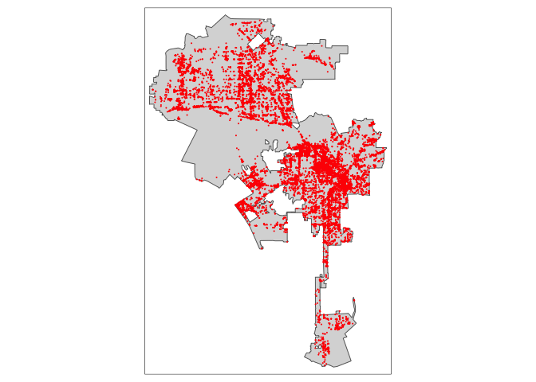
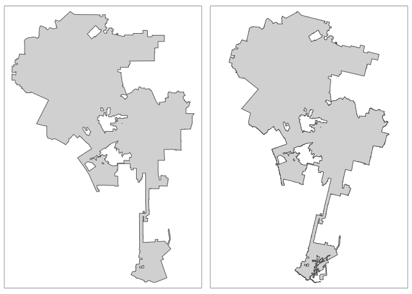
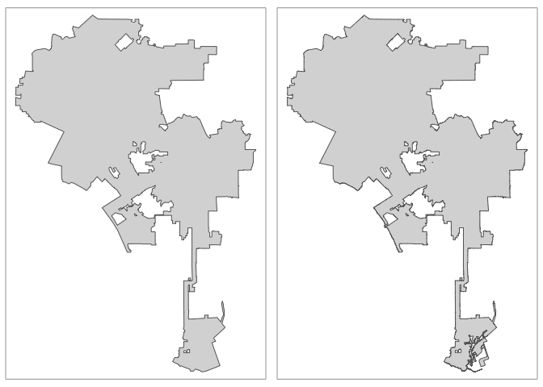

<style>
p.comment {
background-color: #DBDBDB;
padding: 10px;
border: 1px solid black;
margin-left: 25px;
border-radius: 5px;
font-style: italic;
}

h1.title {
  font-weight: bold;
}

</style>
\


In this guide we will cover the spatial data wrangling task of converting point data from a nonspatial to a spatial format.  This process involves using geographic coordinates (longitude and latitude) to place points on a map.  In some cases, you don't have geographic coordinates but street addresses.  Here, you'll need to geocode your data, which involves converting street addresses to geographic coordinates.  These tasks are intimately related to the concept of projection and reprojection, and underlying all of these concepts is a Coordinate Reference System.  These topics will be covered using Los Angeles City as our case study.

<div style="margin-bottom:25px;">
</div>
## **Setting up the data**
\

We'll need to load required packages.  You should have already installed these packages in prior labs, so no need to run the `install.packages()` function.


```r
library(sf)
library(tidyverse)
library(sp)
library(tmap)
```

Next, we'll need to bring in shapefiles for Los Angeles City boundaries.  I uploaded a zip file containing Los Angeles City shapefile boundaries on GitHub. There are actually two boundary files - one from the package **tigris** and the other downloaded from the [National Historical Geographic Information System](https://crd150.github.io/nhgis.html#download_shapefiles) (NHGIS). Set your working directory to a folder you want to work out of.  Download the file and unzip it using the following code.


```r
setwd("insert your pathway here")
download.file(url = "https://raw.githubusercontent.com/crd150/data/master/georeferencing_minilab.zip", destfile = "georeferencing_minilab.zip")
unzip(zipfile = "georeferencing_minilab.zip")
```


Bring in the **tigris** and NHGIS boundary files 


```r
la.city.tigris <- st_read("lacity_tigris.shp")
la.city.nhgis <- st_read("lacity_nhgis.shp")
```

<div style="margin-bottom:25px;">
</div>
## **Bringing in point data: Longitude/Latitude**
\

Many point data sets are not in spatial form (i.e. data you can immediately map).  Best case scenario is that you have a point data set with geographic coordinates.  Geographic coordinates are in the form of a longitude and latitude, where longitude is your X coordinate and spans East/West and latitude is your Y coordinate and spans North/South. 

Let's bring in a csv data set of homeless encampments in Los Angeles City, which was downloaded from the [Los Angeles City Open Data portal](https://data.lacity.org/A-Well-Run-City/MyLA311-Service-Request-Data-2017/d4vt-q4t5) and uploaded onto GitHub.


```r
homeless311.df <- read_csv("https://raw.githubusercontent.com/crd150/data/master/homeless311_la_2017.csv")
```

The data represent homeless encampment locations as reported through the City's [311 system](https://www.lacity.org/311-services).  We will use the function `st_as_sf()` to create a point **sf** object of *homeless311.df*.  The function requires you to specify the longitude and latitude of each point, which are conveniently located in the variables *longitude* and *latitude* in *homeless311.df*.  The other important option that should be set is `crs=`.  This option specifies the coordinate reference system.  We talked about this in lecture and we'll cover this more a little later, but the most important point is that because we are going to map the points onto the Los Angeles City boundary *la.city.tigris*, we should adopt the CRS of *la.city.tigris*.  The CRS of *la.city.tigris* can be called up by using the `st_crs()` function


```r
st_crs(la.city.tigris)
```

```
## Coordinate Reference System:
##   EPSG: 4269 
##   proj4string: "+proj=longlat +datum=NAD83 +no_defs"
```

We plug this CRS directly into the `st_as_sf()` (along with the longitude and latitude) as follows 


```r
homeless311.sf <- st_as_sf(homeless311.df, coords = c("longitude", "latitude"), crs = st_crs(la.city.tigris))
```

Now we can map homeless encampments onto the city's boundaries


```r
tm_shape(la.city.tigris) +
  tm_polygons() +
tm_shape(homeless311.sf) +  
  tm_dots(col="red")
```

<!-- -->
  
<div style="margin-bottom:25px;">
</div>  
## **Coordinate Reference System**
\

The Coordinate Reference System is an important concept to understand when dealing with spatial data.  We won't go through the *real* nuts and bolts of CRS, which you can read in GWR Chapter 2.4 and 6, but we'll go through enough of it so that you can get through most CRS related spatial data wrangling tasks.

The CRS contains two major components: the Geographic Coordinate System (GCS) and the Projected Coordinate System (PCS).  The GCS can be further separated into two parts: the ellipse and the datum.  The ellipse is a model of the Earth's shape.  The datum defines the coordinate system of this model - the origin point and the axes.  You need these two basic components to place points on Earth's three-dimensional surface.  Think of it as trying to create a globe (ellipse) and figuring out where to place points on that globe (datum).

The PCS then translates these points from a globe onto a two-dimensional space.  We need to do this because were creating maps, not globes (it's kind of hard carrying a globe around when you're finding your way around a city).  

When you call up the CRS of a spatial data set


```r
st_crs(la.city.tigris)
```

```
## Coordinate Reference System:
##   EPSG: 4269 
##   proj4string: "+proj=longlat +datum=NAD83 +no_defs"
```

You see two ways to describe the CRS: an `epsg` code and a `proj4string`.  The `epsg` is a shortcut way for defining all the components of a CRS in one number. You can look up all the possible `epsg` [here](http://spatialreference.org/ref/epsg/).  `proj4string`, in contrast, spells everything out. For some reason, `st_crs()` truncates some of `proj4string`, so let's run the function `proj4string()` on *la.city.tigris*, which we need to convert to an **sp** object using the function `as()` because `proj4string()` does not work on **sf** objects


```r
proj4string(as(la.city.tigris, "Spatial"))
```

```
## [1] "+proj=longlat +datum=NAD83 +no_defs +ellps=GRS80 +towgs84=0,0,0"
```

Here we find the three major components to a CRS.  The GCS ellipse and datum are specified by `ellps` and `datum`, respectively.  The PCS is specified by `+proj`.  


OK, this may be too much info.  Let's step back and ask ourselves why do we need to know about the CRS for practical mapping and analysis purposes? There are three main reasons: 

1. Two objects that are compared or combined should have the same CRS.
2. Aesthetic purposes and/or to correct distortions.
3. Many geometric functions require certain CRSs.

We already talked about reason (1) above when we used the CRS of *la.city.tigris* to define the CRS of *homeless311.sf*.  To illustrate (2), let's compare the **tigris** and NHGIS Los Angeles City boundaries.

We find that *la.city.nhgis* has a different CRS from *la.city.tigris*.  


```r
st_crs(la.city.nhgis)
```

```
## Coordinate Reference System:
##   No EPSG code
##   proj4string: "+proj=aea +lat_1=29.5 +lat_2=45.5 +lat_0=37.5 +lon_0=-96 +x_0=0 +y_0=0 +datum=NAD83 +units=m +no_defs"
```

Which is not necessarily a problem, but let's map the two boundaries side by side. I used the function `tmap_arrange()` from the **tmap** package to do this


```r
lacity1 <- tm_shape(la.city.tigris) +
  tm_polygons() 
lacity2 <- tm_shape(la.city.nhgis) +
  tm_polygons() 

tmap_arrange(lacity1, lacity2)
```

<!-- -->

You see a tilt for the NHGIS boundary map on the right.  That tilt is not due to our bad eyesight or anything wrong in our code.  It's due to the projection system that NHGIS uses for their shapefiles, which is Albers Equal Area (`aea`).  Figure 1 shows maps of the United States by different projection systems, include Albers Equal Area (top left)


<center>


</center>

You'll see that under Albers Equal Area, California tilts.  Hence, Los Angeles will tilt.  In this case, AEA may be better for maps of the entire U.S. or for certain parts of the country (e.g. Midwest).  

To fix the tilt, let's reproject *la.city.nhgis* to the CRS of *la.city.tigris*, which has a PCS of `longlat`.  We use the function `st_transform` to reproject spatial data from one CRS to another.


```r
la.city.nhgis.tr <-st_transform(la.city.nhgis, st_crs(la.city.tigris)) 
```

Now, no more tilt!


```r
lacity1 <- tm_shape(la.city.tigris) +
  tm_polygons() 
lacity2 <- tm_shape(la.city.nhgis.tr) +
  tm_polygons() 

tmap_arrange(lacity1, lacity2)
```

<!-- -->

Now, what about reason (3) in our list of reasons above?  Right now, the spatial point data of homeless encampments are in longitude/latitude coordinates.  Many of R's geometric functions that require calculating distances (e.g. distance from one point to another) or areas require a standard measure of distance/area.  Distance in latitude/longitude is in decimal degrees, which is not a standard measure.  We can find out the units of a spatial data set by using the `st_crs()` function and calling up units as follows


```r
st_crs(homeless311.sf)$units
```

```
## NULL
```

```r
st_crs(la.city.nhgis.tr)$units
```

```
## NULL
```

Not good. We can reproject the encampments and Los Angeles City boundaries to a CRS that handles standard distance measures such as meters or kilometers.  Going back to Figure 1, a Mercator projection looks appropriate for California.  A [Universal Transverse Mercator](http://desktop.arcgis.com/en/arcmap/latest/map/projections/universal-transverse-mercator.htm) (UTM) coordinate system splits the country into zones so that you can get appropriate (non titling) maps of your specific region.  The zones are shown in Figure 2


<center>


</center>

Southern California looks like its in Zone 11.  So, let's reproject *la.city.nhgis* to a UTM Zone 11 projection using `st_transform()`.  We'll have to spell out the PCS (utm in zone 11), datum and ellipse in the `crs=` option.


```r
la.city.nhgis.tr2 <-st_transform(la.city.nhgis.tr, 
                                 crs = "+proj=utm +zone=11 +datum=NAD83 +ellps=GRS80") 
```

Check the units


```r
st_crs(la.city.nhgis.tr2)$units
```

```
## [1] "m"
```

"m" means meters.  You can use the same code to reproject *homeless311.sf*.

Another important problem that you may encounter is that a spatial data set you downloaded from a source contains no CRS (unprojected or unknown).  In this case, use the function `st_set_crs()` to set the CRS.  See GWR 6.1 for more details.

Main takeaway points:

1. The CRS for any spatial data set you bring into R should always be established.
1. If you are planning to work with multiple spatial data sets on the same project, make sure they have the same CRS.
2. Make sure the CRS is appropriate for your community.
3. Make sure the CRS is appropriate for the types of spatial tasks you are planning to conduct. 

If you stick with these principles, you should be able to get through most issues regarding CRSs. If you get stuck, read GWR Ch. 2.4 and 6.

<div style="margin-bottom:25px;">
</div>
## **Geocoding addresses**
\

Often you will get point data that won’t have longitude/X and latitude/Y coordinates but instead have street addresses. The process of going from address to X/Y coordinates is known as geocoding.  You can geocode street addresses using the `mutate_geocode()` function in the **ggmap** package. The function will take a data frame with physical addresses and create a new data frame with longitude/X and latitude/Y coordinates for those addresses.  The new data frame will retain all columns of the input data frame. 

`mutate_geocode()` draws from Google Maps’ API to connect street addresses to x,y coordinates. You can think of it as R punching in addresses into Google Maps to find locations like you do when you are trying to find directions.  

You used to be able to use `mutate_geocode()` without an API key, but Google changed that policy on July 2018.  Now, you'll need to register for a Google API key [here](https://developers.google.com/maps/documentation/geocoding/get-api-key).  You'll also need to attach a credit card to this API key. After you sign up for a Google API Key, you will need to enable billing.  To do this, go to https://console.cloud.google.com and select APIs & Services and then Library.  Search for Geocoding API and click on enable.  You'll then want to make sure no one "steals" your API key for nefarious purposes by securing it.  Go to Credentials from your API dashboard, select your key, then select on the API restrictions tab under Key restrictions.  From the pull down menu, select Geocoding API and click save. 

When you sign up for a key, you'll get a \$200 per month credit.  The Geocoding API costs \$5.00 per 1,000 calls, or \$0.005 per call. Over a span of 30 days, the daily usage credit for the Geocoding API is \$6.67 per day. This means that you would be able to make 1,334 calls to the Geocoding API per day for free.  

The R CRAN version of **ggmap** is old and doesn't allow you to register a key.  Download the most recent version of **ggmap** through GitHub using the following code


```r
if(!requireNamespace("devtools")) install.packages("devtools")
devtools::install_github("dkahle/ggmap", ref = "tidyup")

library(ggmap)
```


If you have an old version of **ggmap** on your hard drive, you may need to restart R after installing **ggmap** to see the new version. Use the function `register_google()` to register your API key. 


```r
register_google(key = 'insert your Google API key here')
```


Now were set up to geocode stuff.  As an example, let’s geocode colleges and universities in Los Angeles using the data set *Colleges_and_Universities.csv*, which I uploaded onto GitHub.


```r
la.univ.df <- read_csv("https://raw.githubusercontent.com/crd150/data/master/LA_Colleges_and_Universities.csv")
```


The command `mutate_geocode()`  takes on two primary arguments: `data` and `location`.  The argument `data` is the data frame containing the addresses.  The argument `location` is a string variable containing your address information.  Address information at the minimum includes street prefix (e.g. East), number, name, suffix (eg. St., Ave.), city and state.  More information is better, so including a zipcode is ideal. Note that `location` takes in only one variable - this means that you don't separate out city, zipcode, and state from the street address - they all (address, city, state and zipcode) have to be one concatenated (string) line.  You can use the `unite()` function to concatenate fields. The addresses for the universities in *la.univ.df* is in one field and contains the prefix, house number, street name, city, state and zipcode. You can geocode addresses if they are missing one or more of these pieces of information - for example, you can geocode without the zipcode - but you may get some error.  You can also geocode intersections (e.g. 4th st and Main st) and landmarks ("University of California, Davis"). Check the file *Geocoding_Best_Practices* on Canvas for some tips on geocoding.

Unfortunately, Google Maps API can be a little finicky and sensitive when it comes to geocoding addresses.  In other words, although there are only 50 addresses to geocode in *la.univ.df*, you may get several addresses receiving the following warning.

````
geocode failed with status OVER_QUERY_LIMIT, location = ...
````

This means that Google Maps thinks you've gone over a geocoding query limit.  That may be true because Google does limit geocoding queries to prevent a query overload.  You can deal with this by regeocoding the addresses that receive this warning.  And keep doing this until you've got all addresses geocoded.  You can set this up using a `while()` loop.  A `while()` loop repeats an action until some criteria is met.  First, geocode the 50 addresses using `mutate_geocode()`


```r
la.univ.df.geo1 <- mutate_geocode(la.univ.df, location=address)
```

Look at all those pretty red words...

If you ended up with no warnings, you're all good - all your addresses were successfully geocoded.  If you end up getting the warning of a geocoding failure because of an over query limit constraint or get a result at the end that looks something like this

````
There were 16 warnings (use warnings() to see them)
````

run the following `while()` loop


```r
while(sum(is.na(la.univ.df.geo1$lat)) != 0){
  la.univ.df1 <- la.univ.df.geo1 %>%
                filter(is.na(lat) == TRUE) %>%
                select(OBJECTID:address)
  la.univ.df.geo2 <- mutate_geocode(la.univ.df1, location=address )
  la.univ.df.geo1 <- bind_rows(filter(la.univ.df.geo1, is.na(lat) == FALSE), la.univ.df.geo2)
}
```

Note that this process might take some time, but not more than 5-10 minutes.  You can imagine that geocoding many (over 10,000) street addresses will take quite some time.

Let's break down the above code to understand what it is doing.  The code inside the parentheses of the `while()` command tells R to keep running the code inside the brackets `while` the total number of NAs (non geocoded addresses) after geocoding is not equal to 0.  In other words, the while loop keeps running the code until all the addresses are geocoded.  The next line of code after `while()` 

````
la.univ.df1 <- la.univ.df.geo1 %>%
        filter(is.na(lat) == TRUE) %>%
        select(OBJECTID:address)
````

saves the addresses with NA values from the prior geocoded data frame and keeps the original variables.  So, *la.univ.df1* contains addresses that were not successfully geocoded.  The next line of code 

````
la.univ.df.geo2 <- mutate_geocode(la.univ.df1, location=address)
````

geocodes these addresses.  The last line of code 

````
la.univ.df.geo1 <- bind_rows(filter(la.univ.df.geo1, is.na(lat) == FALSE), la.univ.df.geo2)
````

uses the `bind_rows()` function to append (add rows) *la.univ.df.geo2* to the addresses  successfully geocoded (no NA values) from the prior geocoded data frame *la.univ.df.geo1*.  

The `while()` loop then goes back to its criteria in the parentheses - if this second round of geocoding still yields NA values, it will run the code again until all addresses are successfully geocoded.

Note that the final outcome *la.univ.df.geo1* is not a spatial object. It needs to be converted to one if it is to be used in generating a map output.  Make the data frame into an **sf** point object by using the variables *lon* and *lat* in the function `st_as_sf()`. Remember to use the CRS of *la.city.tigris*.


```r
la.univ.sf <- st_as_sf(la.univ.df.geo1, coords = c("lon", "lat"), 
                       crs = st_crs(la.city.tigris))
```

Now, map the colleges and universities.


```r
tm_shape(la.city.tigris) +
  tm_polygons() +
tm_shape(la.univ.sf) +  
  tm_symbols(size = 0.25, col = "red")
```

<!-- -->

Or interactively


```r
tmap_mode("view")
tm_shape(la.univ.sf) +  
  tm_symbols(size = 0.25, shape=3, col = "red")
```

<!--html_preserve--><div id="htmlwidget-b9f66c36a7d252750184" style="width:672px;height:480px;" class="leaflet html-widget"></div>
<script type="application/json" data-for="htmlwidget-b9f66c36a7d252750184">{"x":{"options":{"crs":{"crsClass":"L.CRS.EPSG3857","code":null,"proj4def":null,"projectedBounds":null,"options":{}}},"calls":[{"method":"addProviderTiles","args":["Esri.WorldGrayCanvas",null,"Esri.WorldGrayCanvas",{"minZoom":0,"maxZoom":18,"tileSize":256,"subdomains":"abc","errorTileUrl":"","tms":false,"noWrap":false,"zoomOffset":0,"zoomReverse":false,"opacity":1,"zIndex":1,"detectRetina":false,"pane":"tilePane"}]},{"method":"addProviderTiles","args":["OpenStreetMap",null,"OpenStreetMap",{"minZoom":0,"maxZoom":18,"tileSize":256,"subdomains":"abc","errorTileUrl":"","tms":false,"noWrap":false,"zoomOffset":0,"zoomReverse":false,"opacity":1,"zIndex":1,"detectRetina":false,"pane":"tilePane"}]},{"method":"addProviderTiles","args":["Esri.WorldTopoMap",null,"Esri.WorldTopoMap",{"minZoom":0,"maxZoom":18,"tileSize":256,"subdomains":"abc","errorTileUrl":"","tms":false,"noWrap":false,"zoomOffset":0,"zoomReverse":false,"opacity":1,"zIndex":1,"detectRetina":false,"pane":"tilePane"}]},{"method":"createMapPane","args":["overlayPane01",401]},{"method":"addCircles","args":[[34.1287275,34.0624252,34.027414,34.1409207,34.0839639,34.0613055,34.0633778,33.9562658,34.061086,34.0309703,34.085421,33.9793263,34.0498306,34.0403409,34.0447173,34.0561128,34.0793518,34.0648793,34.0953776,33.9702454,34.08154,34.129581,34.0440447,34.0892322,33.9300832,34.0793518,33.9373547,34.0613992,34.0638524,34.0609199,33.9767364,34.0570639,34.0447812,34.1075609,34.0611135,34.0725988,34.0441185,34.061458,34.0667698,34.0489538,34.0641415,34.0324082,34.0044346,34.0561128,33.9932784,34.036117,34.061413,34.0625502,34.0972638,34.0685563],[-118.4719173,-118.2121202,-118.220028,-118.2250677,-118.4815446,-118.3000389,-118.3620373,-118.4173143,-118.2933151,-118.2789735,-118.3465144,-118.4147483,-118.27637,-118.2583258,-118.3087058,-118.2724303,-118.2925843,-118.2896613,-118.343701,-118.4165979,-118.2913512,-118.210692,-118.2327892,-118.292904,-118.3067827,-118.2925843,-118.2546266,-118.2884225,-118.2931324,-118.2830843,-118.3720193,-118.2745658,-118.3094696,-118.3100989,-118.3028146,-118.439277,-118.2600399,-118.2919856,-118.1684392,-118.2579843,-118.3695242,-118.3893814,-118.3321774,-118.2724303,-118.4427416,-118.262991,-118.2989582,-118.2951419,-118.3084569,-118.3448707],[194.889449088836,194.889449088836,194.889449088836,194.889449088836,194.889449088836,194.889449088836,194.889449088836,194.889449088836,194.889449088836,194.889449088836,194.889449088836,194.889449088836,194.889449088836,194.889449088836,194.889449088836,194.889449088836,194.889449088836,194.889449088836,194.889449088836,194.889449088836,194.889449088836,194.889449088836,194.889449088836,194.889449088836,194.889449088836,194.889449088836,194.889449088836,194.889449088836,194.889449088836,194.889449088836,194.889449088836,194.889449088836,194.889449088836,194.889449088836,194.889449088836,194.889449088836,194.889449088836,194.889449088836,194.889449088836,194.889449088836,194.889449088836,194.889449088836,194.889449088836,194.889449088836,194.889449088836,194.889449088836,194.889449088836,194.889449088836,194.889449088836,194.889449088836],null,"la.univ.sf",{"interactive":true,"className":"","pane":"overlayPane01","stroke":true,"color":"#666666","weight":1,"opacity":0.5,"fill":true,"fillColor":["#FF0000","#FF0000","#FF0000","#FF0000","#FF0000","#FF0000","#FF0000","#FF0000","#FF0000","#FF0000","#FF0000","#FF0000","#FF0000","#FF0000","#FF0000","#FF0000","#FF0000","#FF0000","#FF0000","#FF0000","#FF0000","#FF0000","#FF0000","#FF0000","#FF0000","#FF0000","#FF0000","#FF0000","#FF0000","#FF0000","#FF0000","#FF0000","#FF0000","#FF0000","#FF0000","#FF0000","#FF0000","#FF0000","#FF0000","#FF0000","#FF0000","#FF0000","#FF0000","#FF0000","#FF0000","#FF0000","#FF0000","#FF0000","#FF0000","#FF0000"],"fillOpacity":[1,1,1,1,1,1,1,1,1,1,1,1,1,1,1,1,1,1,1,1,1,1,1,1,1,1,1,1,1,1,1,1,1,1,1,1,1,1,1,1,1,1,1,1,1,1,1,1,1,1]},["<div style=\"max-height:10em;overflow:auto;\"><table>\n\t\t\t   <thead><tr><th colspan=\"2\"><b>108099868<\/b><\/th><\/thead><\/tr><tr><td style=\"color: #888888;\">OBJECTID<\/td><td>108 mln<\/td><\/tr><tr><td style=\"color: #888888;\">Name<\/td><td>American Jewish University<\/td><\/tr><tr><td style=\"color: #888888;\">addrln1<\/td><td>15600 Mulholland Dr<\/td><\/tr><tr><td style=\"color: #888888;\">city<\/td><td>Los Angeles<\/td><\/tr><tr><td style=\"color: #888888;\">state<\/td><td>CA<\/td><\/tr><tr><td style=\"color: #888888;\">zip<\/td><td>90,077<\/td><\/tr><tr><td style=\"color: #888888;\">address<\/td><td>15600 Mulholland Dr , Los Angeles , CA 90077<\/td><\/tr><\/table><\/div>","<div style=\"max-height:10em;overflow:auto;\"><table>\n\t\t\t   <thead><tr><th colspan=\"2\"><b>108099872<\/b><\/th><\/thead><\/tr><tr><td style=\"color: #888888;\">OBJECTID<\/td><td>108 mln<\/td><\/tr><tr><td style=\"color: #888888;\">Name<\/td><td>Los Angeles County College Of Nursing And Allied Health<\/td><\/tr><tr><td style=\"color: #888888;\">addrln1<\/td><td>1237 N. Mission Rd.<\/td><\/tr><tr><td style=\"color: #888888;\">city<\/td><td>Los Angeles<\/td><\/tr><tr><td style=\"color: #888888;\">state<\/td><td>CA<\/td><\/tr><tr><td style=\"color: #888888;\">zip<\/td><td>90,033<\/td><\/tr><tr><td style=\"color: #888888;\">address<\/td><td>1237 N. Mission Rd. , Los Angeles , CA 90033<\/td><\/tr><\/table><\/div>","<div style=\"max-height:10em;overflow:auto;\"><table>\n\t\t\t   <thead><tr><th colspan=\"2\"><b>108099873<\/b><\/th><\/thead><\/tr><tr><td style=\"color: #888888;\">OBJECTID<\/td><td>108 mln<\/td><\/tr><tr><td style=\"color: #888888;\">Name<\/td><td>Marinello School Of Beauty<\/td><\/tr><tr><td style=\"color: #888888;\">addrln1<\/td><td>1241 S. Soto Street<\/td><\/tr><tr><td style=\"color: #888888;\">city<\/td><td>Los Angeles<\/td><\/tr><tr><td style=\"color: #888888;\">state<\/td><td>CA<\/td><\/tr><tr><td style=\"color: #888888;\">zip<\/td><td>90,023<\/td><\/tr><tr><td style=\"color: #888888;\">address<\/td><td>1241 S. Soto Street , Los Angeles , CA 90023<\/td><\/tr><\/table><\/div>","<div style=\"max-height:10em;overflow:auto;\"><table>\n\t\t\t   <thead><tr><th colspan=\"2\"><b>108099876<\/b><\/th><\/thead><\/tr><tr><td style=\"color: #888888;\">OBJECTID<\/td><td>108 mln<\/td><\/tr><tr><td style=\"color: #888888;\">Name<\/td><td>Marinello School Of Beauty<\/td><\/tr><tr><td style=\"color: #888888;\">addrln1<\/td><td>2700 Colorado Blvd<\/td><\/tr><tr><td style=\"color: #888888;\">city<\/td><td>Los Angeles<\/td><\/tr><tr><td style=\"color: #888888;\">state<\/td><td>CA<\/td><\/tr><tr><td style=\"color: #888888;\">zip<\/td><td>90,041<\/td><\/tr><tr><td style=\"color: #888888;\">address<\/td><td>2700 Colorado Blvd , Los Angeles , CA 90041<\/td><\/tr><\/table><\/div>","<div style=\"max-height:10em;overflow:auto;\"><table>\n\t\t\t   <thead><tr><th colspan=\"2\"><b>108099881<\/b><\/th><\/thead><\/tr><tr><td style=\"color: #888888;\">OBJECTID<\/td><td>108 mln<\/td><\/tr><tr><td style=\"color: #888888;\">Name<\/td><td>Mount St Marys College<\/td><\/tr><tr><td style=\"color: #888888;\">addrln1<\/td><td>12001 Chalon Rd<\/td><\/tr><tr><td style=\"color: #888888;\">city<\/td><td>Los Angeles<\/td><\/tr><tr><td style=\"color: #888888;\">state<\/td><td>CA<\/td><\/tr><tr><td style=\"color: #888888;\">zip<\/td><td>90,049<\/td><\/tr><tr><td style=\"color: #888888;\">address<\/td><td>12001 Chalon Rd , Los Angeles , CA 90049<\/td><\/tr><\/table><\/div>","<div style=\"max-height:10em;overflow:auto;\"><table>\n\t\t\t   <thead><tr><th colspan=\"2\"><b>108099883<\/b><\/th><\/thead><\/tr><tr><td style=\"color: #888888;\">OBJECTID<\/td><td>108 mln<\/td><\/tr><tr><td style=\"color: #888888;\">Name<\/td><td>Everest College-La Wilshire<\/td><\/tr><tr><td style=\"color: #888888;\">addrln1<\/td><td>3460 Wilshire Blvd<\/td><\/tr><tr><td style=\"color: #888888;\">city<\/td><td>Los Angeles<\/td><\/tr><tr><td style=\"color: #888888;\">state<\/td><td>CA<\/td><\/tr><tr><td style=\"color: #888888;\">zip<\/td><td>90,010<\/td><\/tr><tr><td style=\"color: #888888;\">address<\/td><td>3460 Wilshire Blvd , Los Angeles , CA 90010<\/td><\/tr><\/table><\/div>","<div style=\"max-height:10em;overflow:auto;\"><table>\n\t\t\t   <thead><tr><th colspan=\"2\"><b>108099886<\/b><\/th><\/thead><\/tr><tr><td style=\"color: #888888;\">OBJECTID<\/td><td>108 mln<\/td><\/tr><tr><td style=\"color: #888888;\">Name<\/td><td>Marinello School Of Beauty<\/td><\/tr><tr><td style=\"color: #888888;\">addrln1<\/td><td>6111 Wilshire Boulevard<\/td><\/tr><tr><td style=\"color: #888888;\">city<\/td><td>Los Angeles<\/td><\/tr><tr><td style=\"color: #888888;\">state<\/td><td>CA<\/td><\/tr><tr><td style=\"color: #888888;\">zip<\/td><td>90,048<\/td><\/tr><tr><td style=\"color: #888888;\">address<\/td><td>6111 Wilshire Boulevard , Los Angeles , CA 90048<\/td><\/tr><\/table><\/div>","<div style=\"max-height:10em;overflow:auto;\"><table>\n\t\t\t   <thead><tr><th colspan=\"2\"><b>108099891<\/b><\/th><\/thead><\/tr><tr><td style=\"color: #888888;\">OBJECTID<\/td><td>108 mln<\/td><\/tr><tr><td style=\"color: #888888;\">Name<\/td><td>Otis College Of Art And Design<\/td><\/tr><tr><td style=\"color: #888888;\">addrln1<\/td><td>9045 Lincoln Blvd<\/td><\/tr><tr><td style=\"color: #888888;\">city<\/td><td>Los Angeles<\/td><\/tr><tr><td style=\"color: #888888;\">state<\/td><td>CA<\/td><\/tr><tr><td style=\"color: #888888;\">zip<\/td><td>90,045<\/td><\/tr><tr><td style=\"color: #888888;\">address<\/td><td>9045 Lincoln Blvd , Los Angeles , CA 90045<\/td><\/tr><\/table><\/div>","<div style=\"max-height:10em;overflow:auto;\"><table>\n\t\t\t   <thead><tr><th colspan=\"2\"><b>108099898<\/b><\/th><\/thead><\/tr><tr><td style=\"color: #888888;\">OBJECTID<\/td><td>108 mln<\/td><\/tr><tr><td style=\"color: #888888;\">Name<\/td><td>Westwood College-Los Angeles<\/td><\/tr><tr><td style=\"color: #888888;\">addrln1<\/td><td>3250 Wilshire Blvd<\/td><\/tr><tr><td style=\"color: #888888;\">city<\/td><td>Los Angeles<\/td><\/tr><tr><td style=\"color: #888888;\">state<\/td><td>CA<\/td><\/tr><tr><td style=\"color: #888888;\">zip<\/td><td>90,010<\/td><\/tr><tr><td style=\"color: #888888;\">address<\/td><td>3250 Wilshire Blvd , Los Angeles , CA 90010<\/td><\/tr><\/table><\/div>","<div style=\"max-height:10em;overflow:auto;\"><table>\n\t\t\t   <thead><tr><th colspan=\"2\"><b>108099899<\/b><\/th><\/thead><\/tr><tr><td style=\"color: #888888;\">OBJECTID<\/td><td>108 mln<\/td><\/tr><tr><td style=\"color: #888888;\">Name<\/td><td>University Of Southern California<\/td><\/tr><tr><td style=\"color: #888888;\">addrln1<\/td><td>University Park<\/td><\/tr><tr><td style=\"color: #888888;\">city<\/td><td>Los Angeles<\/td><\/tr><tr><td style=\"color: #888888;\">state<\/td><td>CA<\/td><\/tr><tr><td style=\"color: #888888;\">zip<\/td><td>90,089<\/td><\/tr><tr><td style=\"color: #888888;\">address<\/td><td>University Park , Los Angeles , CA 90089<\/td><\/tr><\/table><\/div>","<div style=\"max-height:10em;overflow:auto;\"><table>\n\t\t\t   <thead><tr><th colspan=\"2\"><b>108099904<\/b><\/th><\/thead><\/tr><tr><td style=\"color: #888888;\">OBJECTID<\/td><td>108 mln<\/td><\/tr><tr><td style=\"color: #888888;\">Name<\/td><td>Yeshiva Ohr Elchonon Chabad West Coast Talmudical Seminary<\/td><\/tr><tr><td style=\"color: #888888;\">addrln1<\/td><td>7215 Waring Ave<\/td><\/tr><tr><td style=\"color: #888888;\">city<\/td><td>Los Angeles<\/td><\/tr><tr><td style=\"color: #888888;\">state<\/td><td>CA<\/td><\/tr><tr><td style=\"color: #888888;\">zip<\/td><td>90,046<\/td><\/tr><tr><td style=\"color: #888888;\">address<\/td><td>7215 Waring Ave , Los Angeles , CA 90046<\/td><\/tr><\/table><\/div>","<div style=\"max-height:10em;overflow:auto;\"><table>\n\t\t\t   <thead><tr><th colspan=\"2\"><b>108099909<\/b><\/th><\/thead><\/tr><tr><td style=\"color: #888888;\">OBJECTID<\/td><td>108 mln<\/td><\/tr><tr><td style=\"color: #888888;\">Name<\/td><td>American Intercontinental University<\/td><\/tr><tr><td style=\"color: #888888;\">addrln1<\/td><td>12655 West Jefferson Blvd<\/td><\/tr><tr><td style=\"color: #888888;\">city<\/td><td>Los Angeles<\/td><\/tr><tr><td style=\"color: #888888;\">state<\/td><td>CA<\/td><\/tr><tr><td style=\"color: #888888;\">zip<\/td><td>90,066<\/td><\/tr><tr><td style=\"color: #888888;\">address<\/td><td>12655 West Jefferson Blvd , Los Angeles , CA 90066<\/td><\/tr><\/table><\/div>","<div style=\"max-height:10em;overflow:auto;\"><table>\n\t\t\t   <thead><tr><th colspan=\"2\"><b>108099911<\/b><\/th><\/thead><\/tr><tr><td style=\"color: #888888;\">OBJECTID<\/td><td>108 mln<\/td><\/tr><tr><td style=\"color: #888888;\">Name<\/td><td>Samra University Of Oriental Medicine<\/td><\/tr><tr><td style=\"color: #888888;\">addrln1<\/td><td>1730 W. Olympic Boulevard<\/td><\/tr><tr><td style=\"color: #888888;\">city<\/td><td>Los Angeles<\/td><\/tr><tr><td style=\"color: #888888;\">state<\/td><td>CA<\/td><\/tr><tr><td style=\"color: #888888;\">zip<\/td><td>90,015<\/td><\/tr><tr><td style=\"color: #888888;\">address<\/td><td>1730 W. Olympic Boulevard , Los Angeles , CA 90015<\/td><\/tr><\/table><\/div>","<div style=\"max-height:10em;overflow:auto;\"><table>\n\t\t\t   <thead><tr><th colspan=\"2\"><b>108099915<\/b><\/th><\/thead><\/tr><tr><td style=\"color: #888888;\">OBJECTID<\/td><td>108 mln<\/td><\/tr><tr><td style=\"color: #888888;\">Name<\/td><td>Virginia Sewing Machines And School Center<\/td><\/tr><tr><td style=\"color: #888888;\">addrln1<\/td><td>1033 S Broadway St<\/td><\/tr><tr><td style=\"color: #888888;\">city<\/td><td>Los Angeles<\/td><\/tr><tr><td style=\"color: #888888;\">state<\/td><td>CA<\/td><\/tr><tr><td style=\"color: #888888;\">zip<\/td><td>90,015<\/td><\/tr><tr><td style=\"color: #888888;\">address<\/td><td>1033 S Broadway St , Los Angeles , CA 90015<\/td><\/tr><\/table><\/div>","<div style=\"max-height:10em;overflow:auto;\"><table>\n\t\t\t   <thead><tr><th colspan=\"2\"><b>108099916<\/b><\/th><\/thead><\/tr><tr><td style=\"color: #888888;\">OBJECTID<\/td><td>108 mln<\/td><\/tr><tr><td style=\"color: #888888;\">Name<\/td><td>Pacific States University<\/td><\/tr><tr><td style=\"color: #888888;\">addrln1<\/td><td>1516 S Western Ave<\/td><\/tr><tr><td style=\"color: #888888;\">city<\/td><td>Los Angeles<\/td><\/tr><tr><td style=\"color: #888888;\">state<\/td><td>CA<\/td><\/tr><tr><td style=\"color: #888888;\">zip<\/td><td>90,006<\/td><\/tr><tr><td style=\"color: #888888;\">address<\/td><td>1516 S Western Ave , Los Angeles , CA 90006<\/td><\/tr><\/table><\/div>","<div style=\"max-height:10em;overflow:auto;\"><table>\n\t\t\t   <thead><tr><th colspan=\"2\"><b>108099917<\/b><\/th><\/thead><\/tr><tr><td style=\"color: #888888;\">OBJECTID<\/td><td>108 mln<\/td><\/tr><tr><td style=\"color: #888888;\">Name<\/td><td>Associated Technical College<\/td><\/tr><tr><td style=\"color: #888888;\">addrln1<\/td><td>1670 Wilshire Blvd<\/td><\/tr><tr><td style=\"color: #888888;\">city<\/td><td>Los Angeles<\/td><\/tr><tr><td style=\"color: #888888;\">state<\/td><td>CA<\/td><\/tr><tr><td style=\"color: #888888;\">zip<\/td><td>90,017<\/td><\/tr><tr><td style=\"color: #888888;\">address<\/td><td>1670 Wilshire Blvd , Los Angeles , CA 90017<\/td><\/tr><\/table><\/div>","<div style=\"max-height:10em;overflow:auto;\"><table>\n\t\t\t   <thead><tr><th colspan=\"2\"><b>108099918<\/b><\/th><\/thead><\/tr><tr><td style=\"color: #888888;\">OBJECTID<\/td><td>108 mln<\/td><\/tr><tr><td style=\"color: #888888;\">Name<\/td><td>American Career College<\/td><\/tr><tr><td style=\"color: #888888;\">addrln1<\/td><td>4021 Rosewood Avenue<\/td><\/tr><tr><td style=\"color: #888888;\">city<\/td><td>Los Angeles<\/td><\/tr><tr><td style=\"color: #888888;\">state<\/td><td>CA<\/td><\/tr><tr><td style=\"color: #888888;\">zip<\/td><td>90,004<\/td><\/tr><tr><td style=\"color: #888888;\">address<\/td><td>4021 Rosewood Avenue , Los Angeles , CA 90004<\/td><\/tr><\/table><\/div>","<div style=\"max-height:10em;overflow:auto;\"><table>\n\t\t\t   <thead><tr><th colspan=\"2\"><b>108099919<\/b><\/th><\/thead><\/tr><tr><td style=\"color: #888888;\">OBJECTID<\/td><td>108 mln<\/td><\/tr><tr><td style=\"color: #888888;\">Name<\/td><td>World Mission University<\/td><\/tr><tr><td style=\"color: #888888;\">addrln1<\/td><td>500 Shatto Pl<\/td><\/tr><tr><td style=\"color: #888888;\">city<\/td><td>Los Angeles<\/td><\/tr><tr><td style=\"color: #888888;\">state<\/td><td>CA<\/td><\/tr><tr><td style=\"color: #888888;\">zip<\/td><td>90,020<\/td><\/tr><tr><td style=\"color: #888888;\">address<\/td><td>500 Shatto Pl , Los Angeles , CA 90020<\/td><\/tr><\/table><\/div>","<div style=\"max-height:10em;overflow:auto;\"><table>\n\t\t\t   <thead><tr><th colspan=\"2\"><b>108099928<\/b><\/th><\/thead><\/tr><tr><td style=\"color: #888888;\">OBJECTID<\/td><td>108 mln<\/td><\/tr><tr><td style=\"color: #888888;\">Name<\/td><td>American Academy Of Dramatic Arts-West<\/td><\/tr><tr><td style=\"color: #888888;\">addrln1<\/td><td>1336 N La Brea<\/td><\/tr><tr><td style=\"color: #888888;\">city<\/td><td>Los Angeles<\/td><\/tr><tr><td style=\"color: #888888;\">state<\/td><td>CA<\/td><\/tr><tr><td style=\"color: #888888;\">zip<\/td><td>90,028<\/td><\/tr><tr><td style=\"color: #888888;\">address<\/td><td>1336 N La Brea , Los Angeles , CA 90028<\/td><\/tr><\/table><\/div>","<div style=\"max-height:10em;overflow:auto;\"><table>\n\t\t\t   <thead><tr><th colspan=\"2\"><b>108099947<\/b><\/th><\/thead><\/tr><tr><td style=\"color: #888888;\">OBJECTID<\/td><td>108 mln<\/td><\/tr><tr><td style=\"color: #888888;\">Name<\/td><td>Loyola Marymount University<\/td><\/tr><tr><td style=\"color: #888888;\">addrln1<\/td><td>One Lmu Drive<\/td><\/tr><tr><td style=\"color: #888888;\">city<\/td><td>Los Angeles<\/td><\/tr><tr><td style=\"color: #888888;\">state<\/td><td>CA<\/td><\/tr><tr><td style=\"color: #888888;\">zip<\/td><td>90,045<\/td><\/tr><tr><td style=\"color: #888888;\">address<\/td><td>One Lmu Drive , Los Angeles , CA 90045<\/td><\/tr><\/table><\/div>","<div style=\"max-height:10em;overflow:auto;\"><table>\n\t\t\t   <thead><tr><th colspan=\"2\"><b>108099950<\/b><\/th><\/thead><\/tr><tr><td style=\"color: #888888;\">OBJECTID<\/td><td>108 mln<\/td><\/tr><tr><td style=\"color: #888888;\">Name<\/td><td>Cleveland Chiropractic College Of Los Angeles<\/td><\/tr><tr><td style=\"color: #888888;\">addrln1<\/td><td>590 N Vermont Ave<\/td><\/tr><tr><td style=\"color: #888888;\">city<\/td><td>Los Angeles<\/td><\/tr><tr><td style=\"color: #888888;\">state<\/td><td>CA<\/td><\/tr><tr><td style=\"color: #888888;\">zip<\/td><td>90,004<\/td><\/tr><tr><td style=\"color: #888888;\">address<\/td><td>590 N Vermont Ave , Los Angeles , CA 90004<\/td><\/tr><\/table><\/div>","<div style=\"max-height:10em;overflow:auto;\"><table>\n\t\t\t   <thead><tr><th colspan=\"2\"><b>108099962<\/b><\/th><\/thead><\/tr><tr><td style=\"color: #888888;\">OBJECTID<\/td><td>108 mln<\/td><\/tr><tr><td style=\"color: #888888;\">Name<\/td><td>Occidental College<\/td><\/tr><tr><td style=\"color: #888888;\">addrln1<\/td><td>1600 Campus Rd<\/td><\/tr><tr><td style=\"color: #888888;\">city<\/td><td>Los Angeles<\/td><\/tr><tr><td style=\"color: #888888;\">state<\/td><td>CA<\/td><\/tr><tr><td style=\"color: #888888;\">zip<\/td><td>90,041<\/td><\/tr><tr><td style=\"color: #888888;\">address<\/td><td>1600 Campus Rd , Los Angeles , CA 90041<\/td><\/tr><\/table><\/div>","<div style=\"max-height:10em;overflow:auto;\"><table>\n\t\t\t   <thead><tr><th colspan=\"2\"><b>108099964<\/b><\/th><\/thead><\/tr><tr><td style=\"color: #888888;\">OBJECTID<\/td><td>108 mln<\/td><\/tr><tr><td style=\"color: #888888;\">Name<\/td><td>Southern California Institute Of Architecture<\/td><\/tr><tr><td style=\"color: #888888;\">addrln1<\/td><td>960 E. 3Rd Street<\/td><\/tr><tr><td style=\"color: #888888;\">city<\/td><td>Los Angeles<\/td><\/tr><tr><td style=\"color: #888888;\">state<\/td><td>CA<\/td><\/tr><tr><td style=\"color: #888888;\">zip<\/td><td>90,013<\/td><\/tr><tr><td style=\"color: #888888;\">address<\/td><td>960 E. 3Rd Street , Los Angeles , CA 90013<\/td><\/tr><\/table><\/div>","<div style=\"max-height:10em;overflow:auto;\"><table>\n\t\t\t   <thead><tr><th colspan=\"2\"><b>108143665<\/b><\/th><\/thead><\/tr><tr><td style=\"color: #888888;\">OBJECTID<\/td><td>108 mln<\/td><\/tr><tr><td style=\"color: #888888;\">Name<\/td><td>Los Angeles City College<\/td><\/tr><tr><td style=\"color: #888888;\">addrln1<\/td><td>855 N. Vermont Ave.<\/td><\/tr><tr><td style=\"color: #888888;\">city<\/td><td>Los Angeles<\/td><\/tr><tr><td style=\"color: #888888;\">state<\/td><td>CA<\/td><\/tr><tr><td style=\"color: #888888;\">zip<\/td><td>90,029<\/td><\/tr><tr><td style=\"color: #888888;\">address<\/td><td>855 N. Vermont Ave. , Los Angeles , CA 90029<\/td><\/tr><\/table><\/div>","<div style=\"max-height:10em;overflow:auto;\"><table>\n\t\t\t   <thead><tr><th colspan=\"2\"><b>108146032<\/b><\/th><\/thead><\/tr><tr><td style=\"color: #888888;\">OBJECTID<\/td><td>108 mln<\/td><\/tr><tr><td style=\"color: #888888;\">Name<\/td><td>Los Angeles Southwest College<\/td><\/tr><tr><td style=\"color: #888888;\">addrln1<\/td><td>1600 W. Imperial Hwy.<\/td><\/tr><tr><td style=\"color: #888888;\">city<\/td><td>Los Angeles<\/td><\/tr><tr><td style=\"color: #888888;\">state<\/td><td>CA<\/td><\/tr><tr><td style=\"color: #888888;\">zip<\/td><td>90,047<\/td><\/tr><tr><td style=\"color: #888888;\">address<\/td><td>1600 W. Imperial Hwy. , Los Angeles , CA 90047<\/td><\/tr><\/table><\/div>","<div style=\"max-height:10em;overflow:auto;\"><table>\n\t\t\t   <thead><tr><th colspan=\"2\"><b>108146857<\/b><\/th><\/thead><\/tr><tr><td style=\"color: #888888;\">OBJECTID<\/td><td>108 mln<\/td><\/tr><tr><td style=\"color: #888888;\">Name<\/td><td>West Coast University<\/td><\/tr><tr><td style=\"color: #888888;\">addrln1<\/td><td>4021 Rosewood Ave<\/td><\/tr><tr><td style=\"color: #888888;\">city<\/td><td>Los Angeles<\/td><\/tr><tr><td style=\"color: #888888;\">state<\/td><td>CA<\/td><\/tr><tr><td style=\"color: #888888;\">zip<\/td><td>90,004<\/td><\/tr><tr><td style=\"color: #888888;\">address<\/td><td>4021 Rosewood Ave , Los Angeles , CA 90004<\/td><\/tr><\/table><\/div>","<div style=\"max-height:10em;overflow:auto;\"><table>\n\t\t\t   <thead><tr><th colspan=\"2\"><b>108147725<\/b><\/th><\/thead><\/tr><tr><td style=\"color: #888888;\">OBJECTID<\/td><td>108 mln<\/td><\/tr><tr><td style=\"color: #888888;\">Name<\/td><td>Maxine Waters Employment Preparation Center<\/td><\/tr><tr><td style=\"color: #888888;\">addrln1<\/td><td>10925 South  Central Ave<\/td><\/tr><tr><td style=\"color: #888888;\">city<\/td><td>Los Angeles<\/td><\/tr><tr><td style=\"color: #888888;\">state<\/td><td>CA<\/td><\/tr><tr><td style=\"color: #888888;\">zip<\/td><td>90,059<\/td><\/tr><tr><td style=\"color: #888888;\">address<\/td><td>10925 South  Central Ave , Los Angeles , CA 90059<\/td><\/tr><\/table><\/div>","<div style=\"max-height:10em;overflow:auto;\"><table>\n\t\t\t   <thead><tr><th colspan=\"2\"><b>108150988<\/b><\/th><\/thead><\/tr><tr><td style=\"color: #888888;\">OBJECTID<\/td><td>108 mln<\/td><\/tr><tr><td style=\"color: #888888;\">Name<\/td><td>Southwestern Law School<\/td><\/tr><tr><td style=\"color: #888888;\">addrln1<\/td><td>3050 Wilshire Boulevard<\/td><\/tr><tr><td style=\"color: #888888;\">city<\/td><td>Los Angeles<\/td><\/tr><tr><td style=\"color: #888888;\">state<\/td><td>CA<\/td><\/tr><tr><td style=\"color: #888888;\">zip<\/td><td>90,010<\/td><\/tr><tr><td style=\"color: #888888;\">address<\/td><td>3050 Wilshire Boulevard , Los Angeles , CA 90010<\/td><\/tr><\/table><\/div>","<div style=\"max-height:10em;overflow:auto;\"><table>\n\t\t\t   <thead><tr><th colspan=\"2\"><b>108099828<\/b><\/th><\/thead><\/tr><tr><td style=\"color: #888888;\">OBJECTID<\/td><td>108 mln<\/td><\/tr><tr><td style=\"color: #888888;\">Name<\/td><td>Ces College<\/td><\/tr><tr><td style=\"color: #888888;\">addrln1<\/td><td>3251 West 6Th Street<\/td><\/tr><tr><td style=\"color: #888888;\">city<\/td><td>Los Angeles<\/td><\/tr><tr><td style=\"color: #888888;\">state<\/td><td>CA<\/td><\/tr><tr><td style=\"color: #888888;\">zip<\/td><td>90,020<\/td><\/tr><tr><td style=\"color: #888888;\">address<\/td><td>3251 West 6Th Street , Los Angeles , CA 90020<\/td><\/tr><\/table><\/div>","<div style=\"max-height:10em;overflow:auto;\"><table>\n\t\t\t   <thead><tr><th colspan=\"2\"><b>108099829<\/b><\/th><\/thead><\/tr><tr><td style=\"color: #888888;\">OBJECTID<\/td><td>108 mln<\/td><\/tr><tr><td style=\"color: #888888;\">Name<\/td><td>Liberty Training Institute<\/td><\/tr><tr><td style=\"color: #888888;\">addrln1<\/td><td>2706 Wilshire Blvd<\/td><\/tr><tr><td style=\"color: #888888;\">city<\/td><td>Los Angeles<\/td><\/tr><tr><td style=\"color: #888888;\">state<\/td><td>CA<\/td><\/tr><tr><td style=\"color: #888888;\">zip<\/td><td>90,057<\/td><\/tr><tr><td style=\"color: #888888;\">address<\/td><td>2706 Wilshire Blvd , Los Angeles , CA 90057<\/td><\/tr><\/table><\/div>","<div style=\"max-height:10em;overflow:auto;\"><table>\n\t\t\t   <thead><tr><th colspan=\"2\"><b>108099832<\/b><\/th><\/thead><\/tr><tr><td style=\"color: #888888;\">OBJECTID<\/td><td>108 mln<\/td><\/tr><tr><td style=\"color: #888888;\">Name<\/td><td>Ladera Career Paths Training Centers<\/td><\/tr><tr><td style=\"color: #888888;\">addrln1<\/td><td>6820 La Tijera Blvd<\/td><\/tr><tr><td style=\"color: #888888;\">city<\/td><td>Los Angeles<\/td><\/tr><tr><td style=\"color: #888888;\">state<\/td><td>CA<\/td><\/tr><tr><td style=\"color: #888888;\">zip<\/td><td>90,045<\/td><\/tr><tr><td style=\"color: #888888;\">address<\/td><td>6820 La Tijera Blvd , Los Angeles , CA 90045<\/td><\/tr><\/table><\/div>","<div style=\"max-height:10em;overflow:auto;\"><table>\n\t\t\t   <thead><tr><th colspan=\"2\"><b>108099834<\/b><\/th><\/thead><\/tr><tr><td style=\"color: #888888;\">OBJECTID<\/td><td>108 mln<\/td><\/tr><tr><td style=\"color: #888888;\">Name<\/td><td>Walter Jay Md Institute An Educational Center<\/td><\/tr><tr><td style=\"color: #888888;\">addrln1<\/td><td>1930 Wilshire Blvd<\/td><\/tr><tr><td style=\"color: #888888;\">city<\/td><td>Los Angeles<\/td><\/tr><tr><td style=\"color: #888888;\">state<\/td><td>CA<\/td><\/tr><tr><td style=\"color: #888888;\">zip<\/td><td>90,057<\/td><\/tr><tr><td style=\"color: #888888;\">address<\/td><td>1930 Wilshire Blvd , Los Angeles , CA 90057<\/td><\/tr><\/table><\/div>","<div style=\"max-height:10em;overflow:auto;\"><table>\n\t\t\t   <thead><tr><th colspan=\"2\"><b>108099838<\/b><\/th><\/thead><\/tr><tr><td style=\"color: #888888;\">OBJECTID<\/td><td>108 mln<\/td><\/tr><tr><td style=\"color: #888888;\">Name<\/td><td>Palace Beauty College<\/td><\/tr><tr><td style=\"color: #888888;\">addrln1<\/td><td>1517 S Western Ave<\/td><\/tr><tr><td style=\"color: #888888;\">city<\/td><td>Los Angeles<\/td><\/tr><tr><td style=\"color: #888888;\">state<\/td><td>CA<\/td><\/tr><tr><td style=\"color: #888888;\">zip<\/td><td>90,006<\/td><\/tr><tr><td style=\"color: #888888;\">address<\/td><td>1517 S Western Ave , Los Angeles , CA 90006<\/td><\/tr><\/table><\/div>","<div style=\"max-height:10em;overflow:auto;\"><table>\n\t\t\t   <thead><tr><th colspan=\"2\"><b>108099853<\/b><\/th><\/thead><\/tr><tr><td style=\"color: #888888;\">OBJECTID<\/td><td>108 mln<\/td><\/tr><tr><td style=\"color: #888888;\">Name<\/td><td>American Film Institute Conservatory<\/td><\/tr><tr><td style=\"color: #888888;\">addrln1<\/td><td>2021 N Western Ave<\/td><\/tr><tr><td style=\"color: #888888;\">city<\/td><td>Los Angeles<\/td><\/tr><tr><td style=\"color: #888888;\">state<\/td><td>CA<\/td><\/tr><tr><td style=\"color: #888888;\">zip<\/td><td>90,027<\/td><\/tr><tr><td style=\"color: #888888;\">address<\/td><td>2021 N Western Ave , Los Angeles , CA 90027<\/td><\/tr><\/table><\/div>","<div style=\"max-height:10em;overflow:auto;\"><table>\n\t\t\t   <thead><tr><th colspan=\"2\"><b>108099855<\/b><\/th><\/thead><\/tr><tr><td style=\"color: #888888;\">OBJECTID<\/td><td>108 mln<\/td><\/tr><tr><td style=\"color: #888888;\">Name<\/td><td>Bryan College<\/td><\/tr><tr><td style=\"color: #888888;\">addrln1<\/td><td>3580 Wilshire Blvd<\/td><\/tr><tr><td style=\"color: #888888;\">city<\/td><td>Los Angeles<\/td><\/tr><tr><td style=\"color: #888888;\">state<\/td><td>CA<\/td><\/tr><tr><td style=\"color: #888888;\">zip<\/td><td>90,010<\/td><\/tr><tr><td style=\"color: #888888;\">address<\/td><td>3580 Wilshire Blvd , Los Angeles , CA 90010<\/td><\/tr><\/table><\/div>","<div style=\"max-height:10em;overflow:auto;\"><table>\n\t\t\t   <thead><tr><th colspan=\"2\"><b>108099857<\/b><\/th><\/thead><\/tr><tr><td style=\"color: #888888;\">OBJECTID<\/td><td>108 mln<\/td><\/tr><tr><td style=\"color: #888888;\">Name<\/td><td>University Of California-Los Angeles<\/td><\/tr><tr><td style=\"color: #888888;\">addrln1<\/td><td>405 Hilgard Ave<\/td><\/tr><tr><td style=\"color: #888888;\">city<\/td><td>Los Angeles<\/td><\/tr><tr><td style=\"color: #888888;\">state<\/td><td>CA<\/td><\/tr><tr><td style=\"color: #888888;\">zip<\/td><td>90,095<\/td><\/tr><tr><td style=\"color: #888888;\">address<\/td><td>405 Hilgard Ave , Los Angeles , CA 90095<\/td><\/tr><\/table><\/div>","<div style=\"max-height:10em;overflow:auto;\"><table>\n\t\t\t   <thead><tr><th colspan=\"2\"><b>108099864<\/b><\/th><\/thead><\/tr><tr><td style=\"color: #888888;\">OBJECTID<\/td><td>108 mln<\/td><\/tr><tr><td style=\"color: #888888;\">Name<\/td><td>The Fashion Institute Of Design &amp; Merchandising-Los Angeles<\/td><\/tr><tr><td style=\"color: #888888;\">addrln1<\/td><td>919 S Grand Ave<\/td><\/tr><tr><td style=\"color: #888888;\">city<\/td><td>Los Angeles<\/td><\/tr><tr><td style=\"color: #888888;\">state<\/td><td>CA<\/td><\/tr><tr><td style=\"color: #888888;\">zip<\/td><td>90,015<\/td><\/tr><tr><td style=\"color: #888888;\">address<\/td><td>919 S Grand Ave , Los Angeles , CA 90015<\/td><\/tr><\/table><\/div>","<div style=\"max-height:10em;overflow:auto;\"><table>\n\t\t\t   <thead><tr><th colspan=\"2\"><b>108099865<\/b><\/th><\/thead><\/tr><tr><td style=\"color: #888888;\">OBJECTID<\/td><td>108 mln<\/td><\/tr><tr><td style=\"color: #888888;\">Name<\/td><td>La College International<\/td><\/tr><tr><td style=\"color: #888888;\">addrln1<\/td><td>3200 Wilshire Blvd.<\/td><\/tr><tr><td style=\"color: #888888;\">city<\/td><td>Los Angeles<\/td><\/tr><tr><td style=\"color: #888888;\">state<\/td><td>CA<\/td><\/tr><tr><td style=\"color: #888888;\">zip<\/td><td>90,010<\/td><\/tr><tr><td style=\"color: #888888;\">address<\/td><td>3200 Wilshire Blvd. , Los Angeles , CA 90010<\/td><\/tr><\/table><\/div>","<div style=\"max-height:10em;overflow:auto;\"><table>\n\t\t\t   <thead><tr><th colspan=\"2\"><b>108090956<\/b><\/th><\/thead><\/tr><tr><td style=\"color: #888888;\">OBJECTID<\/td><td>108 mln<\/td><\/tr><tr><td style=\"color: #888888;\">Name<\/td><td>California State University Los Angeles<\/td><\/tr><tr><td style=\"color: #888888;\">addrln1<\/td><td>5151 State University Dr.<\/td><\/tr><tr><td style=\"color: #888888;\">city<\/td><td>Los Angeles<\/td><\/tr><tr><td style=\"color: #888888;\">state<\/td><td>CA<\/td><\/tr><tr><td style=\"color: #888888;\">zip<\/td><td>90,032<\/td><\/tr><tr><td style=\"color: #888888;\">address<\/td><td>5151 State University Dr. , Los Angeles , CA 90032<\/td><\/tr><\/table><\/div>","<div style=\"max-height:10em;overflow:auto;\"><table>\n\t\t\t   <thead><tr><th colspan=\"2\"><b>108091068<\/b><\/th><\/thead><\/tr><tr><td style=\"color: #888888;\">OBJECTID<\/td><td>108 mln<\/td><\/tr><tr><td style=\"color: #888888;\">Name<\/td><td>Los Angeles Community College District<\/td><\/tr><tr><td style=\"color: #888888;\">addrln1<\/td><td>770 Wilshire Blvd.<\/td><\/tr><tr><td style=\"color: #888888;\">city<\/td><td>Los Angeles<\/td><\/tr><tr><td style=\"color: #888888;\">state<\/td><td>CA<\/td><\/tr><tr><td style=\"color: #888888;\">zip<\/td><td>90,017<\/td><\/tr><tr><td style=\"color: #888888;\">address<\/td><td>770 Wilshire Blvd. , Los Angeles , CA 90017<\/td><\/tr><\/table><\/div>","<div style=\"max-height:10em;overflow:auto;\"><table>\n\t\t\t   <thead><tr><th colspan=\"2\"><b>108099786<\/b><\/th><\/thead><\/tr><tr><td style=\"color: #888888;\">OBJECTID<\/td><td>108 mln<\/td><\/tr><tr><td style=\"color: #888888;\">Name<\/td><td>Los Angeles Ort Technical Institute<\/td><\/tr><tr><td style=\"color: #888888;\">addrln1<\/td><td>6435 Wilshire Blvd<\/td><\/tr><tr><td style=\"color: #888888;\">city<\/td><td>Los Angeles<\/td><\/tr><tr><td style=\"color: #888888;\">state<\/td><td>CA<\/td><\/tr><tr><td style=\"color: #888888;\">zip<\/td><td>90,048<\/td><\/tr><tr><td style=\"color: #888888;\">address<\/td><td>6435 Wilshire Blvd , Los Angeles , CA 90048<\/td><\/tr><\/table><\/div>","<div style=\"max-height:10em;overflow:auto;\"><table>\n\t\t\t   <thead><tr><th colspan=\"2\"><b>108099787<\/b><\/th><\/thead><\/tr><tr><td style=\"color: #888888;\">OBJECTID<\/td><td>108 mln<\/td><\/tr><tr><td style=\"color: #888888;\">Name<\/td><td>Everest College-West Los Angeles<\/td><\/tr><tr><td style=\"color: #888888;\">addrln1<\/td><td>3000 S Robertson Blvd<\/td><\/tr><tr><td style=\"color: #888888;\">city<\/td><td>Los Angeles<\/td><\/tr><tr><td style=\"color: #888888;\">state<\/td><td>CA<\/td><\/tr><tr><td style=\"color: #888888;\">zip<\/td><td>90,034<\/td><\/tr><tr><td style=\"color: #888888;\">address<\/td><td>3000 S Robertson Blvd , Los Angeles , CA 90034<\/td><\/tr><\/table><\/div>","<div style=\"max-height:10em;overflow:auto;\"><table>\n\t\t\t   <thead><tr><th colspan=\"2\"><b>108099792<\/b><\/th><\/thead><\/tr><tr><td style=\"color: #888888;\">OBJECTID<\/td><td>108 mln<\/td><\/tr><tr><td style=\"color: #888888;\">Name<\/td><td>Universal College Of Beauty Inc<\/td><\/tr><tr><td style=\"color: #888888;\">addrln1<\/td><td>3419 W 43Rd Place<\/td><\/tr><tr><td style=\"color: #888888;\">city<\/td><td>Los Angeles<\/td><\/tr><tr><td style=\"color: #888888;\">state<\/td><td>CA<\/td><\/tr><tr><td style=\"color: #888888;\">zip<\/td><td>90,008<\/td><\/tr><tr><td style=\"color: #888888;\">address<\/td><td>3419 W 43Rd Place , Los Angeles , CA 90008<\/td><\/tr><\/table><\/div>","<div style=\"max-height:10em;overflow:auto;\"><table>\n\t\t\t   <thead><tr><th colspan=\"2\"><b>108099796<\/b><\/th><\/thead><\/tr><tr><td style=\"color: #888888;\">OBJECTID<\/td><td>108 mln<\/td><\/tr><tr><td style=\"color: #888888;\">Name<\/td><td>Diversified Language Institute<\/td><\/tr><tr><td style=\"color: #888888;\">addrln1<\/td><td>1670 Wilshire Blvd<\/td><\/tr><tr><td style=\"color: #888888;\">city<\/td><td>Los Angeles<\/td><\/tr><tr><td style=\"color: #888888;\">state<\/td><td>CA<\/td><\/tr><tr><td style=\"color: #888888;\">zip<\/td><td>90,017<\/td><\/tr><tr><td style=\"color: #888888;\">address<\/td><td>1670 Wilshire Blvd , Los Angeles , CA 90017<\/td><\/tr><\/table><\/div>","<div style=\"max-height:10em;overflow:auto;\"><table>\n\t\t\t   <thead><tr><th colspan=\"2\"><b>108099800<\/b><\/th><\/thead><\/tr><tr><td style=\"color: #888888;\">OBJECTID<\/td><td>108 mln<\/td><\/tr><tr><td style=\"color: #888888;\">Name<\/td><td>Yo San University Of Traditional Chinese Medicine<\/td><\/tr><tr><td style=\"color: #888888;\">addrln1<\/td><td>13315 W. Washington Boulevard<\/td><\/tr><tr><td style=\"color: #888888;\">city<\/td><td>Los Angeles<\/td><\/tr><tr><td style=\"color: #888888;\">state<\/td><td>CA<\/td><\/tr><tr><td style=\"color: #888888;\">zip<\/td><td>90,066<\/td><\/tr><tr><td style=\"color: #888888;\">address<\/td><td>13315 W. Washington Boulevard , Los Angeles , CA 90066<\/td><\/tr><\/table><\/div>","<div style=\"max-height:10em;overflow:auto;\"><table>\n\t\t\t   <thead><tr><th colspan=\"2\"><b>108099801<\/b><\/th><\/thead><\/tr><tr><td style=\"color: #888888;\">OBJECTID<\/td><td>108 mln<\/td><\/tr><tr><td style=\"color: #888888;\">Name<\/td><td>Coast Career Institute<\/td><\/tr><tr><td style=\"color: #888888;\">addrln1<\/td><td>1354 S Hill St<\/td><\/tr><tr><td style=\"color: #888888;\">city<\/td><td>Los Angeles<\/td><\/tr><tr><td style=\"color: #888888;\">state<\/td><td>CA<\/td><\/tr><tr><td style=\"color: #888888;\">zip<\/td><td>90,015<\/td><\/tr><tr><td style=\"color: #888888;\">address<\/td><td>1354 S Hill St , Los Angeles , CA 90015<\/td><\/tr><\/table><\/div>","<div style=\"max-height:10em;overflow:auto;\"><table>\n\t\t\t   <thead><tr><th colspan=\"2\"><b>108099802<\/b><\/th><\/thead><\/tr><tr><td style=\"color: #888888;\">OBJECTID<\/td><td>108 mln<\/td><\/tr><tr><td style=\"color: #888888;\">Name<\/td><td>The Art Institute Of California-Hollywood<\/td><\/tr><tr><td style=\"color: #888888;\">addrln1<\/td><td>3440 Wilshire Blvd<\/td><\/tr><tr><td style=\"color: #888888;\">city<\/td><td>Los Angeles<\/td><\/tr><tr><td style=\"color: #888888;\">state<\/td><td>CA<\/td><\/tr><tr><td style=\"color: #888888;\">zip<\/td><td>90,010<\/td><\/tr><tr><td style=\"color: #888888;\">address<\/td><td>3440 Wilshire Blvd , Los Angeles , CA 90010<\/td><\/tr><\/table><\/div>","<div style=\"max-height:10em;overflow:auto;\"><table>\n\t\t\t   <thead><tr><th colspan=\"2\"><b>108099803<\/b><\/th><\/thead><\/tr><tr><td style=\"color: #888888;\">OBJECTID<\/td><td>108 mln<\/td><\/tr><tr><td style=\"color: #888888;\">Name<\/td><td>Marian Health Careers Center<\/td><\/tr><tr><td style=\"color: #888888;\">addrln1<\/td><td>3325 Wilshire Blvd<\/td><\/tr><tr><td style=\"color: #888888;\">city<\/td><td>Los Angeles<\/td><\/tr><tr><td style=\"color: #888888;\">state<\/td><td>CA<\/td><\/tr><tr><td style=\"color: #888888;\">zip<\/td><td>90,010<\/td><\/tr><tr><td style=\"color: #888888;\">address<\/td><td>3325 Wilshire Blvd , Los Angeles , CA 90010<\/td><\/tr><\/table><\/div>","<div style=\"max-height:10em;overflow:auto;\"><table>\n\t\t\t   <thead><tr><th colspan=\"2\"><b>108099812<\/b><\/th><\/thead><\/tr><tr><td style=\"color: #888888;\">OBJECTID<\/td><td>108 mln<\/td><\/tr><tr><td style=\"color: #888888;\">Name<\/td><td>Icdc College<\/td><\/tr><tr><td style=\"color: #888888;\">addrln1<\/td><td>5422 Sunset Blvd.<\/td><\/tr><tr><td style=\"color: #888888;\">city<\/td><td>Los Angeles<\/td><\/tr><tr><td style=\"color: #888888;\">state<\/td><td>CA<\/td><\/tr><tr><td style=\"color: #888888;\">zip<\/td><td>90,027<\/td><\/tr><tr><td style=\"color: #888888;\">address<\/td><td>5422 Sunset Blvd. , Los Angeles , CA 90027<\/td><\/tr><\/table><\/div>","<div style=\"max-height:10em;overflow:auto;\"><table>\n\t\t\t   <thead><tr><th colspan=\"2\"><b>108099814<\/b><\/th><\/thead><\/tr><tr><td style=\"color: #888888;\">OBJECTID<\/td><td>108 mln<\/td><\/tr><tr><td style=\"color: #888888;\">Name<\/td><td>Community Based Education And Development Dba Cbd College<\/td><\/tr><tr><td style=\"color: #888888;\">addrln1<\/td><td>5724 W. Third Street<\/td><\/tr><tr><td style=\"color: #888888;\">city<\/td><td>Los Angeles<\/td><\/tr><tr><td style=\"color: #888888;\">state<\/td><td>CA<\/td><\/tr><tr><td style=\"color: #888888;\">zip<\/td><td>90,036<\/td><\/tr><tr><td style=\"color: #888888;\">address<\/td><td>5724 W. Third Street , Los Angeles , CA 90036<\/td><\/tr><\/table><\/div>"],{"maxWidth":500,"minWidth":100,"autoPan":true,"keepInView":false,"closeButton":true,"className":""},[108099868,108099872,108099873,108099876,108099881,108099883,108099886,108099891,108099898,108099899,108099904,108099909,108099911,108099915,108099916,108099917,108099918,108099919,108099928,108099947,108099950,108099962,108099964,108143665,108146032,108146857,108147725,108150988,108099828,108099829,108099832,108099834,108099838,108099853,108099855,108099857,108099864,108099865,108090956,108091068,108099786,108099787,108099792,108099796,108099800,108099801,108099802,108099803,108099812,108099814],{"interactive":false,"permanent":false,"direction":"auto","opacity":1,"offset":[0,0],"textsize":"10px","textOnly":false,"className":"","sticky":true},null,null]},{"method":"addLayersControl","args":[["Esri.WorldGrayCanvas","OpenStreetMap","Esri.WorldTopoMap"],"la.univ.sf",{"collapsed":true,"autoZIndex":true,"position":"topleft"}]}],"limits":{"lat":[33.9300832,34.1409207],"lng":[-118.4815446,-118.1684392]},"fitBounds":[33.9300832,-118.4815446,34.1409207,-118.1684392,[]]},"evals":[],"jsHooks":[]}</script><!--/html_preserve-->


The street addresses in *LA_Colleges_and_Universities.csv* are pretty clean and thus geocoding was relatively smooth.  Geocoding, however, is a messy process when you've got dirty addresses.  Check the file Geocoding_Best_Practices.pdf in the Week 6 folder on Canvas for some tips on geocoding.


***

Website created and maintained by [Noli Brazil](https://nbrazil.faculty.ucdavis.edu/)


  
  
