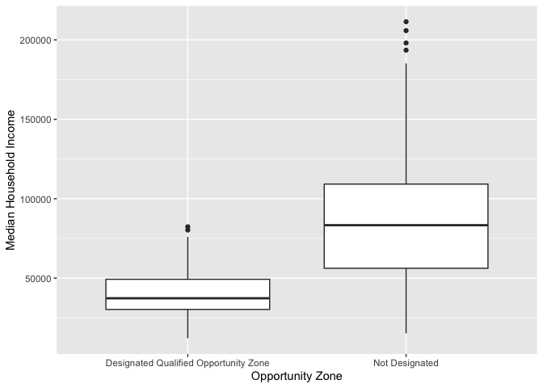
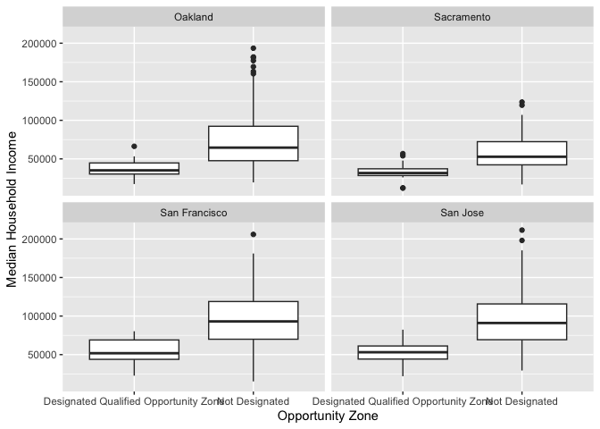

<style>
p.comment {
background-color: #DBDBDB;
padding: 10px;
border: 1px solid black;
margin-left: 25px;
border-radius: 5px;
font-style: normal;
}

.figure {
   margin-top: 20px;
   margin-bottom: 20px;
}

h1.title {
  font-weight: bold;
  font-family: Arial;  
}

h2.title {
  font-family: Arial;  
}

</style>


<style type="text/css">
#TOC {
  font-size: 13px;
  font-family: Arial;
}
</style>


\


The goal of this lab is to acquire skills in running descriptive statistics and creating graphs using R. Make sure you've read and fully understood Handout 4 as this guide tracks closely with the material presented there. In this lab, we will be working with census tract data from [PolicyMap](https://ucdavis.policymap.com/maps).  As described in Handout 3, census tracts are the traditional measure of neighborhoods in the United States.  The objectives of the guide are as follows

1. Learn how to use various R functions to summarize neighborhood characteristics
2. Learn how to make presentation-ready tables of descriptive statistics
3. Introduction to R graphics

This lab guide follows closely and supplements the material presented in Chapters 1,3, 7 and 28 in the textbook [R for Data Science](http://r4ds.had.co.nz/index.html) (RDS) and the class Handout 4.

<p class="comment">**Assignment 4 is due by 10:00 am, February 7th on Canvas.**  See [here](https://crd150.github.io/hw_guidelines.html) for assignment guidelines.  You must submit an `.Rmd` file and its associated `.html` file. Name the files: yourLastName_firstInitial_asgn04. For example: brazil_n_asgn04.</p>

<div style="margin-bottom:25px;">
</div>
## **Open up a R Markdown file**
\

Download the [Lab template](https://raw.githubusercontent.com/crd150/data/master/labtemplate.Rmd) into an appropriate folder on your hard drive (preferably, a folder named 'Lab 4'), open it in R Studio, and type and run your code there. The template is also located on Canvas under Files. Change the title ("Lab 4") and insert your name and date. Don't change anything else inside the YAML (the stuff at the top in between the `---`).  Also keep the grey chunk after the YAML. For a rundown on the use of R Markdown, see the [assignment guidelines](https://crd150.github.io/hw_guidelines.html)

<div style="margin-bottom:25px;">
</div>
## **Installing and loading packages**
\

We will be installing two new packages in this lab. Install the following packages. These packages will be needed to create presentation ready tables. Remember, you only do this once, and never within your R Markdown.


```r
install.packages("flextable")
install.packages("webshot")
```


Load the following packages using `library()`. Remember, you need to do this every time you run an R session, so the following code should appear at the top of your R Markdown file.


```r
library(tidyverse)
library(flextable)
library(webshot)
```


<div style="margin-bottom:25px;">
</div>
## **Reading in census tract data**
\

You will be working with census tract data for the cities of Sacramento, San Francisco, San Jose, and Oakland, the four largest cities in Northern California.  Let's get some more practice working with data from PolicyMap. To save us time, I downloaded data from PolicyMap, cleaned the file, and uploaded it on GitHub. The data file and its metadata are also located on Canvas in the Week 4 Lab folder under Files. Let's bring the csv file into R using `read_csv()`.


```r
ncal.tracts <- read_csv("https://raw.githubusercontent.com/crd150/data/master/pmap_lab3.csv")
```

Make sure you take a look at any dataset you bring into R.


```r
glimpse(ncal.tracts)
```

```
## Rows: 599
## Columns: 8
## $ fips      <dbl> 6067005205, 6067007204, 6067009601, 6067007106, 6067005301, …
## $ oppzone   <chr> "Designated Qualified Opportunity Zone", "Designated Qualifi…
## $ city      <chr> "Sacramento", "Sacramento", "Sacramento", "Sacramento", "Sac…
## $ levratio  <dbl> 2.280000, 3.220000, 3.450000, 2.750000, 3.367861, 2.990000, …
## $ medincome <dbl> 30585, 56806, 52750, 98056, 12355, 61061, 41614, 30309, 5137…
## $ phisp     <dbl> 0.23168831, 0.25734355, 0.29462923, 0.25339747, 0.34152140, …
## $ pblk      <dbl> 0.09298701, 0.10451256, 0.21833995, 0.10547204, 0.30427892, …
## $ mhisp     <chr> "Not Majority", "Not Majority", "Not Majority", "Not Majorit…
```

The dataset contains tract-level median household income, percent Hispanic, percent Black, whether the tract is designated as an [Opportunity Zone](https://opzones.ca.gov/) (a high-poverty neighborhood eligible for federal economic development funding), the home mortgage loan-to-income ratio (also known as the [leverage ratio](https://www.citylab.com/equity/2015/11/the-housing-boom-is-not-a-bubble/417966/)), and whether the tract is "Majority" Hispanic (*phisp* > 50%) or "Not Majority" Hispanic.  Make sure you explore PolicyMap on your own, as it offers a wealth of data that may be useful for your final projects. Check the PolicyMap [tutorial](https://crd150.github.io/policymap.html) for steps to downloading and cleaning PolicyMap data.

<div style="margin-bottom:25px;">
</div>
## **Summarizing a single variable**
\

Recall from Handout 4 our two important data types: categorical and numeric. Let's first summarize a single numeric variable - neighborhood median household income - using some basic descriptive statistics.

<div style="margin-bottom:25px;">
</div>
### **Numeric variables**
\

We can use the function `summarize()` to calculate mean neighborhood income.  The first argument inside `summarize()` is the data object *ncal.tracts* and the second argument is the function calculating the specific summary statistic, in this case `mean()`, which unsurprisingly calculates the mean of the variable you indicate in between the parentheses.


```r
ncal.tracts %>%
      summarize(mean(medincome))
```

```
## # A tibble: 1 × 1
##   `mean(medincome)`
##               <dbl>
## 1                NA
```

We get the value *NA*, which as we learned in [Lab 3](https://crd150.github.io/lab3.html#Missing_data) represents a missing value. If a variable has missing values, functions like `mean()` will return an `NA`.  If we use the function `summary()`, we find that *medincome* has 8 tracts with missing median income values


```r
summary(ncal.tracts)
```

```
##       fips             oppzone              city              levratio    
##  Min.   :6.001e+09   Length:599         Length:599         Min.   :2.050  
##  1st Qu.:6.067e+09   Class :character   Class :character   1st Qu.:3.140  
##  Median :6.075e+09   Mode  :character   Mode  :character   Median :3.368  
##  Mean   :6.063e+09                                         Mean   :3.368  
##  3rd Qu.:6.086e+09                                         3rd Qu.:3.570  
##  Max.   :6.086e+09                                         Max.   :5.460  
##                                                                           
##    medincome          phisp             pblk            mhisp          
##  Min.   : 12171   Min.   :0.0000   Min.   :0.00000   Length:599        
##  1st Qu.: 49690   1st Qu.:0.1039   1st Qu.:0.01798   Class :character  
##  Median : 77188   Median :0.1944   Median :0.04365   Mode  :character  
##  Mean   : 80407   Mean   :0.2447   Mean   :0.09279                     
##  3rd Qu.:104670   3rd Qu.:0.3411   3rd Qu.:0.11576                     
##  Max.   :211442   Max.   :0.8172   Max.   :0.63884                     
##  NA's   :8
```

In order to calculate the mean (or any numeric descriptive statistic) for a variable with missing values, use the argument `na.rm = TRUE`, which will calculate the mean of the variable without the missing values.


```r
summarize(ncal.tracts, mean(medincome, na.rm = TRUE))
```

```
## # A tibble: 1 × 1
##   `mean(medincome, na.rm = TRUE)`
##                             <dbl>
## 1                          80407.
```


Does the average neighborhood income differ by city?  We need to pair `summarize()` with the function `group_by()` to answer this question.  The function `group_by()` tells R to run subsequent functions on the data object *by* a group characteristic (such as gender, educational attainment, or in this case, city). Let's use our new best friend `%>%`, who we met in [Lab 2](https://crd150.github.io/lab2.html#Pipes), to accomplish this task.


```r
ncal.tracts %>%
  group_by(city) %>%
  summarize(mean(medincome, na.rm = TRUE))
```

```
## # A tibble: 4 × 2
##   city          `mean(medincome, na.rm = TRUE)`
##   <chr>                                   <dbl>
## 1 Oakland                                66559.
## 2 Sacramento                             53798.
## 3 San Francisco                          91052.
## 4 San Jose                               91805.
```

The first pipe sends *ncal.tracts* into the function *group_by()*, which tells R to group *ncal.tracts* by the variable *city*.  


```r
ncal.tracts %>%
  group_by(city)
```

How do you know the tibble is grouped? Because it tells you 

<br>

<center>


</center>

<br>

The second pipe takes this grouped dataset and sends it into the `summarize()` command, which calculates the mean neighborhood income (by city, because the dataset is grouped by city).

We can calculate more than one summary statistic within `summarize()`.  For example, to get the mean, median, standard deviation and interquartile range (IQR) of median income, and give column labels for the variables in the resulting summary table, we type in


```r
ncal.tracts %>%
  group_by(city) %>%
  summarize(Mean = mean(medincome,  na.rm = TRUE),
            Median = median(medincome, na.rm = TRUE),
            SD = sd(medincome,  na.rm = TRUE),
            IQR = IQR(medincome,  na.rm = TRUE))
```

```
## # A tibble: 4 × 5
##   city            Mean Median     SD    IQR
##   <chr>          <dbl>  <dbl>  <dbl>  <dbl>
## 1 Oakland       66559. 51438. 41417. 40686.
## 2 Sacramento    53798. 49552  24415. 28390.
## 3 San Francisco 91052. 89184. 37913. 50444 
## 4 San Jose      91805. 88299  34650. 48412.
```

<br>

Remember from Handout 4 that the IQR is the difference between the 75th and 25th percentiles.  It is a measure of spread, and more generally, an indicator of inequality.  Another measure of spread or inequality is the 90/10 ratio. To calculate this ratio, we'll first need to calculate the 90th and 10th percentiles using the `quantile()` command, where we indicate the percentile using the argument `p = `. We can do all of this inside `summarize()`. Make sure you understand what each function in the code below is doing. 


```r
ncal.tracts %>%
  group_by(city) %>%
  summarize(p90 = quantile(medincome, p = 0.90,  na.rm = TRUE),
            p10 = quantile(medincome, p = 0.10,  na.rm = TRUE),
            Ratio9010 = p90/p10) %>%
  select(-(c(p90,p10)))
```

```
## # A tibble: 4 × 2
##   city          Ratio9010
##   <chr>             <dbl>
## 1 Oakland            4.39
## 2 Sacramento         3.15
## 3 San Francisco      3.49
## 4 San Jose           2.73
```


<div style="margin-bottom:25px;">
</div>
### **Categorical variables**
\

Let's next summarize a single categorical variable.  *oppzone* indicates whether a tract is designated as an [Opportunity Zone](https://opzones.ca.gov/) neighborhood. The variable has two categories: designated and not designated as an Opportunity Zone. 

To get the proportion of tracts that are Opportunity Zone neighborhoods, you'll need to combine the functions `group_by()`, `summarize()` and `mutate()` using `%>%`.


```r
ncal.tracts %>%
  group_by(oppzone) %>%
  summarize(n = n()) %>%
  mutate(freq = n / sum(n))
```

```
## # A tibble: 2 × 3
##   oppzone                                   n  freq
##   <chr>                                 <int> <dbl>
## 1 Designated Qualified Opportunity Zone    75 0.125
## 2 Not Designated                          524 0.875
```

Let's break up this chunk of code to show exactly what was done here. First, *ncal.tracts* was piped into the `group_by()` function.  Next, `group_by(oppzone)` separates the neighborhoods by Opportunity Zone designation. We then used `summarize()` to count the number of neighborhoods by Opportunity Zone designation.  The function to get a count is `n()`, and we saved this count in a variable named *n*. This gave us the following table.


```r
ncal.tracts %>%
  group_by(oppzone) %>%
  summarize (n = n())
```

```
## # A tibble: 2 × 2
##   oppzone                                   n
##   <chr>                                 <int>
## 1 Designated Qualified Opportunity Zone    75
## 2 Not Designated                          524
```

There are 75 neighborhoods that are designated as an Opportunity Zone. Next, this table is piped into  `mutate()`, which creates a variable *freq* showing the proportion of all neighborhoods by Opportunity Zone designation (how would you transform this to a percentage?). The code `sum(n)` adds the values of *n*:  524+75 = 599. We then divide the value of each *n* by this sum:  75/599 = 0.125 and 524/599 = 0.875. That yields the final frequency table. 


```r
ncal.tracts %>%
  group_by(oppzone) %>%
  summarize (n = n()) %>%
  mutate(freq = n / sum(n))
```

```
## # A tibble: 2 × 3
##   oppzone                                   n  freq
##   <chr>                                 <int> <dbl>
## 1 Designated Qualified Opportunity Zone    75 0.125
## 2 Not Designated                          524 0.875
```

  
We can add *city* to the `group_by()` function to disaggregate the above result by city.  


```r
ncal.tracts %>%
  group_by(city, oppzone) %>%
  summarize (n = n()) %>%
  mutate(freq = n / sum(n))
```

```
## # A tibble: 8 × 4
## # Groups:   city [4]
##   city          oppzone                                   n   freq
##   <chr>         <chr>                                 <int>  <dbl>
## 1 Oakland       Designated Qualified Opportunity Zone    30 0.265 
## 2 Oakland       Not Designated                           83 0.735 
## 3 Sacramento    Designated Qualified Opportunity Zone    23 0.23  
## 4 Sacramento    Not Designated                           77 0.77  
## 5 San Francisco Designated Qualified Opportunity Zone    11 0.0558
## 6 San Francisco Not Designated                          186 0.944 
## 7 San Jose      Designated Qualified Opportunity Zone    11 0.0582
## 8 San Jose      Not Designated                          178 0.942
```
 
Which city has the highest proportion of Opportunity Zone neighborhoods? Lowest? 

<div style="margin-bottom:25px;">
</div>
## **Summarizing two variables**
\

The functions we've gone through so far describe **one** variable. It is often the case that we are interested in understanding whether two variables are associated with one another. 

Let's go through the ways we can describe the association between: (1) two categorical variables; (2) one categorical variable and one numeric variable; and (3) two numeric variables.

<div style="margin-bottom:25px;">
</div>
### **Two categorical variables**
\

To summarize the relationship between two categorical variables, you'll need to find the proportion of observations for each combination, also known as a cross tabulation. Let's create a cross tabulation of the categorical variables *oppzone* and *mhisp*. We do this by using both variables in the `group_by()` command.


```r
ncal.tracts %>%
  group_by(oppzone, mhisp) %>%
  summarize(n = n())  %>%
  mutate(freq = n / sum(n))
```

```
## # A tibble: 4 × 4
## # Groups:   oppzone [2]
##   oppzone                               mhisp            n   freq
##   <chr>                                 <chr>        <int>  <dbl>
## 1 Designated Qualified Opportunity Zone Majority        16 0.213 
## 2 Designated Qualified Opportunity Zone Not Majority    59 0.787 
## 3 Not Designated                        Majority        47 0.0897
## 4 Not Designated                        Not Majority   477 0.910
```

A much higher proportion of Opportunity Zone neighborhoods are Majority Hispanic (0.213) compared to non Opportunity Zone neighborhoods (0.0897).

<div style="margin-bottom:25px;">
</div>
### **One categorical, one numeric**
\

A typical way of summarizing the relationship between a categorical variable and a numeric variable is to take the mean of the numeric variable for each level of the categorical variable. We can get the mean median household income for neighborhoods designated and not designated as an Opportunity Zone using the following code.


```r
ncal.tracts %>%
  group_by(oppzone) %>%
  summarize("Mean Income" = mean(medincome, na.rm = TRUE))
```

```
## # A tibble: 2 × 2
##   oppzone                               `Mean Income`
##   <chr>                                         <dbl>
## 1 Designated Qualified Opportunity Zone        40694.
## 2 Not Designated                               86003.
```

Let's separate by city by adding *city* to the `group_by()` function.


```r
ncal.tracts %>%
  group_by(city, oppzone) %>%
  summarize("Mean Income" = mean(medincome, na.rm = TRUE))
```

```
## # A tibble: 8 × 3
## # Groups:   city [4]
##   city          oppzone                               `Mean Income`
##   <chr>         <chr>                                         <dbl>
## 1 Oakland       Designated Qualified Opportunity Zone        36980.
## 2 Oakland       Not Designated                               77380.
## 3 Sacramento    Designated Qualified Opportunity Zone        33468.
## 4 Sacramento    Not Designated                               59606.
## 5 San Francisco Designated Qualified Opportunity Zone        53810 
## 6 San Francisco Not Designated                               93291.
## 7 San Jose      Designated Qualified Opportunity Zone        53305.
## 8 San Jose      Not Designated                               93993.
```


<div style="margin-bottom:25px;">
</div>
### **Two numeric variables**
\

You can summarize the relationship between two numeric variables with the correlation coefficient.  To calculate the correlation coefficient, use the function `cor()`.  The first two arguments in `cor()` are the two numeric variables you want to calculate the correlation for. Let's calculate the correlation between neighborhood income and percent race, and neighborhood loan-to-income ratio and percent black. Note that the argument `use = "complete.obs"` removes the missing values in *medincome*.


```r
ncal.tracts %>%
  summarize(blk_inc = cor(medincome,pblk, use = "complete.obs"))
```

```
## # A tibble: 1 × 1
##   blk_inc
##     <dbl>
## 1  -0.445
```

Group these correlations by city. 


```r
ncal.tracts %>%
  group_by(city) %>%
  summarize(blk_inc = cor(medincome,pblk, use = "complete.obs"))
```

```
## # A tibble: 4 × 2
##   city          blk_inc
##   <chr>           <dbl>
## 1 Oakland        -0.487
## 2 Sacramento     -0.490
## 3 San Francisco  -0.340
## 4 San Jose       -0.236
```

Make sure you understand what these values mean (see Handout 4).

<div style="margin-bottom:25px;">
</div>
### **Tables for presentation**
\

The output from the descriptive statistics we've ran so far is not presentation ready. For example, taking a screenshot of the following results table produces unnecessary information that is confusing and messy.


```r
ncal.tracts %>%
  group_by(city) %>%
  summarize(Mean = mean(medincome,  na.rm = TRUE),
            Median = median(medincome, na.rm = TRUE),
            SD = sd(medincome,  na.rm = TRUE),
            IQR = IQR(medincome,  na.rm = TRUE))
```

```
## # A tibble: 4 × 5
##   city            Mean Median     SD    IQR
##   <chr>          <dbl>  <dbl>  <dbl>  <dbl>
## 1 Oakland       66559. 51438. 41417. 40686.
## 2 Sacramento    53798. 49552  24415. 28390.
## 3 San Francisco 91052. 89184. 37913. 50444 
## 4 San Jose      91805. 88299  34650. 48412.
```

Furthermore, you would like to show a table, say, in your final project that does not require you to take a screenshot, but instead can be produced via code, that way it can be fixed if there is an issue, and is reproducible. 

One way of producing presentation tables in R is through the **flextable** package. First, before creating any table, run the following code to ensure that the tables you save will have a transparent or white background (the default is gray).


```r
set_flextable_defaults(background.color = "white")
```

Next, you will need to save the tibble or data frame of results into an object. For example, let's save the above results into an object named *ncal.summary*


```r
ncal.summary <- ncal.tracts %>%
  group_by(city) %>%
  summarize(Mean = mean(medincome,  na.rm = TRUE),
            Median = median(medincome, na.rm = TRUE),
            SD = sd(medincome,  na.rm = TRUE),
            IQR = IQR(medincome,  na.rm = TRUE))
```

You then input the object into the function `flextable()`. Save it into an object called *my_table*


```r
my_table <- flextable(ncal.summary)
```

If you type in *my_table* in the console, you should see a relatively clean table pop up in the Viewer window. We can progressively pipe the *my_table* object through **flextable** formatting functions. For example, you can change the column header names using the function `set_header_labels()` and center the header names using the function `align()`


```r
my_table <- my_table %>%
          set_header_labels(
            city = "City",
            Mean = "Mean",
            Median = "Median",
            SD = "Standard Deviation",
            IQR = "IQR") %>%
  colformat_double(digits = 1) %>%
  align(align = "center")

my_table
```

```{=html}
<div class="tabwid"><style>.cl-bf3770c4{}.cl-bf2a5d08{font-family:'Helvetica';font-size:11pt;font-weight:normal;font-style:normal;text-decoration:none;color:rgba(0, 0, 0, 1.00);background-color:transparent;}.cl-bf2e82de{margin:0;text-align:left;border-bottom: 0 solid rgba(0, 0, 0, 1.00);border-top: 0 solid rgba(0, 0, 0, 1.00);border-left: 0 solid rgba(0, 0, 0, 1.00);border-right: 0 solid rgba(0, 0, 0, 1.00);padding-bottom:5pt;padding-top:5pt;padding-left:5pt;padding-right:5pt;line-height: 1;background-color:transparent;}.cl-bf2e82f2{margin:0;text-align:right;border-bottom: 0 solid rgba(0, 0, 0, 1.00);border-top: 0 solid rgba(0, 0, 0, 1.00);border-left: 0 solid rgba(0, 0, 0, 1.00);border-right: 0 solid rgba(0, 0, 0, 1.00);padding-bottom:5pt;padding-top:5pt;padding-left:5pt;padding-right:5pt;line-height: 1;background-color:transparent;}.cl-bf2e82f3{margin:0;text-align:center;border-bottom: 0 solid rgba(0, 0, 0, 1.00);border-top: 0 solid rgba(0, 0, 0, 1.00);border-left: 0 solid rgba(0, 0, 0, 1.00);border-right: 0 solid rgba(0, 0, 0, 1.00);padding-bottom:5pt;padding-top:5pt;padding-left:5pt;padding-right:5pt;line-height: 1;background-color:transparent;}.cl-bf2ea0f2{width:0.75in;background-color:rgba(255, 255, 255, 1.00);vertical-align: middle;border-bottom: 1.5pt solid rgba(102, 102, 102, 1.00);border-top: 1.5pt solid rgba(102, 102, 102, 1.00);border-left: 0 solid rgba(0, 0, 0, 1.00);border-right: 0 solid rgba(0, 0, 0, 1.00);margin-bottom:0;margin-top:0;margin-left:0;margin-right:0;}.cl-bf2ea0fc{width:0.75in;background-color:rgba(255, 255, 255, 1.00);vertical-align: middle;border-bottom: 1.5pt solid rgba(102, 102, 102, 1.00);border-top: 1.5pt solid rgba(102, 102, 102, 1.00);border-left: 0 solid rgba(0, 0, 0, 1.00);border-right: 0 solid rgba(0, 0, 0, 1.00);margin-bottom:0;margin-top:0;margin-left:0;margin-right:0;}.cl-bf2ea106{width:0.75in;background-color:rgba(255, 255, 255, 1.00);vertical-align: middle;border-bottom: 0 solid rgba(0, 0, 0, 1.00);border-top: 0 solid rgba(0, 0, 0, 1.00);border-left: 0 solid rgba(0, 0, 0, 1.00);border-right: 0 solid rgba(0, 0, 0, 1.00);margin-bottom:0;margin-top:0;margin-left:0;margin-right:0;}.cl-bf2ea107{width:0.75in;background-color:rgba(255, 255, 255, 1.00);vertical-align: middle;border-bottom: 1.5pt solid rgba(102, 102, 102, 1.00);border-top: 0 solid rgba(0, 0, 0, 1.00);border-left: 0 solid rgba(0, 0, 0, 1.00);border-right: 0 solid rgba(0, 0, 0, 1.00);margin-bottom:0;margin-top:0;margin-left:0;margin-right:0;}</style><table data-quarto-disable-processing='true' class='cl-bf3770c4'><thead><tr style="overflow-wrap:break-word;"><th class="cl-bf2ea0f2"><p class="cl-bf2e82de"><span class="cl-bf2a5d08">City</span></p></th><th class="cl-bf2ea0fc"><p class="cl-bf2e82f2"><span class="cl-bf2a5d08">Mean</span></p></th><th class="cl-bf2ea0fc"><p class="cl-bf2e82f2"><span class="cl-bf2a5d08">Median</span></p></th><th class="cl-bf2ea0fc"><p class="cl-bf2e82f2"><span class="cl-bf2a5d08">Standard Deviation</span></p></th><th class="cl-bf2ea0fc"><p class="cl-bf2e82f2"><span class="cl-bf2a5d08">IQR</span></p></th></tr></thead><tbody><tr style="overflow-wrap:break-word;"><td class="cl-bf2ea106"><p class="cl-bf2e82f3"><span class="cl-bf2a5d08">Oakland</span></p></td><td class="cl-bf2ea106"><p class="cl-bf2e82f3"><span class="cl-bf2a5d08">66,558.9</span></p></td><td class="cl-bf2ea106"><p class="cl-bf2e82f3"><span class="cl-bf2a5d08">51,437.5</span></p></td><td class="cl-bf2ea106"><p class="cl-bf2e82f3"><span class="cl-bf2a5d08">41,417.3</span></p></td><td class="cl-bf2ea106"><p class="cl-bf2e82f3"><span class="cl-bf2a5d08">40,686.5</span></p></td></tr><tr style="overflow-wrap:break-word;"><td class="cl-bf2ea106"><p class="cl-bf2e82f3"><span class="cl-bf2a5d08">Sacramento</span></p></td><td class="cl-bf2ea106"><p class="cl-bf2e82f3"><span class="cl-bf2a5d08">53,797.9</span></p></td><td class="cl-bf2ea106"><p class="cl-bf2e82f3"><span class="cl-bf2a5d08">49,552.0</span></p></td><td class="cl-bf2ea106"><p class="cl-bf2e82f3"><span class="cl-bf2a5d08">24,414.8</span></p></td><td class="cl-bf2ea106"><p class="cl-bf2e82f3"><span class="cl-bf2a5d08">28,390.5</span></p></td></tr><tr style="overflow-wrap:break-word;"><td class="cl-bf2ea106"><p class="cl-bf2e82f3"><span class="cl-bf2a5d08">San Francisco</span></p></td><td class="cl-bf2ea106"><p class="cl-bf2e82f3"><span class="cl-bf2a5d08">91,052.1</span></p></td><td class="cl-bf2ea106"><p class="cl-bf2e82f3"><span class="cl-bf2a5d08">89,184.5</span></p></td><td class="cl-bf2ea106"><p class="cl-bf2e82f3"><span class="cl-bf2a5d08">37,913.3</span></p></td><td class="cl-bf2ea106"><p class="cl-bf2e82f3"><span class="cl-bf2a5d08">50,444.0</span></p></td></tr><tr style="overflow-wrap:break-word;"><td class="cl-bf2ea107"><p class="cl-bf2e82f3"><span class="cl-bf2a5d08">San Jose</span></p></td><td class="cl-bf2ea107"><p class="cl-bf2e82f3"><span class="cl-bf2a5d08">91,805.1</span></p></td><td class="cl-bf2ea107"><p class="cl-bf2e82f3"><span class="cl-bf2a5d08">88,299.0</span></p></td><td class="cl-bf2ea107"><p class="cl-bf2e82f3"><span class="cl-bf2a5d08">34,649.9</span></p></td><td class="cl-bf2ea107"><p class="cl-bf2e82f3"><span class="cl-bf2a5d08">48,412.2</span></p></td></tr></tbody></table></div>
```

\


There are a slew of options for formatting your table, including adding footnotes, borders, shade and other features. Check out this [useful](https://epirhandbook.com/en/tables-for-presentation.html) tutorial for an explanation of some of these features.

Once you're done formatting your table, you can then export it to Word, PowerPoint or HTML or as an image (PNG) files. To do this, use one of the following functions: `save_as_docx()`, `save_as_pptx()`, `save_as_image()`, and `save_as_html()`. For the final project, you will likely be saving your tables as images. Before saving, make sure your working diirectory is set to the appropriate folder. Then use the `save_as_image()` function


```r
save_as_image(my_table, path = "ncal_income.png")
```

You first put in the table *my_table*, and set the file name with the png extension. Check your working directory (type in `getwd()`). You should see the file *ncal_income.png* in the folder.


<div style="margin-bottom:25px;">
</div>
## **Summarizing variables using graphs**
\

Another way of summarizing variables and their relationships is through graphs and charts.  The main package for R graphing is **ggplot2** which is a part of the **tidyverse** package.  The graphing function is `ggplot()` and it takes on the basic template

<br>

````
ggplot(data = <DATA>) +
      <GEOM_FUNCTION>(mapping = aes(x, y)) +
      <OPTIONS>()
````
<br>

1. `ggplot()` is the base function where you specify your dataset using the `data = <DATA>` argument.

2. You then need to build on this base by using the plus operator `+` and `<GEOM_FUNCTION>()` where `<GEOM_FUNCTION>()` is a unique `geom` function indicating the type of graph you want to plot. Each unique function has its unique set of mapping arguments which you specify using the `mapping = aes()` argument.  Charts and graphs have an x-axis, y-axis, or both.  Check [this](https://posit.co/wp-content/uploads/2022/10/data-visualization-1.pdf) ggplot cheat sheet for all possible geoms. 

3. `<OPTIONS>()` are a set of functions you can specify to change the look of the graph, for example relabelling the axes or adding a title.

The basic idea is that a ggplot graphic layers geometric objects (circles, lines, etc), themes, and scales on top of data.

You first start out with the base layer. It represents the empty **ggplot** layer defined by the `ggplot()` function with the data object whose variable(s) you want to graph.


```r
ggplot(ncal.tracts)
```

<!-- -->

We get an empty plot. We haven’t told `ggplot()` what type of geometric object(s) we want to plot, nor how the variables should be mapped to the geometric objects, so we just have a blank plot. We need `geoms` to paint the blank canvas.

From here, we add a `geom` layer to the **ggplot** object. Layers are added to **ggplot** objects using `+`, instead of `%>%`, since you are not explicitly piping an object into each subsequent layer, but adding layers on top of one another. Each `geom` is associated with a specific type of graph. For example, below is code that creates a histogram


```r
ggplot(ncal.tracts) + 
  geom_histogram(mapping = aes(x=medincome))
```

<!-- -->

*ncal.tracts* is `<DATA>`, `geom_histogram()` is the `<GEOM_FUNCTION>()`, and `x=medincome` is the variable in *ncal.tracts* we are graphing. There is no *y* argument specified because a histogram only plots one variable.  Let's go through how to create the graphs outlined in Handout 4. 


<div style="margin-bottom:25px;">
</div>
### **Bar charts**
\

Recall from Handout 4 that we use bar charts to summarize categorical variables.  Bar charts, also known as bar plots, show either the number or frequency of each category.  To create a bar chart, use `geom_bar()` for `<GEOM_FUNCTION>()`.  Let's show a bar chart of *oppzone*. We can borrow from the code we used earlier to create our *oppzone* frequency table and pipe this table directly into `ggplot()`.  


```r
ncal.tracts %>% 
  group_by(oppzone) %>%
  summarize (n = n()) %>%
  mutate(freq = n / sum(n))  %>%
  ggplot() +
    geom_bar(mapping=aes(x=oppzone, y=freq),stat="identity") 
```

<!-- -->
    
We didn't need to specify `data = <DATA>` in `ggplot()` because it was piped in.  Within `aes()`, we specified the categorical variable *oppzone* on the x-axis and then the proportion of neighborhoods *freq* on the y-axis.  The argument `stat = "identity"` tells `ggplot()` to plot the exact value listed for the variable *freq*.  

The X and Y axes labels are not so great. Interpretable labels are important for getting your message  across clearly.  We can relabel the axes using the `xlab()` and `ylab()` functions, which are examples of `<OPTIONS>()` functions.


```r
ncal.tracts %>% 
  group_by(oppzone) %>%
  summarize (n = n()) %>%
  mutate(freq = n / sum(n))  %>%
  ggplot() +
    geom_bar(mapping=aes(x=oppzone, y=freq),stat="identity") +
    xlab("Opportunity Zone") +
    ylab("Proportion")
```

<!-- -->
    

<div style="margin-bottom:25px;">
</div>
### **Histograms**
\

Histograms are used to summarize a single numeric variable.  To create a histogram, use `geom_histogram()` for `<GEOM_FUNCTION()>`.  Let's create a histogram of median household income.


```r
ggplot(ncal.tracts) + 
  geom_histogram(mapping = aes(x=medincome)) +
  xlab("Median Household Income") 
```

```
## `stat_bin()` using `bins = 30`. Pick better value with `binwidth`.
```

```
## Warning: Removed 8 rows containing non-finite values (`stat_bin()`).
```

<!-- -->


As described earlier, because a single variable is plotted on the x-axis, we specify `x =` in `aes()` but not a `y = `.   The message before the plot tells us that we can use the `bins =` argument to change the number of bins used to produce the histogram.  You can increase the number of bins to make the bins narrower and thus get a finer grain of detail. Or you can decrease the number of bins to get a broader visual summary of the shape of the variable's distribution. Try changing the number of bins and see what you get.


<div style="margin-bottom:25px;">
</div>
### **Boxplots**
\

We can use a boxplot to visually summarize the distribution of a single variable or the relationship between a categorical and numeric variable.  Use `geom_boxplot()` for `<GEOM_FUNCTION()>` to create a boxplot.  Let's examine median household income.   


```r
ggplot(ncal.tracts) +
     geom_boxplot(mapping = aes(y = medincome))+
    ylab("Median Household Income") 
```

<!-- -->

Remember from Handout 4 that the points outside the whiskers represent outliers. Outliers are defined as having values that are either larger than the 75th percentile plus 1.5 times the IQR or smaller than the 25th percentile minus 1.5 times the IQR.  The IQR is $55,103, the 75th percentile is $104,670 and the 25th percentile is $49,568.  While we don't see outliers at the bottom, we do see outliers at the top - these are neighborhoods with median income values greater than $104,670 + 1.5*$55,103 = $187,324.5

Let's examine the distribution of median income by Opportunity Zone. Because we are examining the association between two variables, we need to specify *x* **and** *y* variables.  


```r
ggplot(ncal.tracts) +
    geom_boxplot(mapping = aes(x = oppzone, y = medincome)) +
    xlab("Opportunity Zone") +
    ylab("Median Household Income") 
```

<!-- -->

The boxplot is for all neighborhoods combined.  We can use the `facet_wrap()`function to separate by city      
        

```r
ggplot(ncal.tracts) +
  geom_boxplot(mapping = aes(x = oppzone, y = medincome)) +
  xlab("Opportunity Zone") +
  ylab("Median Household Income") +
  facet_wrap(~city) 
```

<!-- -->

Note the tilde operator `~` before city.  

The labels for *oppzone* are really long.  We can change the label names (as an exercise, try this on your own) or we can create horizontal boxplots.  To create horizontal boxplots, add the `coord_flip()` function at the end.  


```r
ggplot(ncal.tracts) +
    geom_boxplot(mapping = aes(x = oppzone, y = medincome)) +
    facet_wrap(~city) +
    ylab("Median Household Income") +
    xlab("Opportunity Zone") +
    coord_flip()
```

<!-- -->

<div style="margin-bottom:25px;">
</div>
### **Scatterplots**
\

The scatterplot is the traditional graph for visualizing the association between two numeric variables. For scatterplots, we use `geom_point()` for `<GEOM_FUNCTION>()`. Because we are plotting two variables, we specify an *x* and *y* variable. Does median household income change with greater percent Hispanic in the neighborhood?


```r
ggplot(ncal.tracts) +
    geom_point(mapping = aes(x = phisp, y = medincome)) +
    xlab("Percent Hispanic") +
    ylab("Median Household Income")
```

<!-- -->

And for each city?


```r
ggplot(ncal.tracts) +
    geom_point(mapping = aes(x = phisp, y = medincome)) +
    xlab("Percent Hispanic") +
    ylab("Median Household Income") +
    facet_wrap(~city) 
```

<!-- -->

<br>

What do these scatter plots suggest about the relationship between income and percent Hispanic across these four cities?

`ggplot()` is a powerful function, and you can make a lot of visually captivating graphs. We have just scratched the surface of its functions and features.  The list of all possible plots for `<GEOM_FUNCTION>()` can be found [here](https://ggplot2.tidyverse.org/reference/).  You can also make your graphs really "pretty" and professional looking by altering graphing features using `<OPTIONS()`, including colors, labels, titles and axes.  For a list of options that alter various features of a graph, check out [Chapter 28 in RDS](http://r4ds.had.co.nz/graphics-for-communication.html).  


Here's your **ggplot2** badge. Wear it with pride!


<center>
{ width=25% }

</center>

<div style="margin-bottom:25px;">
</div>
### **Saving plots**
\

You will, on occasion, need to save a plot to a specific file. Specifically, we expect you to create plots and graphs, save them, and upload them for your final project. Don’t use the built-in “Export” button! If you do, your figure is not reproducible – no one will know how your plot was exported. Instead, use `ggsave()` by explicitly creating the figure and exporting

Let's save the scatterplot of percent Hispanic and median household income as a .png file named "phisp_inc.png".  First, we save the plot produced by `ggplot()` into an R object named *phisp_inc*


```r
phisp_inc <- ggplot(ncal.tracts) +
    geom_point(mapping = aes(x = phisp, y = medincome)) +
    xlab("Percent Hispanic") +
    ylab("Median Household Income")
```

We then save *phisp_inc* using `ggsave()`


```r
ggsave("phisp_inc.png", phisp_inc)
```

Navigate to your working directory folder (type in `getwd()` to find what this folder is) and you should see *phisp_inc.png*.


<div style="margin-bottom:25px;">
</div>
## **Assignment 4**
\


Download and open the [Assignment 4 R Markdown Script](https://raw.githubusercontent.com/crd150/data/master/yourLastName_firstInitial_asgn04.Rmd). Any response requiring a data analysis task  must be supported by code you generate to produce your result. Just examining your various objects in the “Environment” section of R Studio is insufficient—you must use scripted commands. Submit the `Rmd` and its knitted `html` files on Canvas.

<br>
  
1. As a comprehensive source for neighborhood data, PolicyMap allows you to examine interesting associations across different dimensions of neighborhood health and well-being outside of those provided in the U.S. Census.  Let's examine the potential predictors of resident health in the City of Sacramento. Bring into R the dataset [sac_health_policymap.csv](https://raw.githubusercontent.com/crd150/data/master/sac_health_policymap.csv), which contains census-tract level data on Sacramento downloaded from PolicyMap.  I've also uploaded the file on Canvas (Files - Week 4 - Assignment). Consider the dataset to be cleaned and ready for analysis.  A record layout of the data can be found [here](https://raw.githubusercontent.com/crd150/data/master/assgn4_question1_codebook.txt).  

a. Create an appropriate plot that shows the shape of the distribution for the variable *health*, which measures the percent of residents reporting very good to excellent health.  Describe the shape of the distribution. (2 points)

b. Examine the association between *health* and the variable *phys*. Based on this examination, briefly describe the relationship between the variable *health* and *phys*. (2 points)

c. Create the appropriate plots showing the association between *health* and the following variables: *foodaccess*, *unemp*, and *medinc*. (3 points)

d. Based on these plots, briefly describe the relationship between *health* and the three variables. Describe any nonlinearities in the relationships. (2 points)

<br>

2. The following questions investigate housing structure in Yolo County. Bring into R the dataset [ca_border_tracts.csv](https://raw.githubusercontent.com/crd150/data/master/ca_border_tracts.csv), which contains 2012-2016 American Community Survey (ACS) data for census tracts in California and states sharing a boundary with California (Arizona, Nevada, and Oregon). I've also uploaded the file on Canvas (Files - Week 4 - Assignment). Consider the dataset to be cleaned and ready for analysis.  A record layout of the data can be found [here](https://raw.githubusercontent.com/crd150/data/master/assgn4_question2_codebook.txt). 

a. Calculate 90/10 percentile ratios for median household income for each region (Bay Area, Southern California, Other California, Arizona, Nevada, and Oregon).  Present these values in a presentation-ready table using `flextable()`. Which region exhibits the highest neighborhood income inequality? Lowest? (2 points)

b. What is the mean, median, interquartile range, and standard deviation of the percentage of houses built after 2000 in Yolo County? Show these values in a presentation-ready table using `flextable()`. (2 points) 

c. What is the correlation between median household income and percentage of houses built after 2000 in Yolo County? (1 point)

d. Show a plot investigating any potential outliers in the percentage of houses built after 2000 in Yolo County. (2 points)

e. Did you find any outliers? If so, how many? What is the mean, median and standard deviation of the percentage of houses built after 2000 in Yolo County *without* these outliers? Present these values in a presentation-ready table using `flextable()`. What about the correlation between median household income and percentage of houses built after 2000? Briefly comment on what you learned in question 2e. (Hint: How are outliers numerically defined in the plot in 2d? ) (4 points)


***


<a rel="license" href="http://creativecommons.org/licenses/by-nc/4.0/"></a><br />This work is licensed under a <a rel="license" href="http://creativecommons.org/licenses/by-nc/4.0/">Creative Commons Attribution-NonCommercial 4.0 International License</a>.


Website created and maintained by [Noli Brazil](https://nbrazil.faculty.ucdavis.edu/)
