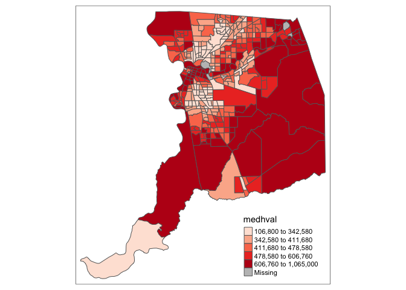

<style>
p.comment {
background-color: #DBDBDB;
padding: 10px;
border: 1px solid black;
margin-left: 25px;
border-radius: 5px;
font-style: italic;
}

.figure {
   margin-top: 20px;
   margin-bottom: 20px;
}

h1.title {
  font-weight: bold;
  font-family: Arial;  
}

h2.title {
  font-family: Arial;  
}

</style>


<style type="text/css">
#TOC {
  font-size: 13px;
  font-family: Arial;
}
</style>


\


The objectives of the guide are as follows 

1. Learn spatial operations on polygon data
2. Learn how to create a spatial weights matrix
3. Calculate global spatial autocorrelation


This lab guide follows closely and supplements the material presented in Chapters 4.1 and 4.2 in the textbook [Geocomputation with R](https://geocompr.robinlovelace.net/) (GWR) and Chapter 7 in the textbook [Geographic Information Analysis](). 

<p class="comment", style="font-style:normal">**Assignment 5 is due by 11:59 pm, February 13th on Canvas.**  See [here](https://crd150.github.io/hw_guidelines.html) for assignment guidelines. You must submit an `.Rmd` file and its associated `.html` file. Name the files: yourLastName_firstInitial_asgn05. For example: brazil_n_asgn05.</p>

<div style="margin-bottom:25px;">
</div>
## **Open up an R Markdown file**
\

Download the [Lab template](https://raw.githubusercontent.com/crd150/data/master/labtemplate.Rmd) into an appropriate folder on your hard drive (preferably, a folder named 'Lab 5'), open it in R Studio, and type and run your code there.  Change the title ("Lab 5") and insert your name and date. Don't change anything else inside the YAML (the stuff at the top in between the `---`).  Also keep the grey chunk after the YAML. For a rundown on the use of R Markdown in labs, see [Lab 1](https://crd150.github.io/lab1.html)

<div style="margin-bottom:25px;">
</div>
## **Installing and loading packages**
\

You’ll need to install the following packages in R. You only need to do it once, so if you’ve already installed these packages, skip the code. Also, don’t put these `install.packages()` in your R Markdown document. Copy and paste the code in the R Console. We’ll talk about what these packages provide as their relevant functions come up in the guide


```r
install.packages("sp")
install.packages("rmapshaper")
install.packages("spdep")
```

You’ll need to load the following packages. Unlike installing, you will always need to load packages whenever you start a new R session. You’ll also always need to use `library()` in your R Markdown file.


```r
library(tidyverse)
library(tidycensus)
library(sf)
library(tigris)
#you need to let R know to bring in the spatial data as sf objects
options(tigris_class = "sf")
library(tmap)
library(rmapshaper)
library(sp)
library(spdep)
```


<div style="margin-bottom:25px;">
</div>
## **Bringing spatial data into R**
\

We will be working with census tract data on the foreign-born population in Sacramento city and the Sacramento metropolitan area. The following code is very similar to the code in [Lab 4](https://crd150.github.io/lab4.html), so we won't dwell on the specifics. We first need to get foreign-born population data for California census tracts. Let's use our best friends the Census API and the function `get_acs()`.


```r
census_api_key("YOUR API KEY GOES HERE")
```

Then use `get_acs()` to bring in the data. 


```r
ca.tracts <- get_acs(geography = "tract", 
              year = 2017,
              variables = c(fb = "B05012_003", totp = "B05012_001"), 
              state = "CA",
              survey = "acs5",
              geometry = TRUE) %>%
              select(-(moe)) %>%
              spread(key = variable, value = estimate) %>%
              mutate(pfb = fb/totp) %>%
              select(GEOID, totp, pfb)
```

Next, let's bring in the Sacramento metropolitan area boundary using `core_based_statistical_areas()` from the **tigris** package.


```r
cb <- core_based_statistical_areas(cb = TRUE, year=2017)
sac.metro <- filter(cb, grepl("Sacramento", NAME))
```

Finally, bring in the Sacramento city boundary using `places()`. 


```r
pl <- places(state = "CA", cb = TRUE, year=2017)
sac.city <- filter(pl, NAME == "Sacramento")
```


<div style="margin-bottom:25px;">
</div>
## **Spatial data wrangling**
\

A major goal in this lab is to compute the spatial autocorrelation of percent foreign born in the Sacramento metropolitan area.  Before we can do this, we need to keep the tracts from *ca.tracts* that are in Sacramento.  Easier said than done. Looking at the variables in the data frame *ca.tracts*, we find that there is no variable that indicates whether the tract belongs to the Sacramento metropolitan area.  This includes the *GEOID*, which only provides state and county census IDs.  In order to extract the Sacramento tracts, we need to do some data wrangling.  However, not just any old data wrangling, but *spatial* data wrangling. Cue [dangerous sounding music](https://www.youtube.com/watch?v=cphNpqKpKc4).

In [Lab 4](https://crd150.github.io/lab4.html), we discovered that all of the nonspatial data wrangling techniques we learned in [Lab 2](https://crd150.github.io/lab2.html) also apply to spatial data. However, spatial data have their own special set of wrangling operations. These functions modify spatial objects based on their location and shape. The **sf** package offers a suite of functions unique to wrangling spatial data.  Most of these functions start out with the prefix `st_`.  To see all of the functions, type in


```r
methods(class = "sf")
```

We won't go through all of these functions as the list is quite extensive.  You can take a look at Chapters 4 and 5 of GWR to see some examples of these functions.  We'll also go through spatial wrangling specific to points in Lab 6. But, let's go through the more relevant ones for this lab guide and this class.  The function we will be primarily using is `st_join()`.

<div style="margin-bottom:25px;">
</div>
### **Intersect**
\

A common spatial data wrangling issue is to subset a set of spatial objects based on their location relative to another spatial object.  In our case, we want to keep California tracts that are in the Sacramento metro area.  Think of what were doing here as something similar to taking a cookie cutter shaped like the Sacramento metro area (in our case, the **sf** object *sac.metro*) and cutting out the metro area from our cookie dough of census tracts (*ca.tracts*).  We can do this using the `st_join()` function


```r
sac.metro.tracts.int <- st_join(x = ca.tracts, y = sac.metro, 
                               join = st_intersects, left=FALSE)
```

The above code tells R to identify the polygons in *ca.tracts* that intersect with the polygon *sac.metro*.  We indicate we want a polygon intersection by specifying `join = st_intersects`.  The option `left=FALSE` tells R to eliminate the polygons from *ca.tracts* that do not intersect (make it `TRUE` and see what happens).

Mapping the border of the Sacramento metropolitan area *sac.metro* (in red) onto these cut out tracts (in blue), we get


```r
ggplot() + 
  geom_sf(data = sac.metro.tracts.int, fill = "blue") +
  geom_sf(data = sac.metro, fill = NA, color = "red")
```

<!-- -->

As a reminder, if you are getting the following error when you map

````
---
Error in grid.Call(C_textBounds, as.graphicsAnnot(x$label), x$x, x$y,  : 
  polygon edge not found
---
````

rerun the code.  Keep rerunning it until the error does not come up. 

<br>

The opposite of `st_intersects is st_disjoint`. If two geometries are disjoint, they do not intersect, and vice-versa. Replace `join = st_intersects` with `join = st_disjoin` and see what you get.

<div style="margin-bottom:25px;">
</div>
### **Within**
\

Do you see an issue with the tracts *sac.metro.tracts.w*?  Using `join = st_intersects` returns all tracts that **intersect** *sac.metro*, which include those that **touch** the metro's boundary. No bueno. We can instead use the argument  `join = st_within` to return tracts that are completely *within* the metro. 


```r
# subset ca.tracts to those in sac.metro
sac.metro.tracts.w <- st_join(ca.tracts, sac.metro, join = st_within, left=FALSE)

ggplot() + 
    geom_sf(data = sac.metro.tracts.w, fill = "blue") +
    geom_sf(data = sac.metro, fill = NA, color = "red")
```

<!-- -->

Now it works!!!  High Five o/ \\o

<br>

If you look at the at *sac.metro.tracts.w*'s attribute table, you'll see it includes all the variables from both *ca.tracts* and *sac.metro*. We don't need these variables, so use `select()` to eliminate them.  You'll also notice that if variables share the same name, R will keep both and attach a *.x* and *.y*  to the end. For example, *GEOID* was found in both *ca.tracts* and *sac.metro*, so R named one *GEOID.x* and the other that was merged in was named *GEOID.y*.


```r
names(sac.metro.tracts.w)
```

```
##  [1] "GEOID.x"  "totp"     "pfb"      "CSAFP"    "CBSAFP"   "AFFGEOID"
##  [7] "GEOID.y"  "NAME"     "LSAD"     "ALAND"    "AWATER"   "geometry"
```

Keep the necessary variables and rename *GEOID.x* back to *GEOID*.


```r
sac.metro.tracts.w <- sac.metro.tracts.w %>%
      select(GEOID.x:pfb) %>%
      rename(GEOID = "GEOID.x")
```


<div style="margin-bottom:25px;">
</div>
### **Clipping**
\

Census tracts neatly fall within a metropolitan area's boundary, as it does for counties.  In other words, tracts don't spill over.  But, it does spill over for cities.  The left diagram in Figure 1 is an example of a metro area in red and four tracts in black - all the tracts fall neatly into the metro boundary.  In contrast, the right diagram is an example of a city on top of four tracts - one tract falls neatly inside (top left), but the other three spill out.


<center>


</center>

If we use `st_join()` with `st_within` for Sacramento city, we’ll produce the following plot


```r
sac.city.tracts.w = st_join(ca.tracts, sac.city, join = st_within, left=FALSE)
ggplot() + 
  geom_sf(data = sac.city.tracts.w, fill = "blue") +
  geom_sf(data = sac.city, fill = NA, color = "red") 
```

<!-- -->

Can you guess what is going on here?

The blue polygons are the tracts we kept. You'll notice that the city is empty around some of the edges of its boundary.  In these cases, only portions of census tracts are within the boundary. `st_within` keeps tracts only if they are *completely within* the boundary.  This is not good when tracts do not neatly fall within a boundary.

One way of dealing with this is to clip the portion of the tract that is inside the boundary.  Clipping will keep just the portion of the tract inside the city boundary and discards the rest of the tract.  We use the function `ms_clip()` which is in the [**rmapshaper**](https://cran.r-project.org/web/packages/rmapshaper/rmapshaper.pdf) package.  In the code below, `target = ca.tracts` tells R to cut out *ca.tracts* using the *sac.city* boundaries.


```r
sac.city.tracts.c <- ms_clip(target = ca.tracts, clip = sac.city, remove_slivers = TRUE)
ggplot() + 
  geom_sf(data = sac.city.tracts.c, fill = "blue") +
  geom_sf(data = sac.city, fill = NA, color = "red")
```

<!-- -->


Now, the city is filled in with tracts. To be clear what a clip is doing, Figure 2 shows a clip of the city example shown in Figure 1.  With a clip, one tract is not clipped because it falls completely within the city (the top left tract). But, the other three are clipped - the portions that are within the boundary are kept (in blue), and the rest (with hash marks) are discarded from the map.  

Because spatial data are not always precise, when you clip you'll sometimes get unwanted [sliver polygons](https://en.wikipedia.org/wiki/Sliver_polygon). The argument `remove_slivers = TRUE` removes these slivers.

<center>


</center>


Sit back and reflect on what a clip is doing in terms of how it represents a city. When you clip a tract and present it as a neighborhood in Sacramento, what are you assuming about that tract? Do you think this assumption is correct? In what ways is the assumption is wrong?

The function `st_overlaps` us the opposite of `st_within`.  Replace `join = st_within` with `join = st_overlaps` to see what this spatial operation produces.  Play around with the other `st_` options and see what you get (type in `? st_join` to find all the options).

<div style="margin-bottom:25px;">
</div>
### **Calculate area**
\

Another useful `st_` function is `st_area()`, which calculates the area of a polygon.  You might need the area, for example, if you want to calculate the density of something (e.g. the number of residents, crimes or trees per meters squared).  To calculate the area, just plug in your **sf** polygon object inside `st_area()`.  Let's find the area of *sac.city.tracts.w* and save it to a vector named *area*


```r
area <- st_area(sac.city.tracts.w)
```

We find that the object *area* is of class *units*


```r
class(area)
```

```
## [1] "units"
```

And the area is in meters squared


```r
area
```

```
## Units: [m^2]
##  [1] 2327060.4 1512570.0 1463450.7  975098.4  866095.5  403388.1  498934.8
##  [8]  568070.9 1577872.0  667854.1  792757.7  794857.9 1745237.3 3055769.1
## [15] 3524130.8 1716995.0 1106144.0 1037844.3 1541582.0 2725701.6 1218553.7
## [22] 3223586.3  985428.8  935123.8 1283782.4  924861.0 2318445.4 2573269.0
## [29] 1252373.7 1156023.0 1654346.9  984307.2 1599634.0 2382303.0 2260735.9
## [36] 1196046.4 1260038.8 1269987.0 1428132.3 4903570.3 2435402.5 3412785.2
## [43] 2996367.5 2179371.0 1968398.2 1652402.6 1887810.5 1646038.0 1207871.4
## [50] 2028272.7 1905370.8 1625437.4 1646702.9 3771040.5 1780715.0 1712940.2
## [57]  952471.2 2055643.1 1874746.5 8905278.9 6242702.1 1297534.2 2813347.0
## [64] 3461723.5 3888061.8 2212860.6 3289682.0 3926262.4 2471415.6 5290734.2
## [71] 2863616.9 3885897.9 2662222.0 1961448.6 1048691.9  673306.7 1979080.9
## [78] 4829069.3 4444028.8 2190099.8 2228979.1 1951779.9 8185367.9 2714006.4
## [85] 1461023.8 1871953.7  705029.9 1179100.6
```

Let's convert it from type *units* to type *numeric* by using the function `as.numeric()` and save it back into *sac.city.tracts.w* using the `mutate()` function


```r
sac.city.tracts.w <- mutate(sac.city.tracts.w, area = as.numeric(st_area(sac.city.tracts.w)))
```

You should find that the variable *area* is now in your dataset.


```r
names(sac.city.tracts.w)
```

```
##  [1] "GEOID.x"  "totp"     "pfb"      "STATEFP"  "PLACEFP"  "PLACENS" 
##  [7] "AFFGEOID" "GEOID.y"  "NAME"     "LSAD"     "ALAND"    "AWATER"  
## [13] "geometry" "area"
```

<div style="margin-bottom:25px;">
</div>
## **sf vs. sp spatial objects**
\

So far, we've been using **sf** to represent spatial data in R.  The traditional way of handling spatial data in R is to use the **sp** package, **sf**'s evil twin sister (actually, no, but almost). **sp** has been around since 2005, and thus has a rich ecosystem of tools built on top of it. However, it uses a rather complex data structure, which can make it challenging to use.  **sf** is newer (first released in 2016) so it doesn’t have such a rich ecosystem. However, it’s much easier to use and fits in very naturally with the tidyverse.  

The trend is gradually shifting towards the use of **sf** as the primary spatial package.  We prefer **sf** over **sp** because it adheres to the tidy principles outlined in RDS, but because it is relatively new, **sf** is not wholly compatible with all of R's spatial functions, particularly those that perform spatial data analysis, including calculating global measures of spatial correlation. In contrast, **sp** is compatible with most spatial functions. As such, we'll need to convert **sf** objects to **sp** objects in some cases.

Use the `as()` function to convert *sac.metro.tracts.w* to an **sp** compatible object. 


```r
#this function to R to convert the sf object to an sp, using "Spatial" to designate sp
sac.metro.tracts.sp <- as(sac.metro.tracts.w, "Spatial")
```

Then use the `class()` function on the **sp** object to see what kind of object we've just created.


```r
class(sac.metro.tracts.sp)
```

```
## [1] "SpatialPolygonsDataFrame"
## attr(,"package")
## [1] "sp"
```

We find out that *sac.metro.tracts.sp* is a **SpatialPolygonsDataFrame** object. **SpatialPolygonsDataFrame** objects are almost like regular R data frames. However, unlike an **sf** spatial object, the attribute and feature data in an **sp** object are stored separately in what are known as [data slots](https://stat.ethz.ch/R-manual/R-devel/library/methods/html/slot.html). To see the complexity of data slots, do a `View()` of the data set


```r
View(sac.metro.tracts.sp)
```

Delving into the feature data slot reveals a series of nested lists and S4 objects, which can be confusing to work with directly.  We won't go into the messy details of **sp** objects and how they differ from **sf** objects.  We'll stick with  **sf** objects when possible, but shift to **sp** when needed, dancing around the details as much as possible and only talking about them when necessary. If you are interested, you can learn more about the **sp** package [here](https://cran.r-project.org/web/packages/sp/vignettes/intro_sp.pdf), [here](https://cran.r-project.org/web/packages/sp/vignettes/over.pdf) and [here](http://www.nickeubank.com/gis-in-r/).  

<div style="margin-bottom:25px;">
</div>
## **Wednesday lecture setup**
\

We went through spatial data wrangling operations during Monday's lecture.  Using these operations,  we created a spatial dataset containing census tracts within the Sacramento metropolitan area. Let's now use that dataset to calculate the spatial autocorrelation of percent foreign born.

First, install the following packages if you have not already done so (we did this during Monday's lecture)


```r
install.packages("sp")
install.packages("spdep")
```

If you get the question "Do you want to install from sources the package which needs compilation?", type in "no" and press return/enter.

Next, load the following packages


```r
library(tidyverse)
library(sf)
library(tmap)
library(sp)
library(spdep)
```

Next, bring into R the Sacramento metropolitan area tract shapefile that we created on Monday.  For your convenience,  I uploaded the file onto GitHub and you can download it onto your hard drive using the following code.


```r
download.file(url = "https://raw.githubusercontent.com/crd150/data/master/week5wedfiles.zip", destfile = "week5wedfiles.zip")
unzip(zipfile = "week5wedfiles.zip")
```

Read the shapefile into R using `st_read()`.


```r
sac.metro.tracts.w <- st_read("sacmetrotractsw.shp", stringsAsFactors = FALSE)
```

There are two census tracts with zero population.  An example of a zero population tract would be something like an airport or a tract located within a state or national forest.  Because nobody lives there, let's take these tracts out using the `filter()` function.


```r
sac.metro.tracts.w <- filter(sac.metro.tracts.w, totp != 0)
```

Now convert *sac.metro.tracts.w* to an **sp** object, which we need to do because the remaining functions in this lab only work with **sp** objects.  


```r
sac.metro.tracts.sp <- as(sac.metro.tracts.w, "Spatial")
```

*sac.metro.tracts.w* contains percent foreign born and total population for tracts in the Sacramento metropolitan area.  *sac.metro.tracts.sp* is the **sp** version of *sac.metro.tracts.w*.  Go through the first half of the lab to determine how these objects were created.

<div style="margin-bottom:25px;">
</div>
## **Spatial autocorrelation**
\

Our next goal is to determine whether the foreign-born population in Sacramento geographically clusters. Let's focus on the Sacramento metropolitan area.  We can explore clustering by examining maps and scatterplots. We can also formally test for clustering by calculating the Moran's I, which was covered in OSU Ch. 7.


<div style="margin-bottom:25px;">
</div>
### **Exploratory mapping**
\

 Before computing spatial autocorrelation, you should map your variable to see if it *looks* like it clusters across space.  Using the function `tm_shape()` and the mapping principles we learned in last week's lecture, let's make a nice map showing the proportion (or percent) foreign-born in the Sacramento metro area using quantile breaks.


```r
tm_shape(sac.metro.tracts.w, unit = "mi") +
  tm_polygons(col = "pfb", style = "quantile",palette = "Reds", 
              border.alpha = 0, title = "") +
  tm_scale_bar(breaks = c(0, 10, 20), size = 1) +
  tm_compass(type = "4star", position = c("left", "bottom")) + 
  tm_layout(main.title = "Percent foreign-born in Sacramento Metropolitan Area 
            Tracts",  main.title.size = 0.95, frame = FALSE)
```

<!-- -->
  
It does look like the foreign-born population clusters.  In particular, there appears to be high concentrations of foreign-born residents in South and North Sacramento city and the more fringe areas of the metro in the North.

<div style="margin-bottom:25px;">
</div>
### **Spatial weights matrix**
\

Before we can formally model the spatial dependency shown in the above map, we must first cover how neighborhoods are spatially connected to one another.  That is, what does "near" mean when we say "near things are more related than distant things"?   You need to define

1. Neighbor connectivity (who is you neighbor?)
2. Neighbor weights (how much does your neighbor matter?)

The functions we will use below are specific to **sp** objects.  As a general rule, we’ll stick with our **sf** object *sac.metro.tracts.w* when possible, but shift to *sac.metro.tracts.sp* when needed.  

<div style="margin-bottom:25px;">
</div>
#### **Neighbor connectivity**
\

A common way of defining neighbors is to see who shares a border.  The two most common ways of defining contiguity is Rook and Queen adjacency (Figure 3).  Rook adjacency refers to neighbors that share a line segment.  Queen adjacency refers to neighbors that share a line segment (or border) or a point (or vertex).


<center>


</center>

Neighbor relationships in R are represented by neighbor *nb* objects.  An *nb* object identifies the neighbors for each feature in the dataset.  We use the command `poly2nb()` from the **spdep** package to create a contiguity-based neighbor object.  

Let's specify Queen connectivity.  The function `poly2nb()` only takes in **sp** objects, so we'll need to use *sac.metro.tracts.sp* here.


```r
sacb<-poly2nb(sac.metro.tracts.sp, queen=T)
```

You plug the object *sac.metro.tracts.sp* into the first argument of `poly2nb()` and then specify Queen contiguity using the argument `queen=T`. To get Rook adjacency, change the argument to `queen=F`. 

The function `summary()` tells us something about the neighborhood. 


```r
summary(sacb)
```

The average number of neighbors (adjacent polygons) is 6.3, 1 polygon has 1 neighbor and 1 has 18 neighbors.


<div style="margin-bottom:25px;">
</div>
#### **Neighbor weights**
\

We've established who our neighbors are by creating an *nb* object.  The next step is to assign weights to each neighbor relationship. The weight determines *how much* each neighbor counts.  You will need to employ the `nb2listw()` command, which will you give you a spatial weights object.


```r
sacw<-nb2listw(sacb, style="W", zero.policy = TRUE)
```

In the command, you first put in your neighbor *nb* object (*sacb*) and then define the weights `style = "W"`. Here, `style = "W"` indicates that the weights for each spatial unit are standardized to sum to 1 (this is known as row standardization - see page 49 in OSU).  For example, if census tract 1 has 3 neighbors, each of those neighbors will have weights of 1/3. This allows for comparability between areas with different numbers of neighbors.

The `zero.policy = TRUE` argument tells R to ignore cases that have **no** neighbors.  How can this occur?  Figure 4 provides an example.  It shows tracts in Los Angeles county.  You'll notice two tracts that are not geographically adjacent to other tracts - they are literally islands (Catalina and San Clemente). So, if you specify queen adjacency, these islands would have no neighbors.   If you conduct a spatial analysis of Los Angeles county tracts in R, most functions will spit out an error indicating that you have polygons with no neighbors.  To avoid that, specify `zero.policy = TRUE`, which will ignore all cases without neighbors.


<center>


</center>


<div style="margin-bottom:25px;">
</div>
### **Moran Scatterplot**
\

We've now defined what we mean by neighbor by creating an *nb* object and the influence of each neighbor by creating a spatial weights matrix.  The map of percent foreign born showed that neighborhood percent foreign born appears to be clustered in Sacramento. We can visually explore this a little more by plotting percent foreign-born on the x-axis and the average percent foreign born of one's neighbors (also known as the spatial lag) on the y-axis.  This plot is known as a Moran scatterplot.  

You can create a Moran scatterplot using the function `moran.plot()`. 


```r
moran.plot(sac.metro.tracts.sp$pfb, sacw,
           xlab = "% foreign born",
           ylab = "Neighbors % foreign born")
```

<!-- -->


The first argument is the variable you want to calculate spatial autocorrelation for. Because we are in the **sp** world, which is not tidy friendly, we refer to variables in *sac.metro.tracts.sp*'s using the dollar sign `$`. *sac.metro.tracts.sp$pfb* will give you the percent foreign born as a vector.


```r
sac.metro.tracts.sp$pfb
```

The second argument is the spatial weights matrix that defines neighbor and interaction.  The `xlab` and `ylab` arguments provides clean labels for the x and y axes.

The x-axis is a tract's percent foreign born and the y-axis is the average percent foreign born of that tract's neighbors. Looks like a fairly strong positive association - the higher your neighbors' percent foreign born, the higher your own neighborhood's percent foreign born.  As we discussed in lecture, you can separate the plot into four quadrants based on positive and negative spatial autocorrelation. 

<div style="margin-bottom:25px;">
</div>
### **Moran's I**
\

The map and Moran scatterplot provide descriptive visualizations of spatial clustering (autocorrelation) in the percent foreign born.  But, rather than eyeballing the correlation, we need a quantitative and objective approach to measuring the degree to which places cluster.  This is where measures of spatial autocorrelation step in.  An index of spatial autocorrelation provides a summary over the entire study area of the level of spatial similarity observed among neighboring observations.  

The most popular test of spatial autocorrelation is the Moran’s I test.  Use the command `moran.test()` in the **spdep** package to calculate the Moran's I.


```r
moran.test(sac.metro.tracts.sp$pfb, sacw)    
```

```
## 
## 	Moran I test under randomisation
## 
## data:  sac.metro.tracts.sp$pfb  
## weights: sacw    
## 
## Moran I statistic standard deviate = 23.926, p-value < 2.2e-16
## alternative hypothesis: greater
## sample estimates:
## Moran I statistic       Expectation          Variance 
##      0.6255551789     -0.0020703934      0.0006881139
```

We find that the Moran's I is positive (0.63) and statistically significant (p-value < 0.05). Remember from lecture that the Moran's I is simply a correlation, and we learned from Handout 3 that correlations go from -1 to 1.  A 0.63 correlation is fairly high (meeting the rule of thumb of 0.30 that OSU states on page 206), indicating strong positive clustering.  Moreover, we find that this correlation is statistically significant (p-value basically at 0).


***


<a rel="license" href="http://creativecommons.org/licenses/by-nc/4.0/"></a><br />This work is licensed under a <a rel="license" href="http://creativecommons.org/licenses/by-nc/4.0/">Creative Commons Attribution-NonCommercial 4.0 International License</a>.


Website created and maintained by [Noli Brazil](https://nbrazil.faculty.ucdavis.edu/)
