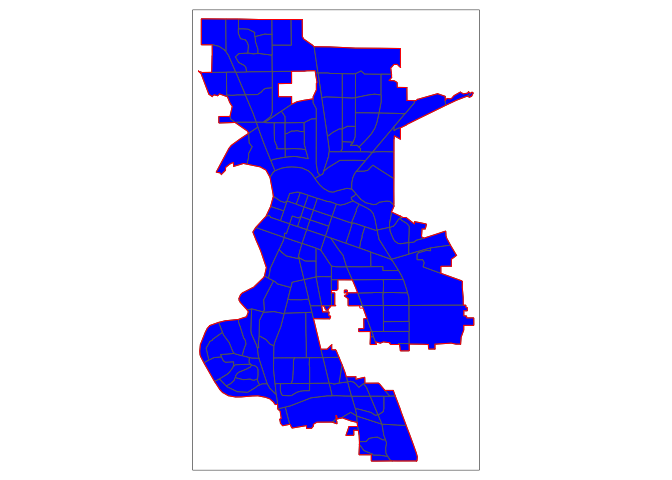
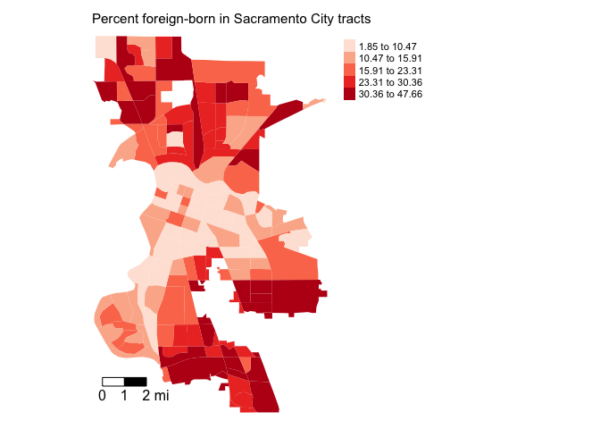

<style>
p.comment {
background-color: #DBDBDB;
padding: 10px;
border: 1px solid black;
margin-left: 25px;
border-radius: 5px;
font-style: normal;
}

.figure {
   margin-top: 20px;
   margin-bottom: 20px;
}

h1.title {
  font-weight: bold;
  font-family: Arial;  
}

h2.title {
  font-family: Arial;  
}

</style>


<style type="text/css">
#TOC {
  font-size: 13px;
  font-family: Arial;
}
</style>


<br>


In this guide you will learn how to calculate spatial autocorrelation. The objectives of the guide are as follows 

1. Learn how to keep tracts that are within city boundaries
2. Learn how to create a spatial weights matrix
3. Calculate spatial autocorrelation

To achieve these objectives,  you will be working with tract-level data on the foreign-born population in Sacramento. This lab guide follows closely and supplements the material presented in Chapters 4.1 and 4.2 in the textbook [Geocomputation with R](https://geocompr.robinlovelace.net/) (GWR) and Handout 6.

<br>

<p class="comment">**Assignment 6 is due by 12:00 pm, February 18th on Canvas.**  See [here](https://crd150.github.io/hw_guidelines.html) for assignment guidelines. You must submit an `.Rmd` file and its associated `.html` file. Name the files: yourLastName_firstInitial_asgn06. For example: brazil_n_asgn06.</p>


<div style="margin-bottom:25px;">
</div>
## **Open up an R Markdown file**
\

Download the [Lab template](https://raw.githubusercontent.com/crd150/data/master/labtemplate.Rmd) into an appropriate folder on your hard drive (preferably, a folder named 'Lab 6'), open it in R Studio, and type and run your code there.  The template is also located on Canvas under Files.  Change the title ("Lab 6") and insert your name and date. Don't change anything else inside the YAML (the stuff at the top in between the `---`).  Also keep the grey chunk after the YAML. For a rundown on the use of R Markdown, see the [assignment guidelines](https://crd150.github.io/hw_guidelines.html)

<div style="margin-bottom:25px;">
</div>
## **Installing and loading packages**
\

You’ll need to install the following packages in R. You only need to do this once, so if you’ve already installed these packages, skip the code. Also, don’t put these `install.packages()` in your R Markdown document. Copy and paste the code in the R Console. We’ll talk about what these packages provide as their relevant functions come up in the guide.


```r
install.packages("rmapshaper")
install.packages("spdep")
```

You’ll need to load the following packages. Unlike installing, you will always need to load packages whenever you start a new R session. You’ll also always need to use `library()` in your R Markdown file.


```r
library(tidyverse)
library(tidycensus)
library(sf)
library(tigris)
library(tmap)
library(rmapshaper)
library(spdep)
```


<div style="margin-bottom:25px;">
</div>
## **Bringing spatial data into R**
\

We will be working with census tract data on the foreign-born population in Sacramento city. The following code is very similar to the code in [Lab 5](https://crd150.github.io/lab5.html), so we won't dwell on the specifics. We first need to get foreign-born population data for California census tracts. Let's use our best friends the Census API and the function `get_acs()`. Remember that "E" at the end of the variable indicates "Estimate" and "M" indicates margins of errors.


```r
ca.tracts <- get_acs(geography = "tract", 
              year = 2019,
              variables = c(fb = "B05012_003", totp = "B05012_001"), 
              state = "CA",
              survey = "acs5",
              output = "wide",
              geometry = TRUE)  %>%
              mutate(pfb = fbE/totpE) %>%
              rename(totp = totpE) %>%
              select(GEOID, totp, pfb)
```

Next, let's bring in the Sacramento City boundary using `places()` from the **tigris** package.


```r
pl <- places(state = "CA", cb = TRUE, year=2019)
sac.city <- filter(pl, NAME == "Sacramento")
```


<div style="margin-bottom:25px;">
</div>
## **Spatial data wrangling**
\

The goal in this lab is to compute the spatial autocorrelation of percent foreign born in Sacramento City.  Before we can do this, we need to keep the tracts from *ca.tracts* that are in Sacramento City *sac.city*.  Easier said than done. Looking at the variables in the data frame *ca.tracts*, we find that there is no variable that indicates whether the tract belongs to Sacramento city.  This includes the *GEOID*, which only provides state and county census IDs. While there is a `county =` argument in `get_acs()`, there is no `place =` argument.  In order to extract the Sacramento tracts, we need to do some data wrangling.  However, not just any old data wrangling, but *spatial* data wrangling. Cue [dangerous sounding music](https://www.youtube.com/watch?v=cphNpqKpKc4).

Well, it's not that dangerous or scary. Spatial Data Wrangling involves cleaning or altering your data set based on the geographic location of features. A common spatial data wrangling task is to subset a set of spatial objects based on their location relative to another spatial object.  In our case, we want to keep California tracts that are in Sacramento city.  Think of what were doing here as something similar to taking a cookie cutter shaped like the Sacramento city (in our case, the **sf** object *sac.city*) and cutting out the city from our cookie dough of census tracts (*ca.tracts*).  

Recall from Handout 3 that census tracts neatly fall within a county's boundary (remember the census geography hierarchy diagram from Handout 3).  In other words, tracts don't spill over.  But, it does spill over for cities.  The left diagram in the Figure below is an example of a county in red and four tracts in black - all the tracts fall neatly into the county boundary.  In contrast, the right diagram is an example of a city on top of four tracts - one tract falls neatly inside (top left), but the other three spill out.


<center>


</center>

One way of dealing with this is to keep or clip the portion of the tract that is inside the boundary.  Clipping will keep just the portion of the tract inside the city boundary and discards the rest of the tract.  We use the function `ms_clip()` which is in the [**rmapshaper**](https://cran.r-project.org/web/packages/rmapshaper/rmapshaper.pdf) package.  In the code below, `target = ca.tracts` tells R to cut out *ca.tracts* using the *sac.city* boundaries.


```r
sac.city.tracts <- ms_clip(target = ca.tracts, clip = sac.city, remove_slivers = TRUE)
```

Map the clipped tracts and the city boundaries.


```r
tm_shape(sac.city.tracts) +
  tm_polygons(col = "blue") +
tm_shape(sac.city) +
  tm_borders(col = "red")
```

<!-- -->


Now, the city is filled in with tracts. The argument `target =` specifies the dough and `clip =` specifies the cookie cutter. To be clear what a clip is doing, the Figure below shows a clip of the city example shown in the first Figure above.  With a clip, one tract is not clipped because it falls completely within the city (the top left tract). But, the other three are clipped - the portions that are within the boundary are kept (in blue), and the rest (with hash marks) are discarded from the map.  

Because spatial data are not always precise, when you clip you'll sometimes get unwanted [sliver polygons](https://en.wikipedia.org/wiki/Sliver_polygon). The argument `remove_slivers = TRUE` removes these slivers.

<center>


</center>

The number of tracts in the City of Sacramento is


```r
nrow(sac.city.tracts)
```

```
## [1] 120
```


<div style="margin-bottom:25px;">
</div>
## **Spatial autocorrelation**
\

Our goal is to determine whether the foreign-born population in Sacramento City is geographically clustered. We can explore clustering by examining maps and scatterplots. We can also formally test for clustering by calculating the Moran's I, which is covered in Handout 6.


<div style="margin-bottom:25px;">
</div>
### **Exploratory mapping**
\

 Before calculating spatial autocorrelation, you should map your variable to see if it *looks* like it clusters across space.  Using the function `tm_shape()`, which we learned about in [Lab 5](https://crd150.github.io/lab5.html#Mapping_in_R), and the mapping principles we learned in last week's lecture, let's make a nice map showing the proportion (or percent) foreign-born in Sacramento city using quantile breaks.


```r
tm_shape(sac.city.tracts, unit = "mi") +
  tm_polygons(col = "pfb", style = "quantile",palette = "Reds", 
              border.alpha = 0, title = "") +
  tm_scale_bar(breaks = c(0, 1, 2), text.size  = 1,  position = c("left", "bottom")) +
  tm_layout(main.title = "Percent foreign-born in Sacramento City tracts",  main.title.size = 0.95, frame = FALSE,
            legend.outside = TRUE)
```

<!-- -->
  
It does look like the foreign-born population clusters.  In particular, there appears to be high concentrations of foreign-born residents in the South and North areas of the city.

<div style="margin-bottom:25px;">
</div>
### **Spatial weights matrix**
\

Before we can formally model the spatial dependency shown in the above map, we must first cover how neighborhoods are spatially connected to one another.  That is, what does "near" mean when we say "near things are more related than distant things"?   You need to define

1. Neighbor connectivity (who is you neighbor?)
2. Neighbor weights (how much does your neighbor matter?)

We go through each of these steps below.

<div style="margin-bottom:25px;">
</div>
#### **Neighbor connectivity**
\

A common way of defining neighbors is to see who shares a border.  The two most common ways of defining contiguity is Rook and Queen adjacency (Figure below).  Rook adjacency refers to neighbors that share a line segment.  Queen adjacency refers to neighbors that share a line segment (or border) or a point (or vertex).  


<center>


</center>

Neighbor relationships in R are represented by neighbor *nb* objects.  An *nb* object identifies the neighbors for each feature in the dataset.  We use the command `poly2nb()` from the **spdep** package to create a contiguity-based neighbor object.  

Let's specify Queen connectivity.


```r
sacb<-poly2nb(sac.city.tracts, queen=T)
```

You plug the object *sac.city.tracts* into the first argument of `poly2nb()` and then specify Queen contiguity using the argument `queen=T`. To get Rook adjacency, change the argument to `queen=F`. 

The function `summary()` tells us something about the neighborhood. 


```r
summary(sacb)
```

The average number of neighbors (i.e. adjacent tracts) is 5.45, 1 tract has 2 neighbors and 2 have 11 neighbors.


<div style="margin-bottom:25px;">
</div>
#### **Neighbor weights**
\

We've established who our neighbors are by creating an *nb* object using `poly2nb()`.  The next step is to assign weights to each neighbor relationship. The weight determines *how much* each neighbor counts.  You will need to employ the `nb2listw()` command from the  **spdep** package, which will you give you a spatial weights object.


```r
sacw<-nb2listw(sacb, style="W", zero.policy = TRUE)
```

In the command, you first put in your neighbor *nb* object (*sacb*) and then define the weights `style = "W"`. Here, `style = "W"` indicates that the weights for each spatial unit are standardized to sum to 1 (this is known as row standardization - see Handout 6).  For example, if census tract 1 has 3 neighbors, each of the neighbors will have a weight of 1/3. This allows for comparability between areas with different numbers of neighbors.

The `zero.policy = TRUE` argument tells R to ignore cases that have **no** neighbors.  How can this occur?  The Figure below provides an example.  It shows tracts in Los Angeles county.  You'll notice two tracts that are not geographically adjacent to other tracts - they are literally islands (Catalina and San Clemente). So, if you specify queen adjacency, these islands would have no neighbors.   If you conduct a spatial analysis of Los Angeles county tracts in R, most functions will spit out an error indicating that you have polygons with no neighbors.  To avoid that, specify `zero.policy = TRUE`, which will ignore all cases without neighbors.


<center>


</center>


<div style="margin-bottom:25px;">
</div>
### **Moran Scatterplot**
\

We've now defined what we mean by neighbor by creating an *nb* object using `poly2nb()` and the influence of each neighbor by creating a spatial weights matrix using `nb2listw()`.  The map of percent foreign born showed that neighborhood percent foreign born appears to be clustered in Sacramento. We can visually explore this more by creating a scatterplot of percent foreign-born on the x-axis and the average percent foreign born of one's neighbors (also known as the spatial lag) on the y-axis.  We've already covered scatterplots in Handout 4. The  scatterplot described here is just a special type of scatterplot known as a Moran scatterplot.  

You can create a Moran scatterplot using the function `moran.plot()` from the **spdep** package. 


```r
moran.plot(sac.city.tracts$pfb, sacw,
           xlab = "% foreign born",
           ylab = "Neighbors % foreign born")
```

<!-- -->


The first argument is the variable you want to calculate spatial autocorrelation for. The function `moran.plot()` is not tidy friendly, so we refer to the percent foreign born variable with a dollar sign `$`, which we learned about in [Lab 1](https://crd150.github.io/lab1.html#Data_Frames). *sac.city.tracts$pfb* will give you the percent foreign born as a vector.


```r
sac.city.tracts$pfb
```

The second argument is the spatial weights matrix that defines neighbor and interaction.  The `xlab` and `ylab` arguments provide clean labels for the x and y axes.

The x-axis is a tract's percent foreign born and the y-axis is the average percent foreign born of that tract's neighbors. There is evidence of strong positive association - the higher your neighbors' percent foreign born, the higher your own neighborhood's percent foreign born.  As we discussed in lecture, you can separate the plot into four quadrants based on positive and negative spatial autocorrelation. 

<div style="margin-bottom:25px;">
</div>
### **Moran's I**
\

The map and Moran scatterplot provide descriptive visualizations of spatial clustering (autocorrelation) in the percent foreign born.  But, rather than eyeballing the correlation, we need a quantitative and objective approach to measuring the degree to which places cluster.  This is where measures of spatial autocorrelation step in.  An index of spatial autocorrelation provides a summary over the entire study area of the level of spatial similarity observed among neighboring observations.  

The most popular test of spatial autocorrelation is the Moran’s I test.  Use the command `moran.test()` in the **spdep** package to calculate the Moran's I.


```r
moran.test(sac.city.tracts$pfb, sacw)    
```

```
## 
## 	Moran I test under randomisation
## 
## data:  sac.city.tracts$pfb  
## weights: sacw    
## 
## Moran I statistic standard deviate = 10.803, p-value < 2.2e-16
## alternative hypothesis: greater
## sample estimates:
## Moran I statistic       Expectation          Variance 
##       0.612502949      -0.008403361       0.003303473
```

We find that the Moran's I is positive (0.61) and statistically significant ([p-value](https://en.wikipedia.org/wiki/P-value) < 0.05). Remember from lecture that the Moran's I is simply a correlation, and we learned from Handout 3 that correlations go from -1 to 1.  A 0.61 correlation is fairly high (meeting the rule of thumb of 0.30  described in Handout 6), indicating strong positive clustering.  Moreover, we find that this correlation is statistically significant (p-value basically at 0).  

Based on the following evidence

1. A map of percent foreign born visually indicating geographic clustering
2. The Moran scatterplot indicating a visual correlation between a neighborhood's percent foreign born and its neighbors' average percent foreign born
3. A Moran's I value that is
 * Greater than 0.3
 * Statistically significant from 0 with a p-value less than 0.05

we can conclude that the foreign-born population in Sacramento city exhibits positive spatial autocorrelation, or, is geographically clustered.


<div style="margin-bottom:25px;">
</div>
## **Assignment 6**
\

Download and open the [Assignment 6 R Markdown Script](https://raw.githubusercontent.com/crd150/data/master/yourLastName_firstInitial_asgn06.Rmd). The script can also be found on Canvas (Files - Week 6 - Assignment). Any response requiring a data analysis task  must be supported by code you generate to produce your result. Just examining your various objects in the “Environment” section of R Studio is insufficient—you must use scripted commands. Submit the `Rmd` and its knitted `html` files on Canvas.

<br>


1. Housing eviction has received significant [public attention](https://www.citylab.com/equity/2017/10/where-evictions-hurt-the-most/544238/) especially in the [City of Oakland](https://www.citylab.com/equity/2020/01/moms-4-housing-eviction-oakland-homeless-crisis-real-estate/605263/).  Let's examine the geographic clustering of housing eviction rates in the City of Oakland.

a. Use the Census API to bring in median household income (ID: B19013_001) from the 2015-19 American Community Survey for census tracts in California. (1 point)
b. For the object you created in (a), keep census tracts that are located in the City of Oakland. (2 points)
c. Download the file oakevict.csv from Canvas (Files - Week 6 - Assignment).  The file contains [housing eviction rates](http://evictionlab.org/) for census tracts in Oakland. Read this file into R and merge it into the object you created in (b). (1 point)
d. Calculate the correlation between median household income and eviction rates. (1 point)
e. Create a map of housing eviction rates using quantile breaks. (1 point)
f. Construct a Moran scatterplot of housing eviction rates. Use queen contiguity and row-standardized weights. (2 points)
g. Calculate the Moran's I for housing eviction rates.  (1 point)
h. Explain in words the conceptual difference between the correlation you calculated in 1d and the correlation you calculated in 1g. (2 points)
i. Are housing eviction rates geographically clustered based on your analysis in (e)-(g)? Explain why or why not. (2 points)


<br>

2. This [article](http://www.latimes.com/nation/la-na-houston-diversity-2017-htmlstory.html) claims that Houston is the most racially integrated city in the United States. We'll examine this claim by calculating the spatial clustering of race/ethnic groups using the Moran's I for Houston metropolitan area data. Bring in the shapefile houstondems.zip into R.  This file contains data for census tracts in the Houston metropolitan areas.  The file is located on Canvas (Files - Week 6 - Assignment).  Save the file in an appropriate folder and unzip it to extract the shapefiles. The record layout for the file can be found [here](https://raw.githubusercontent.com/crd150/data/master/houston_tracts_record_layout.txt).  Consider the file to be clean and ready for analysis.

a. Read the file houstondems.shp into R. Create maps of percent non-Hispanic black, non-Hispanic white, non-Hispanic Asian, and Hispanic in the Houston metropolitan area using quantile breaks. (2 points)
b. Calculate Moran's I for percent non-Hispanic black, non-Hispanic white, non-Hispanic Asian, and Hispanic in Houston. Use queen contiguity and row-standardized weights. (3 points)
c. Summarize in words which race/ethnic groups are geographically clustered in Houston based on your answers in (b). (2 points)


***


<a rel="license" href="http://creativecommons.org/licenses/by-nc/4.0/"></a><br />This work is licensed under a <a rel="license" href="http://creativecommons.org/licenses/by-nc/4.0/">Creative Commons Attribution-NonCommercial 4.0 International License</a>.


Website created and maintained by [Noli Brazil](https://nbrazil.faculty.ucdavis.edu/)
