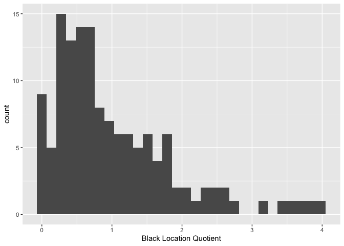

<style>
p.comment {
background-color: #DBDBDB;
padding: 10px;
border: 1px solid black;
margin-left: 25px;
border-radius: 5px;
font-style: normal;
}

.figure {
   margin-top: 20px;
   margin-bottom: 20px;
}

h1.title {
  font-weight: bold;
  font-family: Arial;  
}

h2.title {
  font-family: Arial;  
}

</style>


<style type="text/css">
#TOC {
  font-size: 13px;
  font-family: Arial;
}
</style>


\


Measures of segregation and other indices of place-based inequality have been fundamental to documenting and understanding the causes and consequences of residential patterns of racial separation.  In this guide you will learn how to calculate neighborhood segregation and using R.  The objectives of the guide are as follows

1. Calculate the Dissimilarity index, a measure of residential evenness.
2. Calculate the Interaction index, a measure of residential exposure.
3. Calculate the Location Quotient for Racial Residential Segregation, a measure of neighborhood level concentration

To accomplish these objectives, you will be working with Census tract data for four of the largest cities in California: Fresno, San Diego, San Jose, and San Francisco.

This lab guide follows closely and supplements the material presented in Chapters 4.1 and 4.2 in the textbook [Geocomputation with R](https://geocompr.robinlovelace.net/) (GWR) and Handout 7. 

<br>

<p class="comment">**Assignment 7 is due by 10:00 am, February 28th on Canvas.**  See [here](https://crd150.github.io/hw_guidelines.html) for assignment guidelines. You must submit an `.Rmd` file and its associated `.html` file. Name the files: yourLastName_firstInitial_asgn07. For example: brazil_n_asgn07.</p>


<div style="margin-bottom:25px;">
</div>
## **Open up a R Markdown file**
\

Download the [Lab template](https://raw.githubusercontent.com/crd150/data/master/labtemplate.Rmd) into an appropriate folder on your hard drive (preferably, a folder named 'Lab 7'), open it in R Studio, and type and run your code there.  The template is also located on Canvas under Files.  The template is also located on Canvas under Files.  Change the title ("Lab 7") and insert your name and date. Don't change anything else inside the YAML (the stuff at the top in between the `---`).  Also keep the grey chunk after the YAML. For a rundown on the use of R Markdown, see the [assignment guidelines](https://crd150.github.io/hw_guidelines.html).

<div style="margin-bottom:25px;">
</div>
## **Installing and loading packages**
\

We will not be using any new packages in this lab. You’ll need to load the following packages. Unlike installing, you will always need to load packages whenever you start a new R session. As such, you’ll always need to use `library()` in your R Markdown file.


```r
library(sf)
library(tidyverse)
library(tidycensus)
library(tigris)
library(tmap)
library(rmapshaper)
library(flextable)
```

<div style="margin-bottom:25px;">
</div>
## **Read in the data**
\

The following code uses the Census API to bring in demographic tract-level data for four of the most populated cities in California: San Diego, San Jose, San Francisco, and Fresno.  We won't go through each line of code in detail because we've covered all of these operations and functions in prior labs.  We've embedded comments within the code that briefly explains what each chunk is doing. Go back to prior guides (or RDS/GWR) if you need further help. 


```r
# Bring in 2016-2020 census tract data using the Census API 
ca.tracts20 <- get_acs(geography = "tract", 
              year = 2022,
              variables = c(tpop = "B03002_001", 
                            nhwhite = "B03002_003", nhblk = "B03002_004",
                            nhasn = "B03002_006", hisp = "B03002_012"),
              state = "CA",
              survey = "acs5",
              output = "wide",
              geometry = TRUE)

# Calculate, rename and keep essential vars. 
ca.tracts20 <- ca.tracts20 %>% 
  mutate(pnhwhite = 100*(nhwhiteE/tpopE), pnhasn = 100*(nhasnE/tpopE), 
        pnhblk = 100*(nhblkE/tpopE), phisp = 100*(hispE/tpopE)) %>%
  rename(nhwhite = nhwhiteE, nhasn = nhasnE, nhblk = nhblkE,
         hisp = hispE, tpop = tpopE) %>%
  select(GEOID,tpop, pnhwhite, pnhasn, pnhblk, phisp,
           nhwhite, nhasn, nhblk, hisp)  

# Bring in city boundaries
pl <- places(state = "CA", year = 2022, cb = TRUE)

# Keep four large cities in CA
large.cities <- filter(pl, NAME == "San Diego" |
                         NAME == "San Jose" | NAME == "San Francisco" |
                         NAME == "Fresno")

#Clip tracts in large cities 
large.tracts <- ms_clip(target = ca.tracts20, 
                        clip = large.cities, remove_slivers = TRUE)
```

Make sure to take a look at the final outcome.


```r
glimpse(large.tracts)
```

```
## Rows: 961
## Columns: 11
## $ GEOID    <chr> "06019003804", "06019004405", "06019004801", "06019000501", "…
## $ tpop     <dbl> 6865, 3575, 4442, 2990, 7903, 4435, 2922, 4565, 8409, 6178, 5…
## $ pnhwhite <dbl> 11.6970138, 66.7412587, 23.7055380, 7.3244147, 15.1841073, 5.…
## $ pnhasn   <dbl> 26.365623, 6.237762, 2.678973, 4.347826, 22.611666, 41.984216…
## $ pnhblk   <dbl> 8.8565186, 2.3776224, 8.5997299, 15.7525084, 6.6683538, 3.607…
## $ phisp    <dbl> 49.395484, 22.349650, 60.423233, 70.936455, 49.867139, 47.170…
## $ nhasn    <dbl> 1810, 223, 119, 130, 1787, 1862, 907, 843, 4229, 3790, 1785, …
## $ nhwhite  <dbl> 803, 2386, 1053, 219, 1200, 230, 1336, 438, 2514, 276, 18, 12…
## $ nhblk    <dbl> 608, 85, 382, 471, 527, 160, 67, 7, 405, 230, 41, 23, 0, 435,…
## $ hisp     <dbl> 3391, 799, 2684, 2121, 3941, 2092, 409, 3115, 452, 1655, 3748…
## $ geometry <POLYGON [°]> POLYGON ((-119.8668 36.7863..., POLYGON ((-119.7795 3…
```

The object *large.tracts* contains the census tracts located in the four cities.  When you view the dataset, you'll notice that we don't have any variable indicating which  city each tract belongs to.  We need the city identifier to calculate segregation for each city. The city GEOID and NAME are in the object  *large.cities*, which we will need to append to each tract in the object *large.tracts*. 

We do this by using the `st_join()` function, which is a part of the **sf** package.   The function will join the variables from *large.cities* to *large.tracts* based on geographic location.  That is, if a tract is located within a city, that city's values from *large.cities* will be appended to that tract.

First, look at the variables already in *large.tracts*.


```r
names(large.tracts)
```

```
##  [1] "GEOID"    "tpop"     "pnhwhite" "pnhasn"   "pnhblk"   "phisp"   
##  [7] "nhasn"    "nhwhite"  "nhblk"    "hisp"     "geometry"
```

Then look at the variables in *large.cities*


```r
names(large.cities)
```

```
##  [1] "STATEFP"    "PLACEFP"    "PLACENS"    "AFFGEOID"   "GEOID"     
##  [6] "NAME"       "NAMELSAD"   "STUSPS"     "STATE_NAME" "LSAD"      
## [11] "ALAND"      "AWATER"     "geometry"
```

Then `st_join()`


```r
large.tracts <- large.tracts %>%
                st_join(large.cities)
```

This function joins the variables from *large.cities* to the object *large.tracts*. 


```r
names(large.tracts)
```

```
##  [1] "GEOID.x"    "tpop"       "pnhwhite"   "pnhasn"     "pnhblk"    
##  [6] "phisp"      "nhasn"      "nhwhite"    "nhblk"      "hisp"      
## [11] "STATEFP"    "PLACEFP"    "PLACENS"    "AFFGEOID"   "GEOID.y"   
## [16] "NAME"       "NAMELSAD"   "STUSPS"     "STATE_NAME" "LSAD"      
## [21] "ALAND"      "AWATER"     "geometry"
```

Note that  when the two files have the same variable names, R attaches *.x* and *.y* to the end of the variable names such as *GEOID.x* and *GEOID.y*, which represent the tract and city GEOIDs, respectively.

We don't need all of these new variables, so let's use `select()` to remove the variables we don't need.


```r
large.tracts <- large.tracts %>%
                select(-(STATEFP:AFFGEOID), -(NAMELSAD:AWATER))
```

Make sure we've kept the variables we need


```r
names(large.tracts)
```

```
##  [1] "GEOID.x"  "tpop"     "pnhwhite" "pnhasn"   "pnhblk"   "phisp"   
##  [7] "nhasn"    "nhwhite"  "nhblk"    "hisp"     "GEOID.y"  "NAME"    
## [13] "geometry"
```

<div style="margin-bottom:25px;">
</div>
## **Mapping**
\


Before calculating segregation, you should map neighborhood racial/ethnic composition in order to gain a visual understanding of how race/ethnic groups are spatially distributed in your study region. For example, let's map percent Hispanic in Fresno.


```r
large.tracts %>%
  filter(NAME == "Fresno") %>%
  tm_shape(unit = "mi") +
    tm_polygons(col = "phisp", style = "quantile",palette = "Reds", 
              border.alpha = 0, title = "") +
    tm_scale_bar(breaks = c(0, 1, 2), text.size = 0.75, position = c("right", "bottom")) + 
  tm_compass(type = "4star", position = c("left", "top")) +
  tm_layout(main.title = "Percent Hispanic in Fresno City Tracts", 
            main.title.size = 0.9, frame = FALSE)
```

<!-- -->

How does this spatial distribution compare to percent non-Hispanic white?


```r
large.tracts %>%
  filter(NAME == "Fresno") %>%
tm_shape(unit = "mi") +
  tm_polygons(col = "pnhwhite", style = "quantile",palette = "Reds", 
              border.alpha = 0, title = "") +
  tm_scale_bar(breaks = c(0, 1, 2), text.size = 0.75, position = c("right", "bottom")) +  
    tm_compass(type = "4star", position = c("left", "top")) +
  tm_layout(main.title = "Percent White in Fresno City Tracts", 
            main.title.size = 0.9,
            frame = FALSE)
```

<!-- -->

It looks like a North/South divide.  Map the other two race/ethnic groups in Fresno and all the groups in the other three cities.

<div style="margin-bottom:25px;">
</div>
## **Dissimilarity Index**
\

The most common measure of residential evenness is the Dissimilarity Index *D*. To calculate *D*, we'll follow the Dissimilarity index formula on page 3 of Handout 7. We will calculate Black/White, Hispanic/White, and Asian/White Dissimilarity. 

We already have the values $t_{im}$, and $t_{ik}$, which is the total population of  race/ethnic group $m$ and $k$ in each census tract. But we don't have the total population of race/ethnic group $m$ and $k$ for each city. This is the value $T_m$ and $T_k$ in the formula.   To calculate these values, we use the `group_by()` and `mutate()` functions.  


```r
large.tracts <- large.tracts %>%
      group_by(NAME) %>%
      mutate(nhwhitec = sum(nhwhite), nhasnc = sum(nhasn), 
             nhblkc = sum(nhblk), hispc = sum(hisp), 
             tpopc = sum(tpop)) %>%
      ungroup()
```
  
We already covered `group_by()` in [Lab 4](https://crd150.github.io/lab4.html#Numeric_variables), but as a reminder, the `group_by()` function tells R that all future functions on *large.tracts* will be grouped according to the variable *NAME*, which is the city name. We use the `sum()` function within the `mutate()` function to sum up, for example, the non-Hispanic white population *nhwhite* for each city. We name this variable *nhwhitec*.  If you type in `View(large.tracts)`, you should find that the variable *nhwhitec* provides the same value for all tracts within the same city. We do this for all the other race/ethnic groups.

The function `ungroup()` at the end of the code tells R to stop the grouping.  It's always good practice to `ungroup()` a data set if you are saving it for future use (rather than using it as a summary table as we've been doing so far in the class).

Now we can calculate the rest of the formula, breaking it down piece-by-piece like we did in the handout and in lecture.


```r
large.tracts %>%
      group_by(NAME) %>%
      mutate(d.wb = abs(nhblk/nhblkc-nhwhite/nhwhitec),
              d.wa = abs(nhasn/nhasnc-nhwhite/nhwhitec), 
              d.wh = abs(hisp/hispc-nhwhite/nhwhitec)) %>%
      summarize(BWD = 0.5*sum(d.wb, na.rm=TRUE), AWD = 0.5*sum(d.wa, na.rm=TRUE),
                HWD = 0.5*sum(d.wh, na.rm=TRUE)) %>%
      ungroup()
```

```
## Simple feature collection with 4 features and 4 fields
## Geometry type: MULTIPOLYGON
## Dimension:     XY
## Bounding box:  xmin: -123.0139 ymin: 32.53486 xmax: -116.9057 ymax: 37.86334
## Geodetic CRS:  NAD83
## # A tibble: 4 × 5
##   NAME            BWD   AWD   HWD                                       geometry
##   <chr>         <dbl> <dbl> <dbl>                             <MULTIPOLYGON [°]>
## 1 Fresno        0.463 0.423 0.388 (((-119.8897 36.67738, -119.8895 36.68476, -1…
## 2 San Diego     0.555 0.483 0.509 (((-117.1706 32.7007, -117.1671 32.69915, -11…
## 3 San Francisco 0.546 0.404 0.402 (((-122.3885 37.7897, -122.3923 37.79389, -12…
## 4 San Jose      0.466 0.472 0.468 (((-121.8237 37.20721, -121.8184 37.20481, -1…
```

<br>

Let's break the code down so we're all on the same page. 

* We use `group_by()` because we want to calculate Dissimilarity for each city, which is indicated by the variable *NAME*.
* We use `mutate()` to calculate the tract level contributions to the index, i.e. the value $\left|\frac{t_{rm}}{T_m} - \frac{t_{rk}}{T_k}\right|$ in Equation 1 in Handout 7 for each neighborhood $i$.
* Next, we turn to `summarize()` to finish the rest of the job.  Within `summarize()`, we use the function `sum()` to add the neighborhood specific values in Equation 1 in Handout 7. In other words, `sum()` is performing the $\sum\limits_{i}^{N}$ that adds up $\left|\frac{t_{rm}}{T_m} - \frac{t_{rk}}{T_k}\right|$. 
* Finally, multiply the summed up value by 0.5 to get the final index values.

<br>

The resulting values provide the Dissimilarity indices for Black/White (*BWD*), Asian/White (*AWD*), and Hispanic/White (*HWD*).  In all of these cases, we calculate segregation from white residents, but you can calculate segregation for any race/ethnicity combination (e.g. Black/Hispanic).  Instead of just copying and pasting the chunk of code above into your console, make sure you understand what each line of code is doing.  Not only will it help you become a more seasoned R coder, but it will also help you better understand the underlying math behind the Dissimilarity index.

<br>

The results table we got above is a little messy.  Let's clean it up by doing three things: (1) Drop the geometry column using `st_drop_geometry()`, which is a part of the **sf** package, thus making the object *large.tracts* no longer spatial; (2) use the `flextable()` function to make a nicely formatted table; and (3) save the resulting table in an object we named *dis.table*. The `st_drop_geometry()` function removes the *geometry* variable, and thus makes the object *large.tracts* no longer spatial.  We save the table into an object named *dis.table*


```r
dis.table <- large.tracts %>%
      group_by(NAME) %>%
      mutate(d.wb = abs(nhblk/nhblkc-nhwhite/nhwhitec),
              d.wa = abs(nhasn/nhasnc-nhwhite/nhwhitec), 
              d.wh = abs(hisp/hispc-nhwhite/nhwhitec)) %>%
      summarize(BWD = 0.5*sum(d.wb, na.rm=TRUE), AWD = 0.5*sum(d.wa, na.rm=TRUE),
                HWD = 0.5*sum(d.wh, na.rm=TRUE)) %>%
      ungroup() %>%
      st_drop_geometry() %>%
      flextable() 

dis.table %>%
  colformat_double(j = c("BWD", "AWD", "HWD"), digits = 3)
```

```{=html}
<div class="tabwid"><style>.cl-972f3322{}.cl-97069caa{font-family:'Helvetica';font-size:11pt;font-weight:normal;font-style:normal;text-decoration:none;color:rgba(0, 0, 0, 1.00);background-color:transparent;}.cl-9729b0c8{margin:0;text-align:left;border-bottom: 0 solid rgba(0, 0, 0, 1.00);border-top: 0 solid rgba(0, 0, 0, 1.00);border-left: 0 solid rgba(0, 0, 0, 1.00);border-right: 0 solid rgba(0, 0, 0, 1.00);padding-bottom:5pt;padding-top:5pt;padding-left:5pt;padding-right:5pt;line-height: 1;background-color:transparent;}.cl-9729b0d2{margin:0;text-align:right;border-bottom: 0 solid rgba(0, 0, 0, 1.00);border-top: 0 solid rgba(0, 0, 0, 1.00);border-left: 0 solid rgba(0, 0, 0, 1.00);border-right: 0 solid rgba(0, 0, 0, 1.00);padding-bottom:5pt;padding-top:5pt;padding-left:5pt;padding-right:5pt;line-height: 1;background-color:transparent;}.cl-9729c658{width:0.75in;background-color:transparent;vertical-align: middle;border-bottom: 1.5pt solid rgba(102, 102, 102, 1.00);border-top: 1.5pt solid rgba(102, 102, 102, 1.00);border-left: 0 solid rgba(0, 0, 0, 1.00);border-right: 0 solid rgba(0, 0, 0, 1.00);margin-bottom:0;margin-top:0;margin-left:0;margin-right:0;}.cl-9729c662{width:0.75in;background-color:transparent;vertical-align: middle;border-bottom: 1.5pt solid rgba(102, 102, 102, 1.00);border-top: 1.5pt solid rgba(102, 102, 102, 1.00);border-left: 0 solid rgba(0, 0, 0, 1.00);border-right: 0 solid rgba(0, 0, 0, 1.00);margin-bottom:0;margin-top:0;margin-left:0;margin-right:0;}.cl-9729c663{width:0.75in;background-color:transparent;vertical-align: middle;border-bottom: 0 solid rgba(0, 0, 0, 1.00);border-top: 0 solid rgba(0, 0, 0, 1.00);border-left: 0 solid rgba(0, 0, 0, 1.00);border-right: 0 solid rgba(0, 0, 0, 1.00);margin-bottom:0;margin-top:0;margin-left:0;margin-right:0;}.cl-9729c66c{width:0.75in;background-color:transparent;vertical-align: middle;border-bottom: 0 solid rgba(0, 0, 0, 1.00);border-top: 0 solid rgba(0, 0, 0, 1.00);border-left: 0 solid rgba(0, 0, 0, 1.00);border-right: 0 solid rgba(0, 0, 0, 1.00);margin-bottom:0;margin-top:0;margin-left:0;margin-right:0;}.cl-9729c66d{width:0.75in;background-color:transparent;vertical-align: middle;border-bottom: 1.5pt solid rgba(102, 102, 102, 1.00);border-top: 0 solid rgba(0, 0, 0, 1.00);border-left: 0 solid rgba(0, 0, 0, 1.00);border-right: 0 solid rgba(0, 0, 0, 1.00);margin-bottom:0;margin-top:0;margin-left:0;margin-right:0;}.cl-9729c676{width:0.75in;background-color:transparent;vertical-align: middle;border-bottom: 1.5pt solid rgba(102, 102, 102, 1.00);border-top: 0 solid rgba(0, 0, 0, 1.00);border-left: 0 solid rgba(0, 0, 0, 1.00);border-right: 0 solid rgba(0, 0, 0, 1.00);margin-bottom:0;margin-top:0;margin-left:0;margin-right:0;}</style><table data-quarto-disable-processing='true' class='cl-972f3322'><thead><tr style="overflow-wrap:break-word;"><th class="cl-9729c658"><p class="cl-9729b0c8"><span class="cl-97069caa">NAME</span></p></th><th class="cl-9729c662"><p class="cl-9729b0d2"><span class="cl-97069caa">BWD</span></p></th><th class="cl-9729c662"><p class="cl-9729b0d2"><span class="cl-97069caa">AWD</span></p></th><th class="cl-9729c662"><p class="cl-9729b0d2"><span class="cl-97069caa">HWD</span></p></th></tr></thead><tbody><tr style="overflow-wrap:break-word;"><td class="cl-9729c663"><p class="cl-9729b0c8"><span class="cl-97069caa">Fresno</span></p></td><td class="cl-9729c66c"><p class="cl-9729b0d2"><span class="cl-97069caa">0.463</span></p></td><td class="cl-9729c66c"><p class="cl-9729b0d2"><span class="cl-97069caa">0.423</span></p></td><td class="cl-9729c66c"><p class="cl-9729b0d2"><span class="cl-97069caa">0.388</span></p></td></tr><tr style="overflow-wrap:break-word;"><td class="cl-9729c663"><p class="cl-9729b0c8"><span class="cl-97069caa">San Diego</span></p></td><td class="cl-9729c66c"><p class="cl-9729b0d2"><span class="cl-97069caa">0.555</span></p></td><td class="cl-9729c66c"><p class="cl-9729b0d2"><span class="cl-97069caa">0.483</span></p></td><td class="cl-9729c66c"><p class="cl-9729b0d2"><span class="cl-97069caa">0.509</span></p></td></tr><tr style="overflow-wrap:break-word;"><td class="cl-9729c663"><p class="cl-9729b0c8"><span class="cl-97069caa">San Francisco</span></p></td><td class="cl-9729c66c"><p class="cl-9729b0d2"><span class="cl-97069caa">0.546</span></p></td><td class="cl-9729c66c"><p class="cl-9729b0d2"><span class="cl-97069caa">0.404</span></p></td><td class="cl-9729c66c"><p class="cl-9729b0d2"><span class="cl-97069caa">0.402</span></p></td></tr><tr style="overflow-wrap:break-word;"><td class="cl-9729c66d"><p class="cl-9729b0c8"><span class="cl-97069caa">San Jose</span></p></td><td class="cl-9729c676"><p class="cl-9729b0d2"><span class="cl-97069caa">0.466</span></p></td><td class="cl-9729c676"><p class="cl-9729b0d2"><span class="cl-97069caa">0.472</span></p></td><td class="cl-9729c676"><p class="cl-9729b0d2"><span class="cl-97069caa">0.468</span></p></td></tr></tbody></table></div>
```

\

Looks much better. The Dissimilarity index for Black/White in Fresno is 0.463.  The interpretation of this value is that 46.3% of black residents would need to move neighborhoods in order to achieve a uniform distribution of black and white residents across neighborhoods in the city.  


<div style="margin-bottom:25px;">
</div>
## **Interaction Index**
\

The most common measure of exposure is the Interaction Index $P^*$.  Let's calculate the exposure of black (*BWI*), Asian (*AWI*), Hispanic (*HWI*) residents to white residents using the formula on page 6 of Handout 7.


```r
int.table <-large.tracts %>%
      group_by(NAME) %>%
      mutate(i.wb = (nhblk/nhblkc)*(nhwhite/tpop),
              i.wa = (nhasn/nhasnc)*(nhwhite/tpop), 
              i.wh = (hisp/hispc)*(nhwhite/tpop)) %>%
      summarize(BWI = sum(i.wb, na.rm=TRUE), AWI = sum(i.wa, na.rm=TRUE),
                HWI = sum(i.wh, na.rm=TRUE)) %>%
      ungroup() %>%
      st_drop_geometry() %>%
      flextable()
```

Look at the Interaction index equation in Handout 7. The `mutate()` function is creating the tract specific values $\frac{t_{im}}{T_m} * \frac{t_{ik}}{t_i}$.  We then turn to `summarize()` to perform the $\sum\limits_{i}^{N}$. 

We present the results in a nice table using the function `flextable()`.


```r
int.table %>%
  colformat_double(j = c("BWI", "AWI", "HWI"), digits = 3)
```

```{=html}
<div class="tabwid"><style>.cl-97db88ac{}.cl-97c5290e{font-family:'Helvetica';font-size:11pt;font-weight:normal;font-style:normal;text-decoration:none;color:rgba(0, 0, 0, 1.00);background-color:transparent;}.cl-97c836c6{margin:0;text-align:left;border-bottom: 0 solid rgba(0, 0, 0, 1.00);border-top: 0 solid rgba(0, 0, 0, 1.00);border-left: 0 solid rgba(0, 0, 0, 1.00);border-right: 0 solid rgba(0, 0, 0, 1.00);padding-bottom:5pt;padding-top:5pt;padding-left:5pt;padding-right:5pt;line-height: 1;background-color:transparent;}.cl-97c836d0{margin:0;text-align:right;border-bottom: 0 solid rgba(0, 0, 0, 1.00);border-top: 0 solid rgba(0, 0, 0, 1.00);border-left: 0 solid rgba(0, 0, 0, 1.00);border-right: 0 solid rgba(0, 0, 0, 1.00);padding-bottom:5pt;padding-top:5pt;padding-left:5pt;padding-right:5pt;line-height: 1;background-color:transparent;}.cl-97c848c8{width:0.75in;background-color:transparent;vertical-align: middle;border-bottom: 1.5pt solid rgba(102, 102, 102, 1.00);border-top: 1.5pt solid rgba(102, 102, 102, 1.00);border-left: 0 solid rgba(0, 0, 0, 1.00);border-right: 0 solid rgba(0, 0, 0, 1.00);margin-bottom:0;margin-top:0;margin-left:0;margin-right:0;}.cl-97c848d2{width:0.75in;background-color:transparent;vertical-align: middle;border-bottom: 1.5pt solid rgba(102, 102, 102, 1.00);border-top: 1.5pt solid rgba(102, 102, 102, 1.00);border-left: 0 solid rgba(0, 0, 0, 1.00);border-right: 0 solid rgba(0, 0, 0, 1.00);margin-bottom:0;margin-top:0;margin-left:0;margin-right:0;}.cl-97c848dc{width:0.75in;background-color:transparent;vertical-align: middle;border-bottom: 0 solid rgba(0, 0, 0, 1.00);border-top: 0 solid rgba(0, 0, 0, 1.00);border-left: 0 solid rgba(0, 0, 0, 1.00);border-right: 0 solid rgba(0, 0, 0, 1.00);margin-bottom:0;margin-top:0;margin-left:0;margin-right:0;}.cl-97c848dd{width:0.75in;background-color:transparent;vertical-align: middle;border-bottom: 0 solid rgba(0, 0, 0, 1.00);border-top: 0 solid rgba(0, 0, 0, 1.00);border-left: 0 solid rgba(0, 0, 0, 1.00);border-right: 0 solid rgba(0, 0, 0, 1.00);margin-bottom:0;margin-top:0;margin-left:0;margin-right:0;}.cl-97c848de{width:0.75in;background-color:transparent;vertical-align: middle;border-bottom: 1.5pt solid rgba(102, 102, 102, 1.00);border-top: 0 solid rgba(0, 0, 0, 1.00);border-left: 0 solid rgba(0, 0, 0, 1.00);border-right: 0 solid rgba(0, 0, 0, 1.00);margin-bottom:0;margin-top:0;margin-left:0;margin-right:0;}.cl-97c848e6{width:0.75in;background-color:transparent;vertical-align: middle;border-bottom: 1.5pt solid rgba(102, 102, 102, 1.00);border-top: 0 solid rgba(0, 0, 0, 1.00);border-left: 0 solid rgba(0, 0, 0, 1.00);border-right: 0 solid rgba(0, 0, 0, 1.00);margin-bottom:0;margin-top:0;margin-left:0;margin-right:0;}</style><table data-quarto-disable-processing='true' class='cl-97db88ac'><thead><tr style="overflow-wrap:break-word;"><th class="cl-97c848c8"><p class="cl-97c836c6"><span class="cl-97c5290e">NAME</span></p></th><th class="cl-97c848d2"><p class="cl-97c836d0"><span class="cl-97c5290e">BWI</span></p></th><th class="cl-97c848d2"><p class="cl-97c836d0"><span class="cl-97c5290e">AWI</span></p></th><th class="cl-97c848d2"><p class="cl-97c836d0"><span class="cl-97c5290e">HWI</span></p></th></tr></thead><tbody><tr style="overflow-wrap:break-word;"><td class="cl-97c848dc"><p class="cl-97c836c6"><span class="cl-97c5290e">Fresno</span></p></td><td class="cl-97c848dd"><p class="cl-97c836d0"><span class="cl-97c5290e">0.208</span></p></td><td class="cl-97c848dd"><p class="cl-97c836d0"><span class="cl-97c5290e">0.238</span></p></td><td class="cl-97c848dd"><p class="cl-97c836d0"><span class="cl-97c5290e">0.213</span></p></td></tr><tr style="overflow-wrap:break-word;"><td class="cl-97c848dc"><p class="cl-97c836c6"><span class="cl-97c5290e">San Diego</span></p></td><td class="cl-97c848dd"><p class="cl-97c836d0"><span class="cl-97c5290e">0.304</span></p></td><td class="cl-97c848dd"><p class="cl-97c836d0"><span class="cl-97c5290e">0.357</span></p></td><td class="cl-97c848dd"><p class="cl-97c836d0"><span class="cl-97c5290e">0.282</span></p></td></tr><tr style="overflow-wrap:break-word;"><td class="cl-97c848dc"><p class="cl-97c836c6"><span class="cl-97c5290e">San Francisco</span></p></td><td class="cl-97c848dd"><p class="cl-97c836d0"><span class="cl-97c5290e">0.290</span></p></td><td class="cl-97c848dd"><p class="cl-97c836d0"><span class="cl-97c5290e">0.305</span></p></td><td class="cl-97c848dd"><p class="cl-97c836d0"><span class="cl-97c5290e">0.332</span></p></td></tr><tr style="overflow-wrap:break-word;"><td class="cl-97c848de"><p class="cl-97c836c6"><span class="cl-97c5290e">San Jose</span></p></td><td class="cl-97c848e6"><p class="cl-97c836d0"><span class="cl-97c5290e">0.251</span></p></td><td class="cl-97c848e6"><p class="cl-97c836d0"><span class="cl-97c5290e">0.205</span></p></td><td class="cl-97c848e6"><p class="cl-97c836d0"><span class="cl-97c5290e">0.204</span></p></td></tr></tbody></table></div>
```

\

The probability of a Black resident "interacting" with a white person in his or her neighborhood is about 20.8% in Fresno. We can also interpret this to mean that 21 of every 100 people a Black person meets in his or her neighborhood will be white.  Remember that interaction is not symmetric.  Calculate the interaction of white residents with Black residents in the other cities and see if there are major differences with the values we calculated above.

<div style="margin-bottom:25px;">
</div>
## **Location Quotient**
\

The Dissimilarity and Interaction indices are city-level indices. In the handout, we covered one neighborhood-level measure: Location Quotient for Racial Residential Segregation (LQRSS), which captures neighborhood racial/ethnic concentration.
 
Let’s zoom into the City of Fresno and calculate the LQRSS for each of its tracts. First, keep Fresno tracts from *large.tracts* using the `filter()` command and calculate the LQRSS for blacks, Asians, Hispanics, and whites using equation (3) in this week's handout.
  
  

```r
fresno.tracts <- large.tracts %>%
  filter(NAME == "Fresno") %>%
  mutate(blklq = (nhblk/tpop)/(nhblkc/tpopc), 
        asnlq = (nhasn/tpop)/(nhasnc/tpopc),
        hisplq = (hisp/tpop)/(hispc/tpopc),
        whitelq = (nhwhite/tpop)/(nhwhitec/tpopc))
```

The census tract with GEOID of 06019004217 has a black LQ of 3.96. In your own words, what does this value represent?

You can visualize the distribution using a histogram (or boxplot). For example, a histogram of the black LQ looks like


```r
fresno.tracts %>% 
  ggplot() + 
    geom_histogram(mapping = aes(x=blklq), na.rm=TRUE) +
    xlab("Black Location Quotient") 
```

<!-- -->

The skewness of the distribution indicates significant concentration of the black population in Fresno. We can also map the LQRSS. Let's use the viewing feature in **tmap** so we can zoom in and out, and identify the GEOIDs with the tracts with high or low Black location quotients.


```r
tmap_mode("view")
tm_shape(fresno.tracts, unit = "mi") +
  tm_polygons(col = "blklq", style = "quantile",palette = "Reds", 
              border.alpha = 0, title = "Black Location Quotient") 
```

```{=html}
<div class="leaflet html-widget html-fill-item-overflow-hidden html-fill-item" id="htmlwidget-850031252e624b803198" style="width:672px;height:480px;"></div>
<script type="application/json" data-for="htmlwidget-850031252e624b803198">{"x":{"options":{"crs":{"crsClass":"L.CRS.EPSG3857","code":null,"proj4def":null,"projectedBounds":null,"options":{}}},"calls":[{"method":"createMapPane","args":["tmap401",401]},{"method":"addProviderTiles","args":["Esri.WorldGrayCanvas",null,"Esri.WorldGrayCanvas",{"minZoom":0,"maxZoom":18,"tileSize":256,"subdomains":"abc","errorTileUrl":"","tms":false,"noWrap":false,"zoomOffset":0,"zoomReverse":false,"opacity":1,"zIndex":1,"detectRetina":false,"pane":"tilePane"}]},{"method":"addProviderTiles","args":["OpenStreetMap",null,"OpenStreetMap",{"minZoom":0,"maxZoom":18,"tileSize":256,"subdomains":"abc","errorTileUrl":"","tms":false,"noWrap":false,"zoomOffset":0,"zoomReverse":false,"opacity":1,"zIndex":1,"detectRetina":false,"pane":"tilePane"}]},{"method":"addProviderTiles","args":["Esri.WorldTopoMap",null,"Esri.WorldTopoMap",{"minZoom":0,"maxZoom":18,"tileSize":256,"subdomains":"abc","errorTileUrl":"","tms":false,"noWrap":false,"zoomOffset":0,"zoomReverse":false,"opacity":1,"zIndex":1,"detectRetina":false,"pane":"tilePane"}]},{"method":"addPolygons","args":[[[[{"lng":[-119.866834,-119.866821,-119.871308,-119.869426,-119.869032,-119.867563,-119.868831,-119.868825,-119.871272,-119.871297,-119.87381,-119.875247,-119.875262,-119.880299,-119.880294,-119.880266,-119.871608,-119.871236,-119.862326,-119.862256,-119.862331,-119.866834],"lat":[36.786376,36.784536,36.783629,36.782777,36.780075,36.779103,36.779096,36.777444,36.77743,36.77822,36.77758,36.778345,36.777243,36.777245,36.773606,36.771793,36.771843,36.771831,36.771833,36.779123,36.786384,36.786376]}]],[[{"lng":[-119.779463,-119.779909,-119.782834,-119.785099,-119.783905,-119.783775,-119.774552,-119.765742,-119.765762,-119.765813,-119.767659,-119.777493,-119.779463],"lat":[36.866316,36.865047,36.860469,36.857421,36.854365,36.851919,36.851952,36.851853,36.8592,36.866412,36.866376,36.866333,36.866316]}]],[[{"lng":[-119.817508,-119.817512,-119.817546,-119.817588,-119.808659,-119.804105,-119.802479,-119.806684,-119.807088,-119.808626,-119.809813,-119.813445,-119.817508],"lat":[36.792895,36.786614,36.782989,36.779361,36.779421,36.779449,36.779456,36.78488,36.785118,36.786686,36.787651,36.790239,36.792895]}]],[[{"lng":[-119.776303,-119.776639,-119.777363,-119.777742,-119.777549,-119.776835,-119.772539,-119.772437,-119.772432,-119.772481,-119.772686,-119.776303],"lat":[36.75039,36.745881,36.743329,36.741283,36.735658,36.735874,36.73587,36.73939,36.743168,36.750437,36.75044,36.75039]}]],[[{"lng":[-119.736317,-119.736345,-119.731848,-119.731852,-119.729574,-119.7273,-119.727299,-119.734754,-119.736317],"lat":[36.757693,36.750448,36.75043,36.756799,36.75589,36.756799,36.75748,36.757505,36.757693]}]],[[{"lng":[-119.722948,-119.723339,-119.725277,-119.72531,-119.722743,-119.722766,-119.718243,-119.718258,-119.718253,-119.718244,-119.718246,-119.722948],"lat":[36.757484,36.755498,36.755498,36.753921,36.75293,36.750443,36.750423,36.752223,36.755852,36.756338,36.757464,36.757484]}]],[[{"lng":[-119.791918,-119.791902,-119.791888,-119.793227,-119.796712,-119.796781,-119.79355,-119.792511,-119.784877,-119.790001,-119.787821,-119.779015,-119.778565,-119.787376,-119.786935,-119.78708,-119.787162,-119.788053,-119.790518,-119.791918],"lat":[36.750425,36.746839,36.74332,36.743673,36.743632,36.743287,36.740338,36.741045,36.734105,36.73047,36.728475,36.734693,36.73501,36.74297,36.743315,36.743691,36.750372,36.750358,36.750411,36.750425]}]],[[{"lng":[-119.829196,-119.821283,-119.813455,-119.808363,-119.808536,-119.808571,-119.808592,-119.808591,-119.815385,-119.81764,-119.819914,-119.829196],"lat":[36.764689,36.757508,36.750368,36.750369,36.750852,36.753991,36.759433,36.764902,36.764809,36.764793,36.764756,36.764689]}]],[[{"lng":[-119.797873,-119.797578,-119.80029,-119.802846,-119.802836,-119.797408,-119.795815,-119.791918,-119.790518,-119.788053,-119.787162,-119.787213,-119.787278,-119.792248,-119.792237,-119.794482,-119.797873],"lat":[36.765018,36.755349,36.755337,36.754879,36.750393,36.750411,36.750444,36.750425,36.750411,36.750358,36.750372,36.757279,36.759449,36.759535,36.765055,36.765042,36.765018]}]],[[{"lng":[-119.772481,-119.772432,-119.767636,-119.761028,-119.760822,-119.754397,-119.754417,-119.758939,-119.763429,-119.767576,-119.767988,-119.772481],"lat":[36.750437,36.743168,36.74317,36.743177,36.743182,36.743158,36.750477,36.750471,36.750449,36.750455,36.750452,36.750437]}]],[[{"lng":[-119.783775,-119.783776,-119.78377,-119.783732,-119.781556,-119.781209,-119.777049,-119.772203,-119.765745,-119.765602,-119.765732,-119.765742,-119.774552,-119.783775],"lat":[36.851919,36.848271,36.844648,36.843389,36.839842,36.837446,36.837281,36.837286,36.837293,36.840113,36.844707,36.851853,36.851952,36.851919]}]],[[{"lng":[-119.772506,-119.772486,-119.767991,-119.763468,-119.754461,-119.754465,-119.754469,-119.754511,-119.755686,-119.756562,-119.762576,-119.763493,-119.76367,-119.768068,-119.772506],"lat":[36.765011,36.757689,36.7577,36.757709,36.757723,36.761358,36.761414,36.765117,36.765109,36.765026,36.765026,36.765004,36.765006,36.764997,36.765011]}]],[[{"lng":[-119.793379,-119.79269,-119.791592,-119.791618,-119.791138,-119.793874,-119.793867,-119.791705,-119.792399,-119.79227,-119.790514,-119.788236,-119.785066,-119.781402,-119.78138,-119.78136,-119.781663,-119.785105,-119.78767,-119.790429,-119.792683,-119.793379],"lat":[36.8085,36.808126,36.807459,36.801691,36.801312,36.800844,36.797665,36.794575,36.794057,36.794059,36.794092,36.794089,36.7941,36.794082,36.801319,36.808539,36.808546,36.808524,36.808514,36.808501,36.808501,36.8085]}]],[[{"lng":[-119.795026,-119.795018,-119.799526,-119.799538,-119.795026],"lat":[36.79403,36.794949,36.795805,36.794008,36.79403]}]],[[{"lng":[-119.754165,-119.7542,-119.75422,-119.745227,-119.731703,-119.731733,-119.73184,-119.731842,-119.732164,-119.732041,-119.731985,-119.731971,-119.731763,-119.731778,-119.733319,-119.736278,-119.742301,-119.745224,-119.754165],"lat":[36.808588,36.803163,36.801338,36.801337,36.801272,36.807339,36.807338,36.807521,36.807526,36.807705,36.807873,36.808074,36.808259,36.808532,36.808538,36.808536,36.808566,36.808551,36.808588]}]],[[{"lng":[-119.745566,-119.745621,-119.745627,-119.736411,-119.736508,-119.736479,-119.745566],"lat":[36.721383,36.71414,36.706843,36.706974,36.714184,36.721385,36.721383]}]],[[{"lng":[-119.745629,-119.736569,-119.73658,-119.743411,-119.743427,-119.745637,-119.745629],"lat":[36.696037,36.696051,36.698748,36.698766,36.699679,36.699646,36.696037]}]],[[{"lng":[-119.763639,-119.763647,-119.763649,-119.757347,-119.756886,-119.75466,-119.754632,-119.758024,-119.759129,-119.763639],"lat":[36.72864,36.722332,36.721388,36.721411,36.721392,36.721404,36.728605,36.728614,36.728618,36.72864]}]],[[{"lng":[-119.736345,-119.736363,-119.729715,-119.727349,-119.726412,-119.719448,-119.718229,-119.718224,-119.727329,-119.727347,-119.72959,-119.731866,-119.731848,-119.736345],"lat":[36.750448,36.743187,36.743182,36.743171,36.743176,36.743135,36.743119,36.746911,36.746959,36.745901,36.747375,36.747363,36.75043,36.750448]}]],[[{"lng":[-119.880266,-119.880269,-119.880264,-119.88024,-119.880249,-119.873499,-119.873525,-119.871278,-119.871268,-119.866781,-119.866763,-119.86223,-119.86226,-119.862326,-119.871236,-119.871608,-119.880266],"lat":[36.771793,36.768154,36.766328,36.764521,36.760903,36.760919,36.763622,36.764586,36.76815,36.768215,36.764586,36.764615,36.769878,36.771833,36.771831,36.771843,36.771793]}]],[[{"lng":[-119.817403,-119.821905,-119.826377,-119.830256,-119.840812,-119.841079,-119.837425,-119.826379,-119.817508,-119.817505,-119.817493,-119.817482,-119.81747,-119.817481,-119.817462,-119.817403],"lat":[36.808327,36.808303,36.808271,36.808264,36.808232,36.808228,36.805802,36.798657,36.792895,36.793032,36.793844,36.795288,36.801088,36.801889,36.80615,36.808327]}]],[[{"lng":[-119.804386,-119.806863,-119.809865,-119.812891,-119.812923,-119.813029,-119.805003,-119.80238,-119.799283,-119.794318,-119.800905,-119.804386],"lat":[36.743602,36.742956,36.743034,36.740027,36.739,36.72862,36.728661,36.728721,36.730933,36.734404,36.74037,36.743602]}]],[[{"lng":[-119.763629,-119.763639,-119.759129,-119.758024,-119.754632,-119.751237,-119.745537,-119.741001,-119.7364,-119.73636,-119.736342,-119.740401,-119.74095,-119.745481,-119.751141,-119.754527,-119.757951,-119.761052,-119.763629],"lat":[36.735868,36.72864,36.728618,36.728614,36.728605,36.728623,36.728633,36.728658,36.728666,36.732321,36.735921,36.735913,36.735919,36.735892,36.735867,36.735856,36.73586,36.735858,36.735868]}]],[[{"lng":[-119.754157,-119.754179,-119.754124,-119.754165,-119.754153,-119.754165,-119.745224,-119.742301,-119.736278,-119.733319,-119.7273,-119.727293,-119.727179,-119.727428,-119.729047,-119.736006,-119.736059,-119.743969,-119.745136,-119.754157],"lat":[36.830283,36.830247,36.823117,36.815858,36.812251,36.808588,36.808551,36.808566,36.808536,36.808538,36.814199,36.815762,36.819421,36.820558,36.823027,36.823068,36.83028,36.830343,36.830317,36.830283]}]],[[{"lng":[-119.718229,-119.718277,-119.718314,-119.718363,-119.711562,-119.709317,-119.707531,-119.708226,-119.709293,-119.709293,-119.712421,-119.712681,-119.712681,-119.711539,-119.711542,-119.710392,-119.710395,-119.709274,-119.702916,-119.704319,-119.700956,-119.70002,-119.700052,-119.700044,-119.705633,-119.709221,-119.709242,-119.714905,-119.714907,-119.71671,-119.716017,-119.718229],"lat":[36.743119,36.741231,36.739512,36.735864,36.735888,36.735875,36.735878,36.737143,36.737147,36.737348,36.737292,36.7377,36.738737,36.738756,36.738388,36.73842,36.739503,36.739491,36.739555,36.738313,36.738356,36.736862,36.740552,36.743183,36.743155,36.743141,36.74044,36.739536,36.74094,36.740619,36.743143,36.743119]}]],[[{"lng":[-119.898396,-119.89838,-119.898377,-119.893867,-119.893891,-119.891649,-119.891651,-119.898361,-119.898356,-119.889249,-119.880378,-119.880382,-119.880422,-119.880441,-119.889468,-119.893473,-119.898396],"lat":[36.800748,36.795319,36.793516,36.793527,36.795329,36.795353,36.789903,36.789874,36.786197,36.78627,36.786315,36.79359,36.797421,36.800854,36.800818,36.800789,36.800748]}]],[[{"lng":[-119.68197,-119.682044,-119.682054,-119.682066,-119.675812,-119.673018,-119.671024,-119.668609,-119.668513,-119.669787,-119.668547,-119.668523,-119.663964,-119.663944,-119.673024,-119.673247,-119.678109,-119.68197],"lat":[36.750353,36.747342,36.744122,36.736881,36.736941,36.736944,36.736891,36.736892,36.743102,36.743988,36.744154,36.748647,36.748677,36.750291,36.750324,36.750315,36.750334,36.750353]}]],[[{"lng":[-119.808363,-119.808266,-119.805633,-119.804386,-119.800905,-119.796781,-119.796712,-119.793227,-119.791888,-119.791902,-119.791918,-119.795815,-119.797408,-119.802836,-119.806356,-119.808363],"lat":[36.750369,36.746687,36.744274,36.743602,36.74037,36.743287,36.743632,36.743673,36.74332,36.746839,36.750425,36.750444,36.750411,36.750393,36.750377,36.750369]}]],[[{"lng":[-119.772432,-119.772437,-119.772539,-119.769266,-119.763858,-119.763629,-119.761052,-119.757951,-119.754527,-119.754397,-119.760822,-119.761028,-119.767636,-119.772432],"lat":[36.743168,36.73939,36.73587,36.735868,36.735857,36.735868,36.735858,36.73586,36.735856,36.743158,36.743182,36.743177,36.74317,36.743168]}]],[[{"lng":[-119.888471,-119.890646,-119.893554,-119.894694,-119.895483,-119.886692,-119.88062,-119.877094,-119.862612,-119.853502,-119.844433,-119.841079,-119.844432,-119.852282,-119.853622,-119.863419,-119.870448,-119.880673,-119.888471],"lat":[36.821566,36.821395,36.822419,36.821651,36.820991,36.815072,36.810911,36.808229,36.808267,36.808265,36.808286,36.808228,36.81036,36.815447,36.816308,36.82265,36.822366,36.821824,36.821566]}]],[[{"lng":[-119.78138,-119.781402,-119.779135,-119.772295,-119.763282,-119.754265,-119.75422,-119.763234,-119.765065,-119.772277,-119.78138],"lat":[36.801319,36.794082,36.794088,36.794101,36.794133,36.794133,36.801338,36.801336,36.801326,36.80132,36.801319]}]],[[{"lng":[-119.844363,-119.844413,-119.844397,-119.844395,-119.842689,-119.835378,-119.836454,-119.840997,-119.840981,-119.841617,-119.842165,-119.842166,-119.844363],"lat":[36.822661,36.820033,36.81817,36.815478,36.815464,36.815479,36.819115,36.819097,36.820038,36.820039,36.820049,36.822723,36.822661]}]],[[{"lng":[-119.835526,-119.833063,-119.833093,-119.830847,-119.830824,-119.830777,-119.839352,-119.839371,-119.841666,-119.841692,-119.844408,-119.844432,-119.841079,-119.840812,-119.830256,-119.826377,-119.821905,-119.817403,-119.817404,-119.81928,-119.821904,-119.821895,-119.823008,-119.826383,-119.826381,-119.824044,-119.824679,-119.826379,-119.835376,-119.835526],"lat":[36.822788,36.821774,36.819546,36.819575,36.815498,36.809799,36.810042,36.809231,36.809619,36.810963,36.810944,36.81036,36.808228,36.808232,36.808264,36.808271,36.808303,36.808327,36.808806,36.808794,36.808864,36.809583,36.811932,36.811886,36.815517,36.815526,36.822742,36.822749,36.82275,36.822788]}]],[[{"lng":[-119.796781,-119.800905,-119.794318,-119.790001,-119.784877,-119.792511,-119.79355,-119.796781],"lat":[36.743287,36.74037,36.734404,36.73047,36.734105,36.741045,36.740338,36.743287]}]],[[{"lng":[-119.747301,-119.756418,-119.763574,-119.765297,-119.765931,-119.765787,-119.756679,-119.756706,-119.756677,-119.756745,-119.759236,-119.7619,-119.761143,-119.747649,-119.747461,-119.747524,-119.747502,-119.747408,-119.747435,-119.747301],"lat":[36.895598,36.895572,36.895648,36.896208,36.89543,36.888258,36.88828,36.88102,36.880432,36.877506,36.877507,36.876226,36.873781,36.873891,36.879337,36.879716,36.88111,36.886986,36.888375,36.895598]}]],[[{"lng":[-119.7364,-119.736479,-119.731979,-119.727452,-119.727451,-119.721705,-119.721705,-119.718499,-119.71844,-119.727406,-119.731949,-119.7364],"lat":[36.728666,36.721385,36.721596,36.721837,36.724914,36.724981,36.722109,36.72227,36.728649,36.728662,36.728664,36.728666]}]],[[{"lng":[-119.754417,-119.754397,-119.749954,-119.747467,-119.745439,-119.736363,-119.736345,-119.740891,-119.745407,-119.747664,-119.749919,-119.754417],"lat":[36.750477,36.743158,36.743149,36.743199,36.743185,36.743187,36.750448,36.75045,36.750464,36.750458,36.750462,36.750477]}]],[[{"lng":[-119.889463,-119.889554,-119.889504,-119.888471,-119.880673,-119.870448,-119.863419,-119.868282,-119.869518,-119.874861,-119.880142,-119.88051,-119.885708,-119.889463],"lat":[36.836989,36.82991,36.824319,36.821566,36.821824,36.822366,36.82265,36.825792,36.826544,36.830012,36.833398,36.833637,36.837012,36.836989]}]],[[{"lng":[-119.700137,-119.700088,-119.700058,-119.700044,-119.700052,-119.70002,-119.700021,-119.692981,-119.692198,-119.682066,-119.682054,-119.682044,-119.68197,-119.686514,-119.688873,-119.694202,-119.700137],"lat":[36.750428,36.747893,36.74493,36.743183,36.740552,36.736862,36.735811,36.736206,36.73626,36.736881,36.744122,36.747342,36.750353,36.750368,36.750379,36.750394,36.750428]}]],[[{"lng":[-119.799538,-119.799539,-119.802361,-119.802375,-119.802188,-119.792889,-119.790525,-119.790531,-119.790515,-119.790514,-119.79227,-119.792274,-119.792872,-119.792878,-119.795026,-119.799538],"lat":[36.794008,36.790371,36.79034,36.786748,36.779457,36.779521,36.779623,36.784073,36.788625,36.794092,36.794059,36.793706,36.793694,36.794052,36.79403,36.794008]}]],[[{"lng":[-119.747734,-119.756724,-119.756459,-119.75422,-119.75417,-119.75416,-119.747758,-119.747717,-119.747314,-119.747734],"lat":[36.844803,36.844741,36.840573,36.83871,36.837544,36.837349,36.83754,36.841146,36.843523,36.844803]}]],[[{"lng":[-119.786089,-119.786037,-119.78603,-119.781514,-119.777031,-119.772525,-119.772542,-119.777009,-119.778732,-119.784963,-119.786089],"lat":[36.779678,36.775912,36.772266,36.772264,36.772279,36.772279,36.779601,36.779649,36.779642,36.77967,36.779678]}]],[[{"lng":[-119.699917,-119.699892,-119.699895,-119.699963,-119.694494,-119.693308,-119.693301,-119.690923,-119.682016,-119.682076,-119.682097,-119.682117,-119.699917],"lat":[36.722211,36.719941,36.714845,36.710289,36.710283,36.711222,36.707453,36.70745,36.707424,36.714864,36.71627,36.722175,36.722211]}]],[[{"lng":[-119.754397,-119.754527,-119.751141,-119.745481,-119.74095,-119.740401,-119.736342,-119.736312,-119.736363,-119.745439,-119.747467,-119.749954,-119.754397],"lat":[36.743158,36.735856,36.735867,36.735892,36.735919,36.735913,36.735921,36.739556,36.743187,36.743185,36.743199,36.743149,36.743158]}]],[[{"lng":[-119.747734,-119.747314,-119.747717,-119.747758,-119.745154,-119.736115,-119.729551,-119.72962,-119.729685,-119.731317,-119.731336,-119.738737,-119.747742,-119.747734],"lat":[36.844803,36.843523,36.841146,36.83754,36.837589,36.837604,36.837591,36.844832,36.849423,36.84941,36.852149,36.852096,36.852054,36.844803]},{"lng":[-119.738677,-119.738744,-119.731981,-119.731961,-119.733101,-119.738677],"lat":[36.841255,36.844653,36.844756,36.841199,36.841202,36.841255]}]],[[{"lng":[-119.889463,-119.901593,-119.910547,-119.912904,-119.915423,-119.895483,-119.894694,-119.893554,-119.890646,-119.888471,-119.889504,-119.889554,-119.889463],"lat":[36.836989,36.836873,36.836865,36.836386,36.834433,36.820991,36.821651,36.822419,36.821395,36.821566,36.824319,36.82991,36.836989]}]],[[{"lng":[-119.778921,-119.779463,-119.777493,-119.767659,-119.765813,-119.756748,-119.748675,-119.747765,-119.747649,-119.761143,-119.762389,-119.764692,-119.767594,-119.770632,-119.773878,-119.778921],"lat":[36.872443,36.866316,36.866333,36.866376,36.866412,36.866483,36.866638,36.866614,36.873891,36.873781,36.873519,36.87225,36.875224,36.877159,36.874116,36.872443]}]],[[{"lng":[-119.804105,-119.804076,-119.804067,-119.804086,-119.801057,-119.797873,-119.794482,-119.792237,-119.791374,-119.78604,-119.78603,-119.78603,-119.786037,-119.786089,-119.790525,-119.792889,-119.802188,-119.802479,-119.804105],"lat":[36.779449,36.77218,36.771272,36.764963,36.764968,36.765018,36.765042,36.765055,36.765051,36.765021,36.765909,36.772266,36.775912,36.779678,36.779623,36.779521,36.779457,36.779456,36.779449]}]],[[{"lng":[-119.772295,-119.772434,-119.769001,-119.763376,-119.758879,-119.754306,-119.754265,-119.763282,-119.772295],"lat":[36.794101,36.786807,36.786814,36.786844,36.786857,36.78687,36.794133,36.794133,36.794101]}]],[[{"lng":[-119.736363,-119.736312,-119.736342,-119.734162,-119.727401,-119.718363,-119.718314,-119.72645,-119.726412,-119.727349,-119.729715,-119.736363],"lat":[36.743187,36.739556,36.735921,36.735921,36.735887,36.735864,36.739512,36.739535,36.743176,36.743171,36.743182,36.743187]}]],[[{"lng":[-119.719448,-119.720575,-119.718277,-119.718229,-119.719448],"lat":[36.743135,36.741236,36.741231,36.743119,36.743135]}]],[[{"lng":[-119.736342,-119.73636,-119.7364,-119.731949,-119.727406,-119.71844,-119.718373,-119.718363,-119.727401,-119.734162,-119.736342],"lat":[36.735921,36.732321,36.728666,36.728664,36.728662,36.728649,36.732275,36.735864,36.735887,36.735921,36.735921]}]],[[{"lng":[-119.834083,-119.837073,-119.829196,-119.819914,-119.81764,-119.817642,-119.817649,-119.817631,-119.817618,-119.826623,-119.834083],"lat":[36.77194,36.771895,36.764689,36.764756,36.764793,36.766231,36.76665,36.770208,36.772077,36.77199,36.77194]}]],[[{"lng":[-119.844318,-119.844368,-119.843821,-119.841965,-119.835468,-119.826542,-119.826497,-119.826449,-119.830924,-119.835402,-119.844318],"lat":[36.786454,36.781409,36.780899,36.77923,36.779251,36.779311,36.782932,36.786554,36.786553,36.786521,36.786454]}]],[[{"lng":[-119.905965,-119.909098,-119.91192,-119.917112,-119.919523,-119.921405,-119.923759,-119.927777,-119.929099,-119.932593,-119.932338,-119.915423,-119.912904,-119.910547,-119.901593,-119.889463,-119.885708,-119.89672,-119.905965],"lat":[36.850105,36.846199,36.845319,36.844868,36.845072,36.846853,36.847711,36.848458,36.847906,36.844464,36.843323,36.834433,36.836386,36.836865,36.836873,36.836989,36.837012,36.844075,36.850105]}]],[[{"lng":[-119.843276,-119.844457,-119.846219,-119.844587,-119.844397,-119.84432,-119.84428,-119.844261,-119.844286,-119.844284,-119.83553,-119.835543,-119.834384,-119.834387,-119.833341,-119.833341,-119.832913,-119.832686,-119.833381,-119.833367,-119.83554,-119.835561,-119.835537,-119.813033,-119.813952,-119.813455,-119.821283,-119.829196,-119.837073,-119.843276],"lat":[36.777514,36.777776,36.778212,36.776649,36.776137,36.771955,36.77007,36.764693,36.764693,36.757454,36.757452,36.755652,36.755657,36.755301,36.755403,36.754553,36.754553,36.753831,36.753835,36.751662,36.751061,36.750247,36.746409,36.746488,36.75035,36.750368,36.757508,36.764689,36.771895,36.777514]}]],[[{"lng":[-119.841079,-119.841082,-119.843202,-119.843258,-119.841079],"lat":[36.746418,36.750163,36.750153,36.746417,36.746418]}]],[[{"lng":[-119.75422,-119.754265,-119.747809,-119.745305,-119.744993,-119.731664,-119.731703,-119.745227,-119.75422],"lat":[36.801338,36.794133,36.794451,36.794394,36.794389,36.794214,36.801272,36.801337,36.801338]}]],[[{"lng":[-119.790514,-119.790515,-119.790531,-119.790525,-119.786089,-119.784963,-119.778732,-119.777009,-119.772542,-119.772434,-119.772295,-119.779135,-119.781402,-119.785066,-119.788236,-119.790514],"lat":[36.794092,36.788625,36.784073,36.779623,36.779678,36.77967,36.779642,36.779649,36.779601,36.786807,36.794101,36.794088,36.794082,36.7941,36.794089,36.794092]}]],[[{"lng":[-119.787255,-119.791023,-119.791693,-119.793139,-119.794418,-119.795527,-119.800666,-119.799119,-119.799037,-119.793244,-119.790952,-119.787255],"lat":[36.851739,36.857805,36.860944,36.861015,36.860525,36.859896,36.854694,36.853094,36.85185,36.851851,36.851861,36.851739]}]],[[{"lng":[-119.862326,-119.86226,-119.860546,-119.860592,-119.8614,-119.862326],"lat":[36.771833,36.769878,36.769878,36.771859,36.771829,36.771833]}]],[[{"lng":[-119.853308,-119.853306,-119.857839,-119.857774,-119.848814,-119.846598,-119.846618,-119.84428,-119.84432,-119.848778,-119.853308],"lat":[36.771896,36.770042,36.770351,36.768251,36.768271,36.768287,36.770051,36.77007,36.771955,36.771918,36.771896]}]],[[{"lng":[-119.844286,-119.846578,-119.845444,-119.846616,-119.846547,-119.84763,-119.846508,-119.846495,-119.844236,-119.844276,-119.844284,-119.844286],"lat":[36.764693,36.764673,36.76288,36.761042,36.755568,36.753781,36.75197,36.75014,36.750167,36.753794,36.757454,36.764693]}]],[[{"lng":[-119.844353,-119.844326,-119.844314,-119.84427,-119.835348,-119.835354,-119.834645,-119.835352,-119.83805,-119.838085,-119.840306,-119.844353],"lat":[36.804238,36.800749,36.799514,36.793719,36.793766,36.796331,36.79806,36.80101,36.801003,36.803491,36.804263,36.804238]}]],[[{"lng":[-119.817891,-119.817923,-119.806646,-119.802117,-119.799818,-119.795302,-119.790755,-119.790739,-119.791934,-119.795297,-119.796334,-119.799818,-119.806711,-119.817891],"lat":[36.714015,36.70676,36.706859,36.706862,36.706833,36.706858,36.706858,36.714154,36.714157,36.714132,36.714134,36.714125,36.7141,36.714015]}]],[[{"lng":[-119.813029,-119.831127,-119.831182,-119.828978,-119.828984,-119.82665,-119.817818,-119.81555,-119.813331,-119.813029],"lat":[36.72862,36.728501,36.723023,36.723043,36.721293,36.721315,36.721337,36.721354,36.721379,36.72862]}]],[[{"lng":[-119.808591,-119.808592,-119.808571,-119.808536,-119.808363,-119.806356,-119.802836,-119.802846,-119.80029,-119.797578,-119.797873,-119.801057,-119.804086,-119.80592,-119.808591],"lat":[36.764902,36.759433,36.753991,36.750852,36.750369,36.750377,36.750393,36.754879,36.755337,36.755349,36.765018,36.764968,36.764963,36.764965,36.764902]}]],[[{"lng":[-119.754511,-119.754469,-119.754465,-119.754461,-119.754417,-119.749919,-119.747664,-119.745407,-119.740891,-119.736345,-119.736317,-119.736304,-119.736321,-119.740859,-119.743292,-119.745412,-119.747823,-119.749152,-119.751318,-119.752802,-119.754511],"lat":[36.765117,36.761414,36.761358,36.757723,36.750477,36.750462,36.750458,36.750464,36.75045,36.750448,36.757693,36.763417,36.76516,36.765179,36.76518,36.765117,36.765091,36.765083,36.765093,36.765106,36.765117]}]],[[{"lng":[-119.817618,-119.817631,-119.817649,-119.817642,-119.81764,-119.815385,-119.808591,-119.80592,-119.804086,-119.804067,-119.804076,-119.804105,-119.808659,-119.817588,-119.817596,-119.817604,-119.817618],"lat":[36.772077,36.770208,36.76665,36.766231,36.764793,36.764809,36.764902,36.764965,36.764963,36.771272,36.77218,36.779449,36.779421,36.779361,36.775703,36.774818,36.772077]}]],[[{"lng":[-119.817403,-119.817462,-119.811618,-119.811651,-119.815178,-119.817403],"lat":[36.808327,36.80615,36.807204,36.808359,36.808336,36.808327]}]],[[{"lng":[-119.810707,-119.810707,-119.808511,-119.808416,-119.810707],"lat":[36.808369,36.805732,36.805741,36.80839,36.808369]}]],[[{"lng":[-119.765813,-119.765762,-119.765742,-119.75674,-119.747742,-119.747788,-119.747767,-119.747765,-119.748675,-119.756748,-119.765813],"lat":[36.866412,36.8592,36.851853,36.852005,36.852054,36.859337,36.866563,36.866614,36.866638,36.866483,36.866412]}]],[[{"lng":[-119.877094,-119.868994,-119.860812,-119.855117,-119.844471,-119.843276,-119.837073,-119.834083,-119.840776,-119.841965,-119.843821,-119.844368,-119.844318,-119.84427,-119.844314,-119.844326,-119.844353,-119.844433,-119.853502,-119.862612,-119.877094],"lat":[36.808229,36.800963,36.793459,36.788309,36.778612,36.777514,36.771895,36.77194,36.77853,36.77923,36.780899,36.781409,36.786454,36.793719,36.799514,36.800749,36.804238,36.808286,36.808265,36.808267,36.808229]}]],[[{"lng":[-119.799331,-119.799361,-119.799381,-119.799406,-119.794878,-119.794916,-119.799422,-119.799429,-119.797178,-119.797192,-119.793379,-119.792683,-119.790429,-119.78767,-119.785105,-119.781663,-119.78136,-119.781351,-119.781331,-119.781322,-119.790352,-119.792604,-119.795378,-119.799331],"lat":[36.822879,36.821067,36.816997,36.815667,36.815675,36.812096,36.811402,36.810747,36.810326,36.808468,36.8085,36.808501,36.808501,36.808514,36.808524,36.808546,36.808539,36.812143,36.815739,36.822972,36.822915,36.822887,36.8229,36.822879]}]],[[{"lng":[-119.772248,-119.772278,-119.772272,-119.765494,-119.762103,-119.754165,-119.754153,-119.754165,-119.754322,-119.763218,-119.765421,-119.772248],"lat":[36.815761,36.812233,36.808552,36.808578,36.808588,36.808588,36.812251,36.815858,36.815865,36.815816,36.815803,36.815761]}]],[[{"lng":[-119.682147,-119.686135,-119.689741,-119.691091,-119.69231,-119.700251,-119.700192,-119.692321,-119.690699,-119.689649,-119.682146,-119.682166,-119.682147,-119.682155,-119.682147],"lat":[36.789447,36.78937,36.78944,36.789434,36.78305,36.783025,36.779408,36.779417,36.779393,36.779385,36.77942,36.783347,36.786654,36.788506,36.789447]}]],[[{"lng":[-119.802117,-119.802125,-119.803204,-119.808811,-119.808845,-119.811108,-119.811466,-119.804338,-119.79979,-119.799784,-119.799325,-119.795253,-119.795263,-119.793404,-119.793419,-119.790761,-119.790714,-119.790723,-119.790755,-119.795302,-119.799818,-119.802117],"lat":[36.706862,36.70315,36.699551,36.699532,36.694034,36.693991,36.692155,36.69215,36.692163,36.689351,36.689546,36.689539,36.691042,36.691039,36.692287,36.692285,36.699556,36.704296,36.706858,36.706858,36.706833,36.706862]}]],[[{"lng":[-119.754632,-119.75466,-119.753567,-119.751206,-119.745566,-119.736479,-119.7364,-119.741001,-119.745537,-119.751237,-119.754632],"lat":[36.728605,36.721404,36.721404,36.721395,36.721383,36.721385,36.728666,36.728658,36.728633,36.728623,36.728605]}]],[[{"lng":[-119.71844,-119.718499,-119.709394,-119.70935,-119.711642,-119.711562,-119.718363,-119.718373,-119.71844],"lat":[36.728649,36.72227,36.722262,36.72862,36.7286,36.735888,36.735864,36.732275,36.728649]}]],[[{"lng":[-119.70935,-119.70836,-119.706154,-119.706145,-119.709333,-119.709346,-119.70935],"lat":[36.72862,36.728619,36.728608,36.730426,36.730442,36.728984,36.72862]}]],[[{"lng":[-119.817344,-119.817355,-119.815099,-119.815073,-119.812934,-119.812864,-119.817344],"lat":[36.822786,36.822311,36.822305,36.820982,36.820995,36.822818,36.822786]}]],[[{"lng":[-119.809588,-119.808843,-119.810269,-119.815124,-119.815092,-119.809191,-119.808393,-119.808409,-119.809541,-119.810141,-119.810708,-119.811835,-119.815179,-119.81518,-119.815163,-119.817413,-119.817411,-119.817404,-119.817403,-119.815178,-119.811651,-119.810707,-119.808416,-119.805069,-119.805068,-119.801596,-119.801781,-119.807761,-119.807834,-119.806166,-119.806147,-119.80776,-119.807773,-119.806097,-119.806055,-119.808307,-119.809588],"lat":[36.822834,36.821488,36.819232,36.819185,36.815586,36.815613,36.813808,36.811991,36.811992,36.809366,36.809358,36.8089,36.809335,36.810168,36.811962,36.811935,36.810122,36.808806,36.808327,36.808336,36.808359,36.808369,36.80839,36.808402,36.811052,36.811203,36.813844,36.813818,36.815622,36.815624,36.816553,36.816807,36.821924,36.821921,36.822848,36.822843,36.822834]}]],[[{"lng":[-119.801011,-119.80151,-119.799361,-119.799331,-119.801011],"lat":[36.822871,36.821081,36.821067,36.822879,36.822871]}]],[[{"lng":[-119.799381,-119.800441,-119.800525,-119.799421,-119.799406,-119.799381],"lat":[36.816997,36.817196,36.813929,36.813825,36.815667,36.816997]}]],[[{"lng":[-119.754306,-119.754311,-119.754361,-119.752562,-119.750172,-119.745332,-119.740804,-119.738539,-119.738507,-119.736257,-119.736208,-119.735917,-119.731707,-119.731707,-119.731664,-119.744993,-119.745305,-119.747809,-119.754265,-119.754306],"lat":[36.78687,36.785036,36.779615,36.77961,36.7796,36.779545,36.779535,36.779511,36.781805,36.781754,36.785976,36.786775,36.786766,36.789454,36.794214,36.794389,36.794394,36.794451,36.794133,36.78687]}]],[[{"lng":[-119.844277,-119.855474,-119.855493,-119.857809,-119.857856,-119.855607,-119.855578,-119.851649,-119.846586,-119.846625,-119.844338,-119.844277],"lat":[36.746338,36.746304,36.74277,36.742747,36.739128,36.739147,36.740556,36.740171,36.740294,36.739023,36.73903,36.746338]}]],[[{"lng":[-119.844382,-119.851182,-119.851175,-119.853414,-119.853378,-119.85791,-119.85792,-119.862402,-119.862439,-119.848932,-119.846682,-119.846693,-119.844417,-119.844382],"lat":[36.735677,36.735612,36.732241,36.732222,36.7356,36.735546,36.731912,36.731871,36.728265,36.728374,36.729552,36.728384,36.72839,36.735677]}]],[[{"lng":[-119.844553,-119.844483,-119.835789,-119.835714,-119.844553],"lat":[36.721164,36.713892,36.713935,36.721238,36.721164]}]],[[{"lng":[-119.82665,-119.826672,-119.82682,-119.826889,-119.832608,-119.832531,-119.835785,-119.835684,-119.831027,-119.826837,-119.826864,-119.825957,-119.825853,-119.817923,-119.817891,-119.81786,-119.817852,-119.817828,-119.817818,-119.82665],"lat":[36.721315,36.717618,36.713988,36.706703,36.706682,36.69939,36.699364,36.692148,36.692172,36.692192,36.69579,36.695792,36.706709,36.70676,36.714015,36.716479,36.717597,36.719758,36.721337,36.721315]}]],[[{"lng":[-119.889663,-119.88954,-119.880536,-119.880517,-119.88381,-119.883811,-119.889781,-119.908224,-119.916477,-119.934386,-119.934353,-119.916489,-119.916759,-119.907458,-119.898492,-119.889663],"lat":[36.677384,36.684764,36.684694,36.704253,36.704254,36.706407,36.706364,36.706306,36.706316,36.706245,36.691643,36.691743,36.677207,36.67727,36.677354,36.677384]}]],[[{"lng":[-119.844433,-119.844353,-119.840306,-119.838085,-119.83805,-119.835352,-119.834645,-119.835354,-119.835348,-119.833077,-119.826411,-119.826408,-119.826379,-119.837425,-119.841079,-119.844433],"lat":[36.808286,36.804238,36.804263,36.803491,36.801003,36.80101,36.79806,36.796331,36.793766,36.793788,36.793772,36.794247,36.798657,36.805802,36.808228,36.808286]}]],[[{"lng":[-119.844277,-119.844277,-119.844338,-119.844382,-119.844417,-119.844553,-119.835714,-119.835681,-119.831182,-119.831127,-119.813029,-119.812923,-119.812891,-119.809865,-119.806863,-119.804386,-119.805633,-119.808266,-119.808363,-119.813455,-119.813952,-119.813033,-119.835537,-119.841079,-119.843258,-119.844277],"lat":[36.746414,36.746338,36.73903,36.735677,36.72839,36.721164,36.721238,36.723023,36.723023,36.728501,36.72862,36.739,36.740027,36.743034,36.742956,36.743602,36.744274,36.746687,36.750369,36.750368,36.75035,36.746488,36.746409,36.746418,36.746417,36.746414]}]],[[{"lng":[-119.792884,-119.796521,-119.797603,-119.802176,-119.806146,-119.807959,-119.809639,-119.81179,-119.812425,-119.809576,-119.810896,-119.80182,-119.799037,-119.799119,-119.800666,-119.795527,-119.794418,-119.793139,-119.791693,-119.791023,-119.787255,-119.786652,-119.783905,-119.785099,-119.782834,-119.779909,-119.779463,-119.778921,-119.778805,-119.78278,-119.78378,-119.786377,-119.792237,-119.792884],"lat":[36.876214,36.875418,36.874373,36.866689,36.86444,36.863884,36.862569,36.857754,36.852657,36.853031,36.851689,36.851844,36.85185,36.853094,36.854694,36.859896,36.860525,36.861015,36.860944,36.857805,36.851739,36.852289,36.854365,36.857421,36.860469,36.865047,36.866316,36.872443,36.873402,36.872649,36.870849,36.871526,36.870078,36.876214]}]],[[{"lng":[-119.763649,-119.76809,-119.781221,-119.781714,-119.773726,-119.772692,-119.765644,-119.749672,-119.745623,-119.745629,-119.745637,-119.745618,-119.750118,-119.750132,-119.754549,-119.754645,-119.759194,-119.759243,-119.759981,-119.763649,-119.763426,-119.76367,-119.76366,-119.762433,-119.763669,-119.767842,-119.76777,-119.772127,-119.772082,-119.766946,-119.766948,-119.763656,-119.763656,-119.759009,-119.759121,-119.756892,-119.756886,-119.757347,-119.763649],"lat":[36.721388,36.721404,36.721538,36.721471,36.714204,36.713281,36.706877,36.692383,36.692414,36.696037,36.699646,36.70242,36.701847,36.699964,36.700295,36.705958,36.705961,36.703651,36.703647,36.706875,36.707261,36.711261,36.712709,36.713406,36.714146,36.714141,36.716564,36.716833,36.719738,36.719763,36.71842,36.718452,36.717759,36.71806,36.71993,36.719937,36.721392,36.721411,36.721388]}]],[[{"lng":[-119.753567,-119.753559,-119.754663,-119.754672,-119.758503,-119.75852,-119.754686,-119.754669,-119.754645,-119.75317,-119.748648,-119.745627,-119.745621,-119.745566,-119.751206,-119.753567],"lat":[36.721404,36.717735,36.717752,36.714133,36.714163,36.712116,36.712124,36.706929,36.705958,36.705997,36.706859,36.706843,36.71414,36.721383,36.721395,36.721404]}]],[[{"lng":[-119.84427,-119.844318,-119.835402,-119.830924,-119.826449,-119.826438,-119.826411,-119.833077,-119.835348,-119.84427],"lat":[36.793719,36.786454,36.786521,36.786553,36.786554,36.788377,36.793772,36.793788,36.793766,36.793719]}]],[[{"lng":[-119.826449,-119.826497,-119.826542,-119.824274,-119.817588,-119.817546,-119.817512,-119.817508,-119.826379,-119.826408,-119.826411,-119.826438,-119.826449],"lat":[36.786554,36.782932,36.779311,36.779321,36.779361,36.782989,36.786614,36.792895,36.798657,36.794247,36.793772,36.788377,36.786554]}]],[[{"lng":[-119.772434,-119.772542,-119.76351,-119.754361,-119.754311,-119.754306,-119.758879,-119.763376,-119.769001,-119.772434],"lat":[36.786807,36.779601,36.779575,36.779615,36.785036,36.78687,36.786857,36.786844,36.786814,36.786807]}]],[[{"lng":[-119.78136,-119.78138,-119.772277,-119.765065,-119.763234,-119.75422,-119.7542,-119.754165,-119.762103,-119.765494,-119.772272,-119.772628,-119.779102,-119.78136],"lat":[36.808539,36.801319,36.80132,36.801326,36.801336,36.801338,36.803163,36.808588,36.808588,36.808578,36.808552,36.80856,36.80854,36.808539]}]],[[{"lng":[-119.781322,-119.781331,-119.781351,-119.78136,-119.779102,-119.772628,-119.772272,-119.772278,-119.772248,-119.772248,-119.772254,-119.774367,-119.781322],"lat":[36.822972,36.815739,36.812143,36.808539,36.80854,36.80856,36.808552,36.812233,36.815761,36.820226,36.823042,36.823027,36.822972]}]],[[{"lng":[-119.75416,-119.754157,-119.745136,-119.743969,-119.736059,-119.736115,-119.745154,-119.747758,-119.75416],"lat":[36.837349,36.830283,36.830317,36.830343,36.83028,36.837604,36.837589,36.83754,36.837349]}]],[[{"lng":[-119.818746,-119.819334,-119.818755,-119.813498,-119.813358,-119.814729,-119.81889,-119.818493,-119.819363,-119.826329,-119.826337,-119.822176,-119.817329,-119.813031,-119.801883,-119.80182,-119.810896,-119.809576,-119.812425,-119.813832,-119.818746],"lat":[36.848068,36.847545,36.84787,36.84969,36.848741,36.847647,36.845473,36.845015,36.844662,36.844494,36.837235,36.837235,36.836994,36.837006,36.837051,36.851844,36.851689,36.853031,36.852657,36.850208,36.848068]}]],[[{"lng":[-119.682117,-119.677902,-119.673074,-119.673039,-119.668566,-119.668565,-119.664068,-119.664143,-119.659512,-119.659512,-119.656769,-119.658335,-119.659758,-119.661023,-119.664166,-119.667046,-119.667058,-119.668601,-119.668588,-119.664054,-119.664064,-119.668609,-119.671024,-119.673018,-119.673059,-119.67415,-119.676564,-119.682066,-119.682117],"lat":[36.722175,36.722216,36.722104,36.716709,36.716709,36.718551,36.718551,36.724575,36.724541,36.72515,36.725505,36.727969,36.727945,36.729542,36.729578,36.729587,36.7308,36.730716,36.73322,36.733257,36.736905,36.736892,36.736891,36.736944,36.727715,36.72819,36.727699,36.727716,36.722175]}]],[[{"lng":[-119.68207,-119.675767,-119.675812,-119.682066,-119.68207],"lat":[36.735652,36.735626,36.736941,36.736881,36.735652]}]],[[{"lng":[-119.682016,-119.673022,-119.673019,-119.669706,-119.669732,-119.677563,-119.677584,-119.682097,-119.682076,-119.682016],"lat":[36.707424,36.707455,36.709513,36.709529,36.711216,36.711183,36.716728,36.71627,36.714864,36.707424]}]],[[{"lng":[-119.765644,-119.768573,-119.772669,-119.773832,-119.776249,-119.776023,-119.77454,-119.77406,-119.772911,-119.772689,-119.772684,-119.772712,-119.772725,-119.763689,-119.755975,-119.755958,-119.75471,-119.754728,-119.739046,-119.739078,-119.736704,-119.736708,-119.735335,-119.736716,-119.739376,-119.745692,-119.745693,-119.750196,-119.750245,-119.749672,-119.765644],"lat":[36.706877,36.706789,36.706819,36.706842,36.706917,36.70628,36.706181,36.705956,36.704841,36.704182,36.699631,36.692262,36.677981,36.67779,36.677813,36.676104,36.676115,36.670676,36.670683,36.672515,36.672507,36.672789,36.672742,36.673912,36.676106,36.676144,36.677919,36.677916,36.692382,36.692383,36.706877]}]],[[{"lng":[-119.847412,-119.847212,-119.844425,-119.844382,-119.844582,-119.844363,-119.842166,-119.841614,-119.841492,-119.841718,-119.839968,-119.839987,-119.835527,-119.835526,-119.835376,-119.826379,-119.824679,-119.824552,-119.826383,-119.826382,-119.828576,-119.830826,-119.835369,-119.835386,-119.839935,-119.839955,-119.839978,-119.847412],"lat":[36.837272,36.835693,36.83339,36.829968,36.822648,36.822661,36.822723,36.822733,36.825898,36.826363,36.82637,36.827246,36.827238,36.822788,36.82275,36.822749,36.822742,36.82374,36.82374,36.826819,36.826815,36.824126,36.824558,36.829092,36.829044,36.829974,36.837191,36.837272]}]],[[{"lng":[-119.835351,-119.835369,-119.833083,-119.830814,-119.830812,-119.829937,-119.826365,-119.821837,-119.821916,-119.821942,-119.81733,-119.817329,-119.822176,-119.826337,-119.835351],"lat":[36.837195,36.835405,36.834596,36.835096,36.830962,36.829988,36.829991,36.83,36.833263,36.833643,36.833587,36.836994,36.837235,36.837235,36.837195]}]],[[{"lng":[-119.817329,-119.81733,-119.817328,-119.810703,-119.810561,-119.808856,-119.810677,-119.811842,-119.817361,-119.817344,-119.812864,-119.809588,-119.808307,-119.806055,-119.806039,-119.807627,-119.807786,-119.803912,-119.803889,-119.799318,-119.799309,-119.799298,-119.799293,-119.799243,-119.801883,-119.813031,-119.817329],"lat":[36.836994,36.833587,36.830018,36.830056,36.826459,36.824696,36.823232,36.824693,36.824644,36.822786,36.822818,36.822834,36.822843,36.822848,36.824708,36.824715,36.826447,36.826467,36.828314,36.828292,36.828786,36.830108,36.831952,36.83705,36.837051,36.837006,36.836994]},{"lng":[-119.808304,-119.8083,-119.803793,-119.803773,-119.801601,-119.801102,-119.806029,-119.805982,-119.808304],"lat":[36.830076,36.834922,36.834959,36.833676,36.833708,36.831925,36.831887,36.830077,36.830076]}]],[[{"lng":[-119.736115,-119.736059,-119.736006,-119.729047,-119.729374,-119.729452,-119.729551,-119.736115],"lat":[36.837604,36.83028,36.823068,36.823027,36.824443,36.830284,36.837591,36.837604]}]],[[{"lng":[-119.796693,-119.795329,-119.793617,-119.791621,-119.790268,-119.78462,-119.783789,-119.781714,-119.781221,-119.76809,-119.763649,-119.763647,-119.763639,-119.763629,-119.763858,-119.769266,-119.772539,-119.776835,-119.777549,-119.778565,-119.779015,-119.787821,-119.796693],"lat":[36.722119,36.72142,36.722588,36.720781,36.721434,36.721426,36.721991,36.721471,36.721538,36.721404,36.721388,36.722332,36.72864,36.735868,36.735857,36.735868,36.73587,36.735874,36.735658,36.73501,36.734693,36.728475,36.722119]}]],[[{"lng":[-119.787162,-119.78708,-119.786935,-119.787376,-119.778565,-119.777549,-119.777742,-119.777363,-119.776639,-119.776303,-119.781482,-119.787162],"lat":[36.750372,36.743691,36.743315,36.74297,36.73501,36.735658,36.741283,36.743329,36.745881,36.75039,36.750385,36.750372]}]],[[{"lng":[-119.792237,-119.792248,-119.787278,-119.787213,-119.787162,-119.781482,-119.776303,-119.772686,-119.772481,-119.772486,-119.772506,-119.77714,-119.781521,-119.781524,-119.78603,-119.78604,-119.791374,-119.792237],"lat":[36.765055,36.759535,36.759449,36.757279,36.750372,36.750385,36.75039,36.75044,36.750437,36.757689,36.765011,36.765027,36.765001,36.765912,36.765909,36.765021,36.765051,36.765055]}]],[[{"lng":[-119.772486,-119.772481,-119.767988,-119.767576,-119.763429,-119.758939,-119.754417,-119.754461,-119.763468,-119.767991,-119.772486],"lat":[36.757689,36.750437,36.750452,36.750455,36.750449,36.750471,36.750477,36.757723,36.757709,36.7577,36.757689]}]],[[{"lng":[-119.718288,-119.718291,-119.718285,-119.718279,-119.718246,-119.718244,-119.71606,-119.716078,-119.709207,-119.709155,-119.701561,-119.700137,-119.700234,-119.700355,-119.700404,-119.700205,-119.700244,-119.700198,-119.702256,-119.718288],"lat":[36.765171,36.763043,36.76179,36.761153,36.757464,36.756338,36.75632,36.757468,36.757443,36.750422,36.75042,36.750428,36.752553,36.753903,36.760665,36.764191,36.76471,36.765344,36.765174,36.765171]}]],[[{"lng":[-119.718258,-119.717693,-119.717581,-119.717041,-119.713704,-119.713701,-119.718253,-119.718258],"lat":[36.752223,36.752222,36.75345,36.754038,36.754058,36.755864,36.755852,36.752223]}]],[[{"lng":[-119.841965,-119.840776,-119.834083,-119.826623,-119.817618,-119.817604,-119.817596,-119.817588,-119.824274,-119.826542,-119.835468,-119.841965],"lat":[36.77923,36.77853,36.77194,36.77199,36.772077,36.774818,36.775703,36.779361,36.779321,36.779311,36.779251,36.77923]}]],[[{"lng":[-119.745364,-119.745383,-119.745399,-119.747886,-119.747823,-119.745412,-119.743292,-119.740859,-119.736321,-119.731776,-119.731732,-119.736317,-119.740839,-119.745364],"lat":[36.772268,36.769089,36.767094,36.767062,36.765091,36.765117,36.76518,36.765179,36.76516,36.765157,36.77224,36.772252,36.772249,36.772268]}]],[[{"lng":[-119.754482,-119.749943,-119.749941,-119.749912,-119.754452,-119.754447,-119.754482],"lat":[36.768682,36.768678,36.76903,36.770498,36.771741,36.771297,36.768682]}]],[[{"lng":[-119.862543,-119.863419,-119.853622,-119.852282,-119.844432,-119.844408,-119.844374,-119.844374,-119.8444,-119.844395,-119.844397,-119.844413,-119.844363,-119.844582,-119.84843,-119.849489,-119.849722,-119.852801,-119.853455,-119.854608,-119.862543],"lat":[36.82271,36.82265,36.816308,36.815447,36.81036,36.810944,36.813088,36.814034,36.814649,36.815478,36.81817,36.820033,36.822661,36.822648,36.822775,36.82298,36.822671,36.822945,36.822731,36.822714,36.82271]}]],[[{"lng":[-119.747767,-119.747788,-119.747742,-119.738737,-119.731336,-119.729717,-119.729746,-119.729753,-119.734338,-119.73443,-119.738772,-119.747767],"lat":[36.866563,36.859337,36.852054,36.852096,36.852149,36.852152,36.859483,36.863155,36.863104,36.866692,36.866646,36.866563]}]],[[{"lng":[-119.862411,-119.874498,-119.878982,-119.880171,-119.880479,-119.885176,-119.885708,-119.88051,-119.880142,-119.874861,-119.869518,-119.868282,-119.863419,-119.862543,-119.862423,-119.862416,-119.862411],"lat":[36.837231,36.837081,36.83706,36.837051,36.837045,36.837015,36.837012,36.833637,36.833398,36.830012,36.826544,36.825792,36.82265,36.82271,36.829944,36.833535,36.837231]}]],[[{"lng":[-119.80182,-119.801883,-119.799243,-119.797328,-119.790226,-119.787363,-119.781209,-119.781556,-119.783732,-119.78377,-119.783776,-119.783775,-119.783905,-119.786652,-119.787255,-119.790952,-119.793244,-119.799037,-119.80182],"lat":[36.851844,36.837051,36.83705,36.837091,36.837252,36.837435,36.837446,36.839842,36.843389,36.844648,36.848271,36.851919,36.854365,36.852289,36.851739,36.851861,36.851851,36.85185,36.851844]}]],[[{"lng":[-119.736321,-119.736304,-119.736317,-119.734754,-119.727299,-119.722948,-119.718246,-119.718279,-119.718285,-119.718291,-119.718288,-119.731776,-119.736321],"lat":[36.76516,36.763417,36.757693,36.757505,36.75748,36.757484,36.757464,36.761153,36.76179,36.763043,36.765171,36.765157,36.76516]}]],[[{"lng":[-119.802375,-119.804087,-119.804718,-119.806684,-119.802479,-119.802188,-119.802375],"lat":[36.786748,36.786727,36.784887,36.78488,36.779456,36.779457,36.786748]}]],[[{"lng":[-119.932551,-119.927764,-119.909324,-119.911593,-119.916554,-119.916554,-119.91655,-119.917804,-119.917823,-119.921096,-119.921097,-119.923301,-119.92329,-119.925667,-119.925641,-119.925558,-119.925597,-119.923277,-119.921015,-119.920998,-119.912,-119.911936,-119.90741,-119.907436,-119.898396,-119.898439,-119.896664,-119.896133,-119.890702,-119.887792,-119.886883,-119.886692,-119.895483,-119.915423,-119.932338,-119.932551],"lat":[36.84299,36.840199,36.825347,36.825878,36.825846,36.822416,36.820517,36.820491,36.8224,36.822362,36.820551,36.820507,36.817874,36.817774,36.815071,36.815072,36.812312,36.811481,36.811493,36.807884,36.807937,36.803171,36.803517,36.800677,36.800748,36.808235,36.808215,36.808274,36.811107,36.813431,36.814876,36.815072,36.820991,36.834433,36.843323,36.84299]}]],[[{"lng":[-119.770632,-119.767594,-119.764692,-119.762389,-119.761143,-119.7619,-119.759236,-119.765732,-119.765741,-119.756706,-119.756679,-119.765787,-119.765795,-119.765891,-119.770632],"lat":[36.877159,36.875224,36.87225,36.873519,36.873781,36.876226,36.877507,36.877493,36.881212,36.88102,36.88828,36.888258,36.887063,36.884994,36.877159]}]],[[{"lng":[-119.886692,-119.886883,-119.887792,-119.890702,-119.896133,-119.896664,-119.898439,-119.898396,-119.893473,-119.889468,-119.880441,-119.868994,-119.877094,-119.88062,-119.886692],"lat":[36.815072,36.814876,36.813431,36.811107,36.808274,36.808215,36.808235,36.800748,36.800789,36.800818,36.800854,36.800963,36.808229,36.810911,36.815072]}]],[[{"lng":[-119.736479,-119.736508,-119.736411,-119.736444,-119.733198,-119.733204,-119.730958,-119.731019,-119.729671,-119.730703,-119.727363,-119.718422,-119.718416,-119.718499,-119.721705,-119.722927,-119.722989,-119.727471,-119.731948,-119.731979,-119.736479],"lat":[36.721385,36.714184,36.706974,36.703312,36.703429,36.699742,36.699837,36.703559,36.705335,36.707224,36.707353,36.707715,36.709855,36.72227,36.722109,36.722048,36.718365,36.718193,36.717989,36.721596,36.721385]}]],[[{"lng":[-119.78603,-119.78603,-119.781524,-119.781521,-119.77714,-119.772506,-119.772535,-119.772525,-119.777031,-119.781514,-119.78603],"lat":[36.772266,36.765909,36.765912,36.765001,36.765027,36.765011,36.768631,36.772279,36.772279,36.772264,36.772266]}]],[[{"lng":[-119.765742,-119.765732,-119.765602,-119.765745,-119.76334,-119.763154,-119.756734,-119.75417,-119.75422,-119.756459,-119.756724,-119.747734,-119.747742,-119.75674,-119.765742],"lat":[36.851853,36.844707,36.840113,36.837293,36.837306,36.837308,36.837329,36.837544,36.83871,36.840573,36.844741,36.844803,36.852054,36.852005,36.851853]}]],[[{"lng":[-119.880441,-119.880422,-119.880382,-119.880378,-119.871283,-119.871322,-119.862305,-119.862331,-119.855049,-119.854426,-119.855543,-119.855117,-119.860812,-119.868994,-119.880441],"lat":[36.800854,36.797421,36.79359,36.786315,36.786347,36.788152,36.788185,36.786384,36.786419,36.786351,36.788009,36.788309,36.793459,36.800963,36.800854]}]],[[{"lng":[-119.772542,-119.772525,-119.770761,-119.767871,-119.767894,-119.76369,-119.763694,-119.762963,-119.755707,-119.754451,-119.754447,-119.754418,-119.754361,-119.76351,-119.772542],"lat":[36.779601,36.772279,36.772273,36.77228,36.775926,36.77599,36.7723,36.772296,36.77232,36.772324,36.773516,36.775967,36.779615,36.779575,36.779601]}]],[[{"lng":[-119.790761,-119.782648,-119.781739,-119.777464,-119.777192,-119.772725,-119.772712,-119.772684,-119.790714,-119.790761],"lat":[36.692285,36.692252,36.686853,36.686881,36.677899,36.677981,36.692262,36.699631,36.699556,36.692285]}]],[[{"lng":[-119.66405,-119.664063,-119.664051,-119.664054,-119.664046,-119.664031,-119.659558,-119.659369,-119.657127,-119.655,-119.655019,-119.656343,-119.656171,-119.655001,-119.655019,-119.655019,-119.650511,-119.650509,-119.655019,-119.655024,-119.662917,-119.66405],"lat":[36.789335,36.786626,36.779418,36.774015,36.767138,36.764863,36.764836,36.768511,36.770153,36.770203,36.772132,36.772132,36.775687,36.775668,36.783234,36.7839,36.783886,36.786155,36.786168,36.787611,36.788986,36.789335]}]],[[{"lng":[-119.856683,-119.858548,-119.858833,-119.859183,-119.85836,-119.858444,-119.861141,-119.861828,-119.862217,-119.865965,-119.865861,-119.871064,-119.874197,-119.874794,-119.875023,-119.879098,-119.879521,-119.884889,-119.887852,-119.887926,-119.888606,-119.890304,-119.895292,-119.902895,-119.905965,-119.89672,-119.885708,-119.885176,-119.880479,-119.880171,-119.878982,-119.874498,-119.862411,-119.856374,-119.856483,-119.856534,-119.856549,-119.858794,-119.858836,-119.859717,-119.862832,-119.861906,-119.858453,-119.856156,-119.856814,-119.856683],"lat":[36.852047,36.854036,36.853433,36.852457,36.851141,36.849705,36.847293,36.84776,36.846567,36.845343,36.851131,36.851244,36.852272,36.853776,36.853877,36.855669,36.856035,36.858549,36.854896,36.85475,36.852115,36.851534,36.852559,36.851804,36.850105,36.844075,36.837012,36.837015,36.837045,36.837051,36.83706,36.837081,36.837231,36.837249,36.837697,36.841241,36.842389,36.842408,36.844159,36.844161,36.844151,36.844755,36.846544,36.847018,36.84788,36.852047]},{"lng":[-119.874694,-119.874808,-119.872759,-119.87141,-119.869555,-119.865816,-119.8659,-119.872458,-119.874694],"lat":[36.843147,36.844513,36.844019,36.843059,36.842774,36.843254,36.838461,36.842965,36.843147]},{"lng":[-119.874547,-119.874651,-119.87019,-119.871277,-119.874547],"lat":[36.838556,36.842661,36.839447,36.838621,36.838556]}]],[[{"lng":[-119.772254,-119.772248,-119.772248,-119.765421,-119.763218,-119.754322,-119.754165,-119.754124,-119.761515,-119.763157,-119.766021,-119.772254],"lat":[36.823042,36.820226,36.815761,36.815803,36.815816,36.815865,36.815858,36.823117,36.823084,36.82308,36.823055,36.823042]}]],[[{"lng":[-119.925504,-119.925309,-119.921914,-119.921916,-119.916289,-119.91637,-119.90164,-119.900635,-119.89838,-119.898396,-119.907436,-119.916419,-119.925504],"lat":[36.800742,36.782505,36.782482,36.778863,36.7789,36.79343,36.793491,36.795312,36.795319,36.800748,36.800677,36.800718,36.800742]}]],[[{"lng":[-119.898361,-119.902859,-119.902869,-119.907357,-119.907305,-119.898322,-119.898356,-119.898361],"lat":[36.789874,36.789854,36.791674,36.791653,36.782571,36.782593,36.786197,36.789874]}]],[[{"lng":[-119.772525,-119.772535,-119.772506,-119.768068,-119.76367,-119.763493,-119.762576,-119.762613,-119.763674,-119.768699,-119.770835,-119.770874,-119.770761,-119.772525],"lat":[36.772279,36.768631,36.765011,36.764997,36.765006,36.765004,36.765026,36.765832,36.766459,36.766368,36.768644,36.770241,36.772273,36.772279]}]],[[{"lng":[-119.747301,-119.747435,-119.747408,-119.747502,-119.738775,-119.729889,-119.729861,-119.729905,-119.747301],"lat":[36.895598,36.888375,36.886986,36.88111,36.8813,36.88142,36.888714,36.896047,36.895598]}]],[[{"lng":[-119.731664,-119.731707,-119.731707,-119.735917,-119.736208,-119.736257,-119.736258,-119.732004,-119.731695,-119.731687,-119.731732,-119.731776,-119.718288,-119.702256,-119.700198,-119.700197,-119.700192,-119.700251,-119.700297,-119.701677,-119.702716,-119.70916,-119.718119,-119.718132,-119.722647,-119.727336,-119.731664],"lat":[36.794214,36.789454,36.786766,36.786775,36.785976,36.781754,36.779496,36.779497,36.779248,36.778674,36.77224,36.765157,36.765171,36.765174,36.765344,36.76857,36.779408,36.783025,36.785101,36.78336,36.786716,36.786722,36.786706,36.794031,36.794071,36.794136,36.794214]}]],[[{"lng":[-119.856683,-119.856814,-119.853831,-119.853939,-119.854814,-119.852493,-119.85307,-119.855144,-119.855002,-119.852635,-119.850904,-119.847694,-119.847566,-119.847523,-119.856534,-119.856483,-119.856374,-119.853358,-119.847412,-119.839978,-119.835351,-119.826337,-119.826329,-119.819363,-119.818493,-119.81889,-119.82006,-119.820207,-119.819334,-119.818746,-119.823739,-119.831815,-119.832174,-119.834806,-119.836642,-119.839859,-119.840215,-119.848003,-119.848013,-119.844406,-119.842464,-119.844674,-119.844665,-119.847759,-119.849005,-119.848077,-119.851058,-119.853778,-119.856683],"lat":[36.852047,36.84788,36.849438,36.848918,36.84718,36.846901,36.84587,36.846642,36.844736,36.843984,36.848882,36.847099,36.844333,36.841562,36.841241,36.837697,36.837249,36.83727,36.837272,36.837191,36.837195,36.837235,36.844494,36.844662,36.845015,36.845473,36.844754,36.847368,36.847545,36.848068,36.848605,36.851666,36.849112,36.849496,36.850162,36.850255,36.85027,36.850808,36.851585,36.850883,36.856757,36.856661,36.860552,36.860164,36.858356,36.857187,36.852879,36.851345,36.852047]},{"lng":[-119.847511,-119.847523,-119.835366,-119.83535,-119.839934,-119.845057,-119.84518,-119.847511],"lat":[36.83947,36.840779,36.840827,36.839059,36.83904,36.837465,36.839498,36.83947]}]],[[{"lng":[-119.862411,-119.862416,-119.862423,-119.862543,-119.854608,-119.853455,-119.852801,-119.849722,-119.849489,-119.84843,-119.844582,-119.844382,-119.844425,-119.847212,-119.847412,-119.853358,-119.856374,-119.862411],"lat":[36.837231,36.833535,36.829944,36.82271,36.822714,36.822731,36.822945,36.822671,36.82298,36.822775,36.822648,36.829968,36.83339,36.835693,36.837272,36.83727,36.837249,36.837231]}]],[[{"lng":[-119.799243,-119.799293,-119.799298,-119.799309,-119.796956,-119.796983,-119.794576,-119.794245,-119.793667,-119.793686,-119.791432,-119.792567,-119.792604,-119.790352,-119.781322,-119.781303,-119.781209,-119.787363,-119.790226,-119.797328,-119.799243],"lat":[36.83705,36.831952,36.830108,36.828786,36.828806,36.830094,36.83013,36.83013,36.830124,36.826515,36.826507,36.825305,36.822887,36.822915,36.822972,36.830177,36.837446,36.837435,36.837252,36.837091,36.83705]}]],[[{"lng":[-119.795378,-119.795381,-119.799321,-119.799331,-119.795378],"lat":[36.8229,36.824754,36.823856,36.822879,36.8229]}]],[[{"lng":[-119.754361,-119.754418,-119.75216,-119.752562,-119.754361],"lat":[36.779615,36.775967,36.775959,36.77961,36.779615]}]],[[{"lng":[-119.750172,-119.747563,-119.747598,-119.74533,-119.745357,-119.74079,-119.740804,-119.745332,-119.750172],"lat":[36.7796,36.778643,36.777742,36.777739,36.775892,36.775886,36.779535,36.779545,36.7796]}]],[[{"lng":[-119.700198,-119.700244,-119.700205,-119.700404,-119.700355,-119.698084,-119.697283,-119.695944,-119.695947,-119.695967,-119.69702,-119.696569,-119.696621,-119.695648,-119.69557,-119.691109,-119.691069,-119.68781,-119.687792,-119.687524,-119.682211,-119.682129,-119.673092,-119.673084,-119.67984,-119.679813,-119.670767,-119.670834,-119.666328,-119.666384,-119.668602,-119.668581,-119.664054,-119.664051,-119.664063,-119.66405,-119.670081,-119.67306,-119.682128,-119.682147,-119.682155,-119.682147,-119.682166,-119.682146,-119.689649,-119.690699,-119.692321,-119.700192,-119.700197,-119.700198],"lat":[36.765344,36.76471,36.764191,36.760665,36.753903,36.753896,36.752707,36.752556,36.753902,36.757458,36.75746,36.758219,36.759308,36.759269,36.761071,36.761037,36.764932,36.76493,36.772135,36.77214,36.772121,36.76494,36.764946,36.761145,36.76114,36.757402,36.757447,36.761153,36.76116,36.765043,36.764665,36.773963,36.774015,36.779418,36.786626,36.789335,36.792075,36.792279,36.792546,36.789447,36.788506,36.786654,36.783347,36.77942,36.779385,36.779393,36.779417,36.779408,36.76857,36.765344]}]],[[{"lng":[-119.673024,-119.673032,-119.676446,-119.676446,-119.678121,-119.678109,-119.673247,-119.673024],"lat":[36.750324,36.753849,36.753845,36.751788,36.75251,36.750334,36.750315,36.750324]}]],[[{"lng":[-119.686514,-119.686527,-119.688873,-119.688873,-119.686514],"lat":[36.750368,36.753045,36.753039,36.750379,36.750368]}]],[[{"lng":[-119.791621,-119.790909,-119.790706,-119.790739,-119.790755,-119.790723,-119.790714,-119.772684,-119.772689,-119.772911,-119.77406,-119.77454,-119.776023,-119.776249,-119.773832,-119.772669,-119.768573,-119.765644,-119.772692,-119.773726,-119.781714,-119.783789,-119.78462,-119.790268,-119.791621],"lat":[36.720781,36.719819,36.717802,36.714154,36.706858,36.704296,36.699556,36.699631,36.704182,36.704841,36.705956,36.706181,36.70628,36.706917,36.706842,36.706819,36.706789,36.706877,36.713281,36.714204,36.721471,36.721991,36.721426,36.721434,36.720781]}]],[[{"lng":[-119.898356,-119.898322,-119.893827,-119.893819,-119.889283,-119.889307,-119.887051,-119.887072,-119.886505,-119.883694,-119.883713,-119.880356,-119.880378,-119.889249,-119.898356],"lat":[36.786197,36.782593,36.782607,36.78172,36.781736,36.779026,36.77903,36.781204,36.780032,36.780042,36.782652,36.783603,36.786315,36.78627,36.786197]}]],[[{"lng":[-119.880303,-119.884833,-119.884677,-119.889281,-119.889258,-119.884799,-119.884773,-119.880294,-119.880299,-119.880303],"lat":[36.779067,36.779036,36.77539,36.775389,36.771747,36.771767,36.773554,36.773606,36.777245,36.779067]}]],[[{"lng":[-119.880269,-119.88925,-119.889254,-119.893791,-119.889428,-119.893745,-119.893752,-119.889225,-119.889231,-119.88924,-119.890335,-119.890379,-119.893721,-119.89375,-119.892325,-119.892358,-119.891022,-119.891022,-119.884735,-119.88474,-119.882478,-119.882505,-119.884693,-119.88476,-119.880264,-119.880269],"lat":[36.768154,36.768111,36.769936,36.769898,36.768167,36.768082,36.766274,36.766293,36.764503,36.760854,36.760861,36.764485,36.764464,36.757165,36.757165,36.75876,36.75876,36.757255,36.757278,36.760854,36.760906,36.764559,36.764536,36.766312,36.766328,36.768154]}]],[[{"lng":[-119.781303,-119.781322,-119.774367,-119.772254,-119.766021,-119.763157,-119.761515,-119.754124,-119.754179,-119.757057,-119.763192,-119.770306,-119.772221,-119.781303],"lat":[36.830177,36.822972,36.823027,36.823042,36.823055,36.82308,36.823084,36.823117,36.830247,36.830305,36.830245,36.830231,36.830207,36.830177]}]],[[{"lng":[-119.813029,-119.813331,-119.801414,-119.801348,-119.798282,-119.796693,-119.787821,-119.790001,-119.794318,-119.799283,-119.80238,-119.805003,-119.813029],"lat":[36.72862,36.721379,36.721401,36.721399,36.721511,36.722119,36.728475,36.73047,36.734404,36.730933,36.728721,36.728661,36.72862]}]],[[{"lng":[-119.718499,-119.718416,-119.718422,-119.709139,-119.706889,-119.706795,-119.703,-119.702968,-119.699954,-119.699963,-119.699895,-119.699892,-119.699917,-119.705005,-119.7046,-119.7046,-119.706354,-119.708438,-119.709293,-119.709394,-119.718499],"lat":[36.72227,36.709855,36.707715,36.707551,36.707534,36.709682,36.70965,36.707502,36.707477,36.710289,36.714845,36.719941,36.722211,36.722232,36.721852,36.716102,36.716274,36.716262,36.716548,36.722262,36.72227]}]],[[{"lng":[-119.781209,-119.781303,-119.772221,-119.770306,-119.763192,-119.757057,-119.754179,-119.754157,-119.75416,-119.75417,-119.756734,-119.763154,-119.76334,-119.765745,-119.772203,-119.777049,-119.781209],"lat":[36.837446,36.830177,36.830207,36.830231,36.830245,36.830305,36.830247,36.830283,36.837349,36.837544,36.837329,36.837308,36.837306,36.837293,36.837286,36.837281,36.837446]}]],[[{"lng":[-119.700021,-119.70001,-119.69845,-119.700001,-119.699986,-119.698437,-119.698447,-119.692169,-119.692198,-119.692981,-119.700021],"lat":[36.735811,36.733838,36.732663,36.732658,36.732006,36.732045,36.732546,36.732942,36.73626,36.736206,36.735811]}]],[[{"lng":[-119.699992,-119.698513,-119.699993,-119.699992],"lat":[36.730576,36.731143,36.731137,36.730576]}]],[[{"lng":[-119.907458,-119.907327,-119.907304,-119.900599,-119.90063,-119.900735,-119.898514,-119.898492,-119.907458],"lat":[36.67727,36.662766,36.662162,36.66219,36.662946,36.669698,36.669696,36.677354,36.67727]}]],[[{"lng":[-119.817818,-119.817828,-119.817852,-119.81786,-119.817891,-119.806711,-119.799818,-119.796334,-119.795297,-119.791934,-119.790739,-119.790706,-119.790909,-119.791621,-119.793617,-119.795329,-119.796693,-119.798282,-119.801348,-119.801414,-119.813331,-119.81555,-119.817818],"lat":[36.721337,36.719758,36.717597,36.716479,36.714015,36.7141,36.714125,36.714134,36.714132,36.714157,36.714154,36.717802,36.719819,36.720781,36.722588,36.72142,36.722119,36.721511,36.721399,36.721401,36.721379,36.721354,36.721337]}]],[[{"lng":[-119.715511,-119.71602,-119.718224,-119.718229,-119.716017,-119.716019,-119.71377,-119.713705,-119.70916,-119.709155,-119.715511],"lat":[36.750412,36.746919,36.746911,36.743119,36.743143,36.746802,36.746802,36.75018,36.749237,36.750422,36.750412]}]],[[{"lng":[-119.701561,-119.700447,-119.701692,-119.706956,-119.705344,-119.705633,-119.700044,-119.700058,-119.700088,-119.700137,-119.701561],"lat":[36.75042,36.747697,36.7469,36.746906,36.745901,36.743155,36.743183,36.74493,36.747893,36.750428,36.75042]}]],[[{"lng":[-119.728564,-119.734081,-119.74284,-119.742842,-119.747809,-119.752216,-119.756649,-119.762987,-119.765931,-119.765297,-119.763574,-119.756418,-119.747301,-119.729905,-119.730019,-119.732128,-119.73227,-119.731714,-119.728564],"lat":[36.910506,36.910393,36.910327,36.911172,36.909481,36.905525,36.903405,36.902567,36.89543,36.896208,36.895648,36.895572,36.895598,36.896047,36.900824,36.904123,36.905032,36.906669,36.910506]}]],[[{"lng":[-119.765931,-119.766737,-119.769094,-119.769713,-119.77391,-119.777307,-119.778406,-119.783659,-119.786231,-119.787266,-119.787672,-119.788734,-119.788448,-119.784961,-119.786114,-119.789248,-119.792499,-119.792884,-119.792237,-119.786377,-119.78378,-119.78278,-119.778805,-119.778921,-119.773878,-119.770632,-119.765891,-119.765795,-119.765787,-119.765931],"lat":[36.89543,36.894729,36.89456,36.893761,36.892389,36.890473,36.888144,36.888145,36.889967,36.893671,36.892179,36.892559,36.890218,36.884717,36.87889,36.876133,36.876286,36.876214,36.870078,36.871526,36.870849,36.872649,36.873402,36.872443,36.874116,36.877159,36.884994,36.887063,36.888258,36.89543]}]],[[{"lng":[-119.862331,-119.862256,-119.862326,-119.8614,-119.86141,-119.860434,-119.860084,-119.85597,-119.856752,-119.853317,-119.853344,-119.848883,-119.8486,-119.846635,-119.846617,-119.852212,-119.853306,-119.853308,-119.848778,-119.84432,-119.844397,-119.844587,-119.846219,-119.844457,-119.843276,-119.844471,-119.855117,-119.855543,-119.854426,-119.855049,-119.862331],"lat":[36.786384,36.779123,36.771833,36.771829,36.773745,36.773776,36.771867,36.771876,36.775443,36.775522,36.777325,36.777309,36.775551,36.775556,36.773748,36.773697,36.772594,36.771896,36.771918,36.771955,36.776137,36.776649,36.778212,36.777776,36.777514,36.778612,36.788309,36.788009,36.786351,36.786419,36.786384]}]],[[{"lng":[-119.747765,-119.747767,-119.738772,-119.73443,-119.729793,-119.729827,-119.729889,-119.738775,-119.747502,-119.747524,-119.747461,-119.747649,-119.747765],"lat":[36.866614,36.866563,36.866646,36.866692,36.866803,36.874112,36.88142,36.8813,36.88111,36.879716,36.879337,36.873891,36.866614]}]]],["X06019003804","X06019004405","X06019004801","X06019000501","X06019002905","X06019002905.1","X06019000602","X06019002100","X06019002300","X06019002601","X06019004406","X06019002501","X06019005000","X06019005000.1","X06019005304","X06019001202","X06019001202.1","X06019001303","X06019002904","X06019003808","X06019004601","X06019000200","X06019001301","X06019005408","X06019003003","X06019003810","X06019001412","X06019000601","X06019002602","X06019004212","X06019005301","X06019004303","X06019004303.1","X06019000100","X06019005529","X06019001408","X06019002701","X06019004211","X06019001411","X06019004901","X06019005526","X06019003402","X06019001417","X06019002702","X06019005509","X06019004215","X06019005516","X06019003500","X06019005204","X06019002903","X06019002903.1","X06019001407","X06019003701","X06019004704","X06019004216","X06019002000","X06019002000.1","X06019005305","X06019005100","X06019004410","X06019003807","X06019003807.1","X06019003807.2","X06019004705","X06019000901","X06019000701","X06019002200","X06019002800","X06019003600","X06019004602","X06019004602.1","X06019005507","X06019004205","X06019004505","X06019005403","X06019005804","X06019001000","X06019001304","X06019001409","X06019001409.1","X06019004506","X06019004506.1","X06019004506.2","X06019004506.3","X06019005202","X06019008600","X06019008600.1","X06019008600.2","X06019008600.3","X06019008600.4","X06019004706","X06019000702","X06019004411","X06019001201","X06019001201.1","X06019004703","X06019004802","X06019005203","X06019005302","X06019005410","X06019005407","X06019004409","X06019001413","X06019001413.1","X06019001413.2","X06019001500","X06019004302","X06019004302.1","X06019004503","X06019005605","X06019000400","X06019000502","X06019002400","X06019002502","X06019003001","X06019003001.1","X06019003702","X06019003202","X06019003202.1","X06019004213","X06019005508","X06019004210","X06019004404","X06019002906","X06019004902","X06019004218","X06019005528","X06019004217","X06019001415","X06019003401","X06019005527","X06019003809","X06019003301","X06019001800","X06019005904","X06019004208","X06019005409","X06019003812","X06019003812.1","X06019003302","X06019005504","X06019003104","X06019004301","X06019004214","X06019004504","X06019004504.1","X06019003201","X06019003201.1","X06019005805","X06019005805.1","X06019005805.2","X06019001100","X06019003811","X06019003811.1","X06019003811.2","X06019005405","X06019000300","X06019001416","X06019005406","X06019001418","X06019001418.1","X06019007600","X06019000902","X06019003004","X06019003004.1","X06019005503","X06019005503.1","X06019003805","X06019005505"],"fresno.tracts",{"interactive":true,"className":"","pane":"tmap401","stroke":false,"color":"#666666","weight":1,"opacity":0,"fill":true,"fillColor":["#ED392B","#FCB499","#ED392B","#BB1419","#FCB499","#FCB499","#BB1419","#FCB499","#FEE4D8","#FEE4D8","#FEE4D8","#ED392B","#FB795A","#FB795A","#ED392B","#BB1419","#BB1419","#FB795A","#FB795A","#ED392B","#FB795A","#ED392B","#FEE4D8","#FCB499","#FB795A","#BB1419","#FEE4D8","#FB795A","#FB795A","#ED392B","#FB795A","#FCB499","#FCB499","#BB1419","#FEE4D8","#ED392B","#FEE4D8","#BB1419","#ED392B","#FB795A","#BB1419","#BB1419","#FCB499","#FB795A","#FCB499","#ED392B","#FB795A","#ED392B","#ED392B","#BB1419","#BB1419","#BB1419","#FEE4D8","#BB1419","#FCB499","#ED392B","#ED392B","#FCB499","#FB795A","#FCB499","#FCB499","#FCB499","#FCB499","#FEE4D8","#ED392B","#BB1419","#FEE4D8","#FCB499","#FEE4D8","#FEE4D8","#FEE4D8","#ED392B","#BB1419","#ED392B","#BB1419","#FEE4D8","#BB1419","#BB1419","#FB795A","#FB795A","#FB795A","#FB795A","#FB795A","#FB795A","#FB795A","#BB1419","#BB1419","#BB1419","#BB1419","#BB1419","#FCB499","#BB1419","#BB1419","#FEE4D8","#FEE4D8","#FCB499","#ED392B","#ED392B","#FB795A","#FB795A","#FEE4D8","#FB795A","#FCB499","#FCB499","#FCB499","#FEE4D8","#FCB499","#FCB499","#ED392B","#FCB499","#FB795A","#FEE4D8","#FB795A","#FEE4D8","#FB795A","#FB795A","#BB1419","#ED392B","#ED392B","#ED392B","#FEE4D8","#FB795A","#ED392B","#FCB499","#FEE4D8","#FCB499","#FEE4D8","#BB1419","#FB795A","#BB1419","#FEE4D8","#BB1419","#ED392B","#FCB499","#FEE4D8","#FB795A","#ED392B","#BB1419","#BB1419","#ED392B","#FCB499","#FCB499","#FB795A","#FCB499","#BB1419","#BB1419","#FB795A","#FB795A","#FCB499","#FCB499","#FCB499","#BB1419","#FB795A","#FB795A","#FB795A","#FB795A","#BB1419","#FCB499","#FEE4D8","#FCB499","#FCB499","#FCB499","#BB1419","#FEE4D8","#FEE4D8","#FEE4D8","#FEE4D8","#ED392B","#FEE4D8"],"fillOpacity":[1,1,1,1,1,1,1,1,1,1,1,1,1,1,1,1,1,1,1,1,1,1,1,1,1,1,1,1,1,1,1,1,1,1,1,1,1,1,1,1,1,1,1,1,1,1,1,1,1,1,1,1,1,1,1,1,1,1,1,1,1,1,1,1,1,1,1,1,1,1,1,1,1,1,1,1,1,1,1,1,1,1,1,1,1,1,1,1,1,1,1,1,1,1,1,1,1,1,1,1,1,1,1,1,1,1,1,1,1,1,1,1,1,1,1,1,1,1,1,1,1,1,1,1,1,1,1,1,1,1,1,1,1,1,1,1,1,1,1,1,1,1,1,1,1,1,1,1,1,1,1,1,1,1,1,1,1,1,1,1,1,1,1,1,1,1,1,1,1],"dashArray":"none","smoothFactor":1,"noClip":false},["<style> div.leaflet-popup-content {width:auto !important;overflow-y:auto; overflow-x:hidden;}<\/style><div style=\"max-height:25em;padding-right:0px;\"><table>\n\t\t\t   <thead><tr><th colspan=\"2\"><b>06019003804<\/b><\/th><\/thead><\/tr><tr><td style=\"color: #888888;\"><nobr>blklq<\/nobr><\/td><td align=\"right\"><nobr>1.5325<\/nobr><\/td><\/tr><\/table><\/div>","<style> div.leaflet-popup-content {width:auto !important;overflow-y:auto; overflow-x:hidden;}<\/style><div style=\"max-height:25em;padding-right:0px;\"><table>\n\t\t\t   <thead><tr><th colspan=\"2\"><b>06019004405<\/b><\/th><\/thead><\/tr><tr><td style=\"color: #888888;\"><nobr>blklq<\/nobr><\/td><td align=\"right\"><nobr>0.4114<\/nobr><\/td><\/tr><\/table><\/div>","<style> div.leaflet-popup-content {width:auto !important;overflow-y:auto; overflow-x:hidden;}<\/style><div style=\"max-height:25em;padding-right:0px;\"><table>\n\t\t\t   <thead><tr><th colspan=\"2\"><b>06019004801<\/b><\/th><\/thead><\/tr><tr><td style=\"color: #888888;\"><nobr>blklq<\/nobr><\/td><td align=\"right\"><nobr>1.4881<\/nobr><\/td><\/tr><\/table><\/div>","<style> div.leaflet-popup-content {width:auto !important;overflow-y:auto; overflow-x:hidden;}<\/style><div style=\"max-height:25em;padding-right:0px;\"><table>\n\t\t\t   <thead><tr><th colspan=\"2\"><b>06019000501<\/b><\/th><\/thead><\/tr><tr><td style=\"color: #888888;\"><nobr>blklq<\/nobr><\/td><td align=\"right\"><nobr>2.7258<\/nobr><\/td><\/tr><\/table><\/div>","<style> div.leaflet-popup-content {width:auto !important;overflow-y:auto; overflow-x:hidden;}<\/style><div style=\"max-height:25em;padding-right:0px;\"><table>\n\t\t\t   <thead><tr><th colspan=\"2\"><b>06019002905<\/b><\/th><\/thead><\/tr><tr><td style=\"color: #888888;\"><nobr>blklq<\/nobr><\/td><td align=\"right\"><nobr>0.3876<\/nobr><\/td><\/tr><\/table><\/div>","<style> div.leaflet-popup-content {width:auto !important;overflow-y:auto; overflow-x:hidden;}<\/style><div style=\"max-height:25em;padding-right:0px;\"><table>\n\t\t\t   <thead><tr><th colspan=\"2\"><b>06019002905<\/b><\/th><\/thead><\/tr><tr><td style=\"color: #888888;\"><nobr>blklq<\/nobr><\/td><td align=\"right\"><nobr>0.3876<\/nobr><\/td><\/tr><\/table><\/div>","<style> div.leaflet-popup-content {width:auto !important;overflow-y:auto; overflow-x:hidden;}<\/style><div style=\"max-height:25em;padding-right:0px;\"><table>\n\t\t\t   <thead><tr><th colspan=\"2\"><b>06019000602<\/b><\/th><\/thead><\/tr><tr><td style=\"color: #888888;\"><nobr>blklq<\/nobr><\/td><td align=\"right\"><nobr>2.2008<\/nobr><\/td><\/tr><\/table><\/div>","<style> div.leaflet-popup-content {width:auto !important;overflow-y:auto; overflow-x:hidden;}<\/style><div style=\"max-height:25em;padding-right:0px;\"><table>\n\t\t\t   <thead><tr><th colspan=\"2\"><b>06019002100<\/b><\/th><\/thead><\/tr><tr><td style=\"color: #888888;\"><nobr>blklq<\/nobr><\/td><td align=\"right\"><nobr>0.4058<\/nobr><\/td><\/tr><\/table><\/div>","<style> div.leaflet-popup-content {width:auto !important;overflow-y:auto; overflow-x:hidden;}<\/style><div style=\"max-height:25em;padding-right:0px;\"><table>\n\t\t\t   <thead><tr><th colspan=\"2\"><b>06019002300<\/b><\/th><\/thead><\/tr><tr><td style=\"color: #888888;\"><nobr>blklq<\/nobr><\/td><td align=\"right\"><nobr>0.2918<\/nobr><\/td><\/tr><\/table><\/div>","<style> div.leaflet-popup-content {width:auto !important;overflow-y:auto; overflow-x:hidden;}<\/style><div style=\"max-height:25em;padding-right:0px;\"><table>\n\t\t\t   <thead><tr><th colspan=\"2\"><b>06019002601<\/b><\/th><\/thead><\/tr><tr><td style=\"color: #888888;\"><nobr>blklq<\/nobr><\/td><td align=\"right\"><nobr>0.1557<\/nobr><\/td><\/tr><\/table><\/div>","<style> div.leaflet-popup-content {width:auto !important;overflow-y:auto; overflow-x:hidden;}<\/style><div style=\"max-height:25em;padding-right:0px;\"><table>\n\t\t\t   <thead><tr><th colspan=\"2\"><b>06019004406<\/b><\/th><\/thead><\/tr><tr><td style=\"color: #888888;\"><nobr>blklq<\/nobr><\/td><td align=\"right\"><nobr>0.0081<\/nobr><\/td><\/tr><\/table><\/div>","<style> div.leaflet-popup-content {width:auto !important;overflow-y:auto; overflow-x:hidden;}<\/style><div style=\"max-height:25em;padding-right:0px;\"><table>\n\t\t\t   <thead><tr><th colspan=\"2\"><b>06019002501<\/b><\/th><\/thead><\/tr><tr><td style=\"color: #888888;\"><nobr>blklq<\/nobr><\/td><td align=\"right\"><nobr>1.3501<\/nobr><\/td><\/tr><\/table><\/div>","<style> div.leaflet-popup-content {width:auto !important;overflow-y:auto; overflow-x:hidden;}<\/style><div style=\"max-height:25em;padding-right:0px;\"><table>\n\t\t\t   <thead><tr><th colspan=\"2\"><b>06019005000<\/b><\/th><\/thead><\/tr><tr><td style=\"color: #888888;\"><nobr>blklq<\/nobr><\/td><td align=\"right\"><nobr>0.9205<\/nobr><\/td><\/tr><\/table><\/div>","<style> div.leaflet-popup-content {width:auto !important;overflow-y:auto; overflow-x:hidden;}<\/style><div style=\"max-height:25em;padding-right:0px;\"><table>\n\t\t\t   <thead><tr><th colspan=\"2\"><b>06019005000<\/b><\/th><\/thead><\/tr><tr><td style=\"color: #888888;\"><nobr>blklq<\/nobr><\/td><td align=\"right\"><nobr>0.9205<\/nobr><\/td><\/tr><\/table><\/div>","<style> div.leaflet-popup-content {width:auto !important;overflow-y:auto; overflow-x:hidden;}<\/style><div style=\"max-height:25em;padding-right:0px;\"><table>\n\t\t\t   <thead><tr><th colspan=\"2\"><b>06019005304<\/b><\/th><\/thead><\/tr><tr><td style=\"color: #888888;\"><nobr>blklq<\/nobr><\/td><td align=\"right\"><nobr>1.2347<\/nobr><\/td><\/tr><\/table><\/div>","<style> div.leaflet-popup-content {width:auto !important;overflow-y:auto; overflow-x:hidden;}<\/style><div style=\"max-height:25em;padding-right:0px;\"><table>\n\t\t\t   <thead><tr><th colspan=\"2\"><b>06019001202<\/b><\/th><\/thead><\/tr><tr><td style=\"color: #888888;\"><nobr>blklq<\/nobr><\/td><td align=\"right\"><nobr>1.8382<\/nobr><\/td><\/tr><\/table><\/div>","<style> div.leaflet-popup-content {width:auto !important;overflow-y:auto; overflow-x:hidden;}<\/style><div style=\"max-height:25em;padding-right:0px;\"><table>\n\t\t\t   <thead><tr><th colspan=\"2\"><b>06019001202<\/b><\/th><\/thead><\/tr><tr><td style=\"color: #888888;\"><nobr>blklq<\/nobr><\/td><td align=\"right\"><nobr>1.8382<\/nobr><\/td><\/tr><\/table><\/div>","<style> div.leaflet-popup-content {width:auto !important;overflow-y:auto; overflow-x:hidden;}<\/style><div style=\"max-height:25em;padding-right:0px;\"><table>\n\t\t\t   <thead><tr><th colspan=\"2\"><b>06019001303<\/b><\/th><\/thead><\/tr><tr><td style=\"color: #888888;\"><nobr>blklq<\/nobr><\/td><td align=\"right\"><nobr>0.6636<\/nobr><\/td><\/tr><\/table><\/div>","<style> div.leaflet-popup-content {width:auto !important;overflow-y:auto; overflow-x:hidden;}<\/style><div style=\"max-height:25em;padding-right:0px;\"><table>\n\t\t\t   <thead><tr><th colspan=\"2\"><b>06019002904<\/b><\/th><\/thead><\/tr><tr><td style=\"color: #888888;\"><nobr>blklq<\/nobr><\/td><td align=\"right\"><nobr>0.8168<\/nobr><\/td><\/tr><\/table><\/div>","<style> div.leaflet-popup-content {width:auto !important;overflow-y:auto; overflow-x:hidden;}<\/style><div style=\"max-height:25em;padding-right:0px;\"><table>\n\t\t\t   <thead><tr><th colspan=\"2\"><b>06019003808<\/b><\/th><\/thead><\/tr><tr><td style=\"color: #888888;\"><nobr>blklq<\/nobr><\/td><td align=\"right\"><nobr>1.0034<\/nobr><\/td><\/tr><\/table><\/div>","<style> div.leaflet-popup-content {width:auto !important;overflow-y:auto; overflow-x:hidden;}<\/style><div style=\"max-height:25em;padding-right:0px;\"><table>\n\t\t\t   <thead><tr><th colspan=\"2\"><b>06019004601<\/b><\/th><\/thead><\/tr><tr><td style=\"color: #888888;\"><nobr>blklq<\/nobr><\/td><td align=\"right\"><nobr>0.5938<\/nobr><\/td><\/tr><\/table><\/div>","<style> div.leaflet-popup-content {width:auto !important;overflow-y:auto; overflow-x:hidden;}<\/style><div style=\"max-height:25em;padding-right:0px;\"><table>\n\t\t\t   <thead><tr><th colspan=\"2\"><b>06019000200<\/b><\/th><\/thead><\/tr><tr><td style=\"color: #888888;\"><nobr>blklq<\/nobr><\/td><td align=\"right\"><nobr>1.3124<\/nobr><\/td><\/tr><\/table><\/div>","<style> div.leaflet-popup-content {width:auto !important;overflow-y:auto; overflow-x:hidden;}<\/style><div style=\"max-height:25em;padding-right:0px;\"><table>\n\t\t\t   <thead><tr><th colspan=\"2\"><b>06019001301<\/b><\/th><\/thead><\/tr><tr><td style=\"color: #888888;\"><nobr>blklq<\/nobr><\/td><td align=\"right\"><nobr>0.0033<\/nobr><\/td><\/tr><\/table><\/div>","<style> div.leaflet-popup-content {width:auto !important;overflow-y:auto; overflow-x:hidden;}<\/style><div style=\"max-height:25em;padding-right:0px;\"><table>\n\t\t\t   <thead><tr><th colspan=\"2\"><b>06019005408<\/b><\/th><\/thead><\/tr><tr><td style=\"color: #888888;\"><nobr>blklq<\/nobr><\/td><td align=\"right\"><nobr>0.5255<\/nobr><\/td><\/tr><\/table><\/div>","<style> div.leaflet-popup-content {width:auto !important;overflow-y:auto; overflow-x:hidden;}<\/style><div style=\"max-height:25em;padding-right:0px;\"><table>\n\t\t\t   <thead><tr><th colspan=\"2\"><b>06019003003<\/b><\/th><\/thead><\/tr><tr><td style=\"color: #888888;\"><nobr>blklq<\/nobr><\/td><td align=\"right\"><nobr>0.6663<\/nobr><\/td><\/tr><\/table><\/div>","<style> div.leaflet-popup-content {width:auto !important;overflow-y:auto; overflow-x:hidden;}<\/style><div style=\"max-height:25em;padding-right:0px;\"><table>\n\t\t\t   <thead><tr><th colspan=\"2\"><b>06019003810<\/b><\/th><\/thead><\/tr><tr><td style=\"color: #888888;\"><nobr>blklq<\/nobr><\/td><td align=\"right\"><nobr>2.0910<\/nobr><\/td><\/tr><\/table><\/div>","<style> div.leaflet-popup-content {width:auto !important;overflow-y:auto; overflow-x:hidden;}<\/style><div style=\"max-height:25em;padding-right:0px;\"><table>\n\t\t\t   <thead><tr><th colspan=\"2\"><b>06019001412<\/b><\/th><\/thead><\/tr><tr><td style=\"color: #888888;\"><nobr>blklq<\/nobr><\/td><td align=\"right\"><nobr>0.0000<\/nobr><\/td><\/tr><\/table><\/div>","<style> div.leaflet-popup-content {width:auto !important;overflow-y:auto; overflow-x:hidden;}<\/style><div style=\"max-height:25em;padding-right:0px;\"><table>\n\t\t\t   <thead><tr><th colspan=\"2\"><b>06019000601<\/b><\/th><\/thead><\/tr><tr><td style=\"color: #888888;\"><nobr>blklq<\/nobr><\/td><td align=\"right\"><nobr>0.9555<\/nobr><\/td><\/tr><\/table><\/div>","<style> div.leaflet-popup-content {width:auto !important;overflow-y:auto; overflow-x:hidden;}<\/style><div style=\"max-height:25em;padding-right:0px;\"><table>\n\t\t\t   <thead><tr><th colspan=\"2\"><b>06019002602<\/b><\/th><\/thead><\/tr><tr><td style=\"color: #888888;\"><nobr>blklq<\/nobr><\/td><td align=\"right\"><nobr>0.7135<\/nobr><\/td><\/tr><\/table><\/div>","<style> div.leaflet-popup-content {width:auto !important;overflow-y:auto; overflow-x:hidden;}<\/style><div style=\"max-height:25em;padding-right:0px;\"><table>\n\t\t\t   <thead><tr><th colspan=\"2\"><b>06019004212<\/b><\/th><\/thead><\/tr><tr><td style=\"color: #888888;\"><nobr>blklq<\/nobr><\/td><td align=\"right\"><nobr>1.5125<\/nobr><\/td><\/tr><\/table><\/div>","<style> div.leaflet-popup-content {width:auto !important;overflow-y:auto; overflow-x:hidden;}<\/style><div style=\"max-height:25em;padding-right:0px;\"><table>\n\t\t\t   <thead><tr><th colspan=\"2\"><b>06019005301<\/b><\/th><\/thead><\/tr><tr><td style=\"color: #888888;\"><nobr>blklq<\/nobr><\/td><td align=\"right\"><nobr>0.6989<\/nobr><\/td><\/tr><\/table><\/div>","<style> div.leaflet-popup-content {width:auto !important;overflow-y:auto; overflow-x:hidden;}<\/style><div style=\"max-height:25em;padding-right:0px;\"><table>\n\t\t\t   <thead><tr><th colspan=\"2\"><b>06019004303<\/b><\/th><\/thead><\/tr><tr><td style=\"color: #888888;\"><nobr>blklq<\/nobr><\/td><td align=\"right\"><nobr>0.3419<\/nobr><\/td><\/tr><\/table><\/div>","<style> div.leaflet-popup-content {width:auto !important;overflow-y:auto; overflow-x:hidden;}<\/style><div style=\"max-height:25em;padding-right:0px;\"><table>\n\t\t\t   <thead><tr><th colspan=\"2\"><b>06019004303<\/b><\/th><\/thead><\/tr><tr><td style=\"color: #888888;\"><nobr>blklq<\/nobr><\/td><td align=\"right\"><nobr>0.3419<\/nobr><\/td><\/tr><\/table><\/div>","<style> div.leaflet-popup-content {width:auto !important;overflow-y:auto; overflow-x:hidden;}<\/style><div style=\"max-height:25em;padding-right:0px;\"><table>\n\t\t\t   <thead><tr><th colspan=\"2\"><b>06019000100<\/b><\/th><\/thead><\/tr><tr><td style=\"color: #888888;\"><nobr>blklq<\/nobr><\/td><td align=\"right\"><nobr>1.7011<\/nobr><\/td><\/tr><\/table><\/div>","<style> div.leaflet-popup-content {width:auto !important;overflow-y:auto; overflow-x:hidden;}<\/style><div style=\"max-height:25em;padding-right:0px;\"><table>\n\t\t\t   <thead><tr><th colspan=\"2\"><b>06019005529<\/b><\/th><\/thead><\/tr><tr><td style=\"color: #888888;\"><nobr>blklq<\/nobr><\/td><td align=\"right\"><nobr>0.2238<\/nobr><\/td><\/tr><\/table><\/div>","<style> div.leaflet-popup-content {width:auto !important;overflow-y:auto; overflow-x:hidden;}<\/style><div style=\"max-height:25em;padding-right:0px;\"><table>\n\t\t\t   <thead><tr><th colspan=\"2\"><b>06019001408<\/b><\/th><\/thead><\/tr><tr><td style=\"color: #888888;\"><nobr>blklq<\/nobr><\/td><td align=\"right\"><nobr>1.0265<\/nobr><\/td><\/tr><\/table><\/div>","<style> div.leaflet-popup-content {width:auto !important;overflow-y:auto; overflow-x:hidden;}<\/style><div style=\"max-height:25em;padding-right:0px;\"><table>\n\t\t\t   <thead><tr><th colspan=\"2\"><b>06019002701<\/b><\/th><\/thead><\/tr><tr><td style=\"color: #888888;\"><nobr>blklq<\/nobr><\/td><td align=\"right\"><nobr>0.2321<\/nobr><\/td><\/tr><\/table><\/div>","<style> div.leaflet-popup-content {width:auto !important;overflow-y:auto; overflow-x:hidden;}<\/style><div style=\"max-height:25em;padding-right:0px;\"><table>\n\t\t\t   <thead><tr><th colspan=\"2\"><b>06019004211<\/b><\/th><\/thead><\/tr><tr><td style=\"color: #888888;\"><nobr>blklq<\/nobr><\/td><td align=\"right\"><nobr>1.8071<\/nobr><\/td><\/tr><\/table><\/div>","<style> div.leaflet-popup-content {width:auto !important;overflow-y:auto; overflow-x:hidden;}<\/style><div style=\"max-height:25em;padding-right:0px;\"><table>\n\t\t\t   <thead><tr><th colspan=\"2\"><b>06019001411<\/b><\/th><\/thead><\/tr><tr><td style=\"color: #888888;\"><nobr>blklq<\/nobr><\/td><td align=\"right\"><nobr>1.2850<\/nobr><\/td><\/tr><\/table><\/div>","<style> div.leaflet-popup-content {width:auto !important;overflow-y:auto; overflow-x:hidden;}<\/style><div style=\"max-height:25em;padding-right:0px;\"><table>\n\t\t\t   <thead><tr><th colspan=\"2\"><b>06019004901<\/b><\/th><\/thead><\/tr><tr><td style=\"color: #888888;\"><nobr>blklq<\/nobr><\/td><td align=\"right\"><nobr>0.8759<\/nobr><\/td><\/tr><\/table><\/div>","<style> div.leaflet-popup-content {width:auto !important;overflow-y:auto; overflow-x:hidden;}<\/style><div style=\"max-height:25em;padding-right:0px;\"><table>\n\t\t\t   <thead><tr><th colspan=\"2\"><b>06019005526<\/b><\/th><\/thead><\/tr><tr><td style=\"color: #888888;\"><nobr>blklq<\/nobr><\/td><td align=\"right\"><nobr>1.6729<\/nobr><\/td><\/tr><\/table><\/div>","<style> div.leaflet-popup-content {width:auto !important;overflow-y:auto; overflow-x:hidden;}<\/style><div style=\"max-height:25em;padding-right:0px;\"><table>\n\t\t\t   <thead><tr><th colspan=\"2\"><b>06019003402<\/b><\/th><\/thead><\/tr><tr><td style=\"color: #888888;\"><nobr>blklq<\/nobr><\/td><td align=\"right\"><nobr>1.9773<\/nobr><\/td><\/tr><\/table><\/div>","<style> div.leaflet-popup-content {width:auto !important;overflow-y:auto; overflow-x:hidden;}<\/style><div style=\"max-height:25em;padding-right:0px;\"><table>\n\t\t\t   <thead><tr><th colspan=\"2\"><b>06019001417<\/b><\/th><\/thead><\/tr><tr><td style=\"color: #888888;\"><nobr>blklq<\/nobr><\/td><td align=\"right\"><nobr>0.5479<\/nobr><\/td><\/tr><\/table><\/div>","<style> div.leaflet-popup-content {width:auto !important;overflow-y:auto; overflow-x:hidden;}<\/style><div style=\"max-height:25em;padding-right:0px;\"><table>\n\t\t\t   <thead><tr><th colspan=\"2\"><b>06019002702<\/b><\/th><\/thead><\/tr><tr><td style=\"color: #888888;\"><nobr>blklq<\/nobr><\/td><td align=\"right\"><nobr>0.7670<\/nobr><\/td><\/tr><\/table><\/div>","<style> div.leaflet-popup-content {width:auto !important;overflow-y:auto; overflow-x:hidden;}<\/style><div style=\"max-height:25em;padding-right:0px;\"><table>\n\t\t\t   <thead><tr><th colspan=\"2\"><b>06019005509<\/b><\/th><\/thead><\/tr><tr><td style=\"color: #888888;\"><nobr>blklq<\/nobr><\/td><td align=\"right\"><nobr>0.4917<\/nobr><\/td><\/tr><\/table><\/div>","<style> div.leaflet-popup-content {width:auto !important;overflow-y:auto; overflow-x:hidden;}<\/style><div style=\"max-height:25em;padding-right:0px;\"><table>\n\t\t\t   <thead><tr><th colspan=\"2\"><b>06019004215<\/b><\/th><\/thead><\/tr><tr><td style=\"color: #888888;\"><nobr>blklq<\/nobr><\/td><td align=\"right\"><nobr>1.0760<\/nobr><\/td><\/tr><\/table><\/div>","<style> div.leaflet-popup-content {width:auto !important;overflow-y:auto; overflow-x:hidden;}<\/style><div style=\"max-height:25em;padding-right:0px;\"><table>\n\t\t\t   <thead><tr><th colspan=\"2\"><b>06019005516<\/b><\/th><\/thead><\/tr><tr><td style=\"color: #888888;\"><nobr>blklq<\/nobr><\/td><td align=\"right\"><nobr>0.7474<\/nobr><\/td><\/tr><\/table><\/div>","<style> div.leaflet-popup-content {width:auto !important;overflow-y:auto; overflow-x:hidden;}<\/style><div style=\"max-height:25em;padding-right:0px;\"><table>\n\t\t\t   <thead><tr><th colspan=\"2\"><b>06019003500<\/b><\/th><\/thead><\/tr><tr><td style=\"color: #888888;\"><nobr>blklq<\/nobr><\/td><td align=\"right\"><nobr>1.0488<\/nobr><\/td><\/tr><\/table><\/div>","<style> div.leaflet-popup-content {width:auto !important;overflow-y:auto; overflow-x:hidden;}<\/style><div style=\"max-height:25em;padding-right:0px;\"><table>\n\t\t\t   <thead><tr><th colspan=\"2\"><b>06019005204<\/b><\/th><\/thead><\/tr><tr><td style=\"color: #888888;\"><nobr>blklq<\/nobr><\/td><td align=\"right\"><nobr>1.1462<\/nobr><\/td><\/tr><\/table><\/div>","<style> div.leaflet-popup-content {width:auto !important;overflow-y:auto; overflow-x:hidden;}<\/style><div style=\"max-height:25em;padding-right:0px;\"><table>\n\t\t\t   <thead><tr><th colspan=\"2\"><b>06019002903<\/b><\/th><\/thead><\/tr><tr><td style=\"color: #888888;\"><nobr>blklq<\/nobr><\/td><td align=\"right\"><nobr>1.6741<\/nobr><\/td><\/tr><\/table><\/div>","<style> div.leaflet-popup-content {width:auto !important;overflow-y:auto; overflow-x:hidden;}<\/style><div style=\"max-height:25em;padding-right:0px;\"><table>\n\t\t\t   <thead><tr><th colspan=\"2\"><b>06019002903<\/b><\/th><\/thead><\/tr><tr><td style=\"color: #888888;\"><nobr>blklq<\/nobr><\/td><td align=\"right\"><nobr>1.6741<\/nobr><\/td><\/tr><\/table><\/div>","<style> div.leaflet-popup-content {width:auto !important;overflow-y:auto; overflow-x:hidden;}<\/style><div style=\"max-height:25em;padding-right:0px;\"><table>\n\t\t\t   <thead><tr><th colspan=\"2\"><b>06019001407<\/b><\/th><\/thead><\/tr><tr><td style=\"color: #888888;\"><nobr>blklq<\/nobr><\/td><td align=\"right\"><nobr>3.4816<\/nobr><\/td><\/tr><\/table><\/div>","<style> div.leaflet-popup-content {width:auto !important;overflow-y:auto; overflow-x:hidden;}<\/style><div style=\"max-height:25em;padding-right:0px;\"><table>\n\t\t\t   <thead><tr><th colspan=\"2\"><b>06019003701<\/b><\/th><\/thead><\/tr><tr><td style=\"color: #888888;\"><nobr>blklq<\/nobr><\/td><td align=\"right\"><nobr>0.2252<\/nobr><\/td><\/tr><\/table><\/div>","<style> div.leaflet-popup-content {width:auto !important;overflow-y:auto; overflow-x:hidden;}<\/style><div style=\"max-height:25em;padding-right:0px;\"><table>\n\t\t\t   <thead><tr><th colspan=\"2\"><b>06019004704<\/b><\/th><\/thead><\/tr><tr><td style=\"color: #888888;\"><nobr>blklq<\/nobr><\/td><td align=\"right\"><nobr>3.7427<\/nobr><\/td><\/tr><\/table><\/div>","<style> div.leaflet-popup-content {width:auto !important;overflow-y:auto; overflow-x:hidden;}<\/style><div style=\"max-height:25em;padding-right:0px;\"><table>\n\t\t\t   <thead><tr><th colspan=\"2\"><b>06019004216<\/b><\/th><\/thead><\/tr><tr><td style=\"color: #888888;\"><nobr>blklq<\/nobr><\/td><td align=\"right\"><nobr>0.5356<\/nobr><\/td><\/tr><\/table><\/div>","<style> div.leaflet-popup-content {width:auto !important;overflow-y:auto; overflow-x:hidden;}<\/style><div style=\"max-height:25em;padding-right:0px;\"><table>\n\t\t\t   <thead><tr><th colspan=\"2\"><b>06019002000<\/b><\/th><\/thead><\/tr><tr><td style=\"color: #888888;\"><nobr>blklq<\/nobr><\/td><td align=\"right\"><nobr>1.5212<\/nobr><\/td><\/tr><\/table><\/div>","<style> div.leaflet-popup-content {width:auto !important;overflow-y:auto; overflow-x:hidden;}<\/style><div style=\"max-height:25em;padding-right:0px;\"><table>\n\t\t\t   <thead><tr><th colspan=\"2\"><b>06019002000<\/b><\/th><\/thead><\/tr><tr><td style=\"color: #888888;\"><nobr>blklq<\/nobr><\/td><td align=\"right\"><nobr>1.5212<\/nobr><\/td><\/tr><\/table><\/div>","<style> div.leaflet-popup-content {width:auto !important;overflow-y:auto; overflow-x:hidden;}<\/style><div style=\"max-height:25em;padding-right:0px;\"><table>\n\t\t\t   <thead><tr><th colspan=\"2\"><b>06019005305<\/b><\/th><\/thead><\/tr><tr><td style=\"color: #888888;\"><nobr>blklq<\/nobr><\/td><td align=\"right\"><nobr>0.5037<\/nobr><\/td><\/tr><\/table><\/div>","<style> div.leaflet-popup-content {width:auto !important;overflow-y:auto; overflow-x:hidden;}<\/style><div style=\"max-height:25em;padding-right:0px;\"><table>\n\t\t\t   <thead><tr><th colspan=\"2\"><b>06019005100<\/b><\/th><\/thead><\/tr><tr><td style=\"color: #888888;\"><nobr>blklq<\/nobr><\/td><td align=\"right\"><nobr>0.7003<\/nobr><\/td><\/tr><\/table><\/div>","<style> div.leaflet-popup-content {width:auto !important;overflow-y:auto; overflow-x:hidden;}<\/style><div style=\"max-height:25em;padding-right:0px;\"><table>\n\t\t\t   <thead><tr><th colspan=\"2\"><b>06019004410<\/b><\/th><\/thead><\/tr><tr><td style=\"color: #888888;\"><nobr>blklq<\/nobr><\/td><td align=\"right\"><nobr>0.5080<\/nobr><\/td><\/tr><\/table><\/div>","<style> div.leaflet-popup-content {width:auto !important;overflow-y:auto; overflow-x:hidden;}<\/style><div style=\"max-height:25em;padding-right:0px;\"><table>\n\t\t\t   <thead><tr><th colspan=\"2\"><b>06019003807<\/b><\/th><\/thead><\/tr><tr><td style=\"color: #888888;\"><nobr>blklq<\/nobr><\/td><td align=\"right\"><nobr>0.5118<\/nobr><\/td><\/tr><\/table><\/div>","<style> div.leaflet-popup-content {width:auto !important;overflow-y:auto; overflow-x:hidden;}<\/style><div style=\"max-height:25em;padding-right:0px;\"><table>\n\t\t\t   <thead><tr><th colspan=\"2\"><b>06019003807<\/b><\/th><\/thead><\/tr><tr><td style=\"color: #888888;\"><nobr>blklq<\/nobr><\/td><td align=\"right\"><nobr>0.5118<\/nobr><\/td><\/tr><\/table><\/div>","<style> div.leaflet-popup-content {width:auto !important;overflow-y:auto; overflow-x:hidden;}<\/style><div style=\"max-height:25em;padding-right:0px;\"><table>\n\t\t\t   <thead><tr><th colspan=\"2\"><b>06019003807<\/b><\/th><\/thead><\/tr><tr><td style=\"color: #888888;\"><nobr>blklq<\/nobr><\/td><td align=\"right\"><nobr>0.5118<\/nobr><\/td><\/tr><\/table><\/div>","<style> div.leaflet-popup-content {width:auto !important;overflow-y:auto; overflow-x:hidden;}<\/style><div style=\"max-height:25em;padding-right:0px;\"><table>\n\t\t\t   <thead><tr><th colspan=\"2\"><b>06019004705<\/b><\/th><\/thead><\/tr><tr><td style=\"color: #888888;\"><nobr>blklq<\/nobr><\/td><td align=\"right\"><nobr>0.0090<\/nobr><\/td><\/tr><\/table><\/div>","<style> div.leaflet-popup-content {width:auto !important;overflow-y:auto; overflow-x:hidden;}<\/style><div style=\"max-height:25em;padding-right:0px;\"><table>\n\t\t\t   <thead><tr><th colspan=\"2\"><b>06019000901<\/b><\/th><\/thead><\/tr><tr><td style=\"color: #888888;\"><nobr>blklq<\/nobr><\/td><td align=\"right\"><nobr>1.3232<\/nobr><\/td><\/tr><\/table><\/div>","<style> div.leaflet-popup-content {width:auto !important;overflow-y:auto; overflow-x:hidden;}<\/style><div style=\"max-height:25em;padding-right:0px;\"><table>\n\t\t\t   <thead><tr><th colspan=\"2\"><b>06019000701<\/b><\/th><\/thead><\/tr><tr><td style=\"color: #888888;\"><nobr>blklq<\/nobr><\/td><td align=\"right\"><nobr>3.8518<\/nobr><\/td><\/tr><\/table><\/div>","<style> div.leaflet-popup-content {width:auto !important;overflow-y:auto; overflow-x:hidden;}<\/style><div style=\"max-height:25em;padding-right:0px;\"><table>\n\t\t\t   <thead><tr><th colspan=\"2\"><b>06019002200<\/b><\/th><\/thead><\/tr><tr><td style=\"color: #888888;\"><nobr>blklq<\/nobr><\/td><td align=\"right\"><nobr>0.2268<\/nobr><\/td><\/tr><\/table><\/div>","<style> div.leaflet-popup-content {width:auto !important;overflow-y:auto; overflow-x:hidden;}<\/style><div style=\"max-height:25em;padding-right:0px;\"><table>\n\t\t\t   <thead><tr><th colspan=\"2\"><b>06019002800<\/b><\/th><\/thead><\/tr><tr><td style=\"color: #888888;\"><nobr>blklq<\/nobr><\/td><td align=\"right\"><nobr>0.4535<\/nobr><\/td><\/tr><\/table><\/div>","<style> div.leaflet-popup-content {width:auto !important;overflow-y:auto; overflow-x:hidden;}<\/style><div style=\"max-height:25em;padding-right:0px;\"><table>\n\t\t\t   <thead><tr><th colspan=\"2\"><b>06019003600<\/b><\/th><\/thead><\/tr><tr><td style=\"color: #888888;\"><nobr>blklq<\/nobr><\/td><td align=\"right\"><nobr>0.2329<\/nobr><\/td><\/tr><\/table><\/div>","<style> div.leaflet-popup-content {width:auto !important;overflow-y:auto; overflow-x:hidden;}<\/style><div style=\"max-height:25em;padding-right:0px;\"><table>\n\t\t\t   <thead><tr><th colspan=\"2\"><b>06019004602<\/b><\/th><\/thead><\/tr><tr><td style=\"color: #888888;\"><nobr>blklq<\/nobr><\/td><td align=\"right\"><nobr>0.0000<\/nobr><\/td><\/tr><\/table><\/div>","<style> div.leaflet-popup-content {width:auto !important;overflow-y:auto; overflow-x:hidden;}<\/style><div style=\"max-height:25em;padding-right:0px;\"><table>\n\t\t\t   <thead><tr><th colspan=\"2\"><b>06019004602<\/b><\/th><\/thead><\/tr><tr><td style=\"color: #888888;\"><nobr>blklq<\/nobr><\/td><td align=\"right\"><nobr>0.0000<\/nobr><\/td><\/tr><\/table><\/div>","<style> div.leaflet-popup-content {width:auto !important;overflow-y:auto; overflow-x:hidden;}<\/style><div style=\"max-height:25em;padding-right:0px;\"><table>\n\t\t\t   <thead><tr><th colspan=\"2\"><b>06019005507<\/b><\/th><\/thead><\/tr><tr><td style=\"color: #888888;\"><nobr>blklq<\/nobr><\/td><td align=\"right\"><nobr>1.2809<\/nobr><\/td><\/tr><\/table><\/div>","<style> div.leaflet-popup-content {width:auto !important;overflow-y:auto; overflow-x:hidden;}<\/style><div style=\"max-height:25em;padding-right:0px;\"><table>\n\t\t\t   <thead><tr><th colspan=\"2\"><b>06019004205<\/b><\/th><\/thead><\/tr><tr><td style=\"color: #888888;\"><nobr>blklq<\/nobr><\/td><td align=\"right\"><nobr>1.9511<\/nobr><\/td><\/tr><\/table><\/div>","<style> div.leaflet-popup-content {width:auto !important;overflow-y:auto; overflow-x:hidden;}<\/style><div style=\"max-height:25em;padding-right:0px;\"><table>\n\t\t\t   <thead><tr><th colspan=\"2\"><b>06019004505<\/b><\/th><\/thead><\/tr><tr><td style=\"color: #888888;\"><nobr>blklq<\/nobr><\/td><td align=\"right\"><nobr>1.1423<\/nobr><\/td><\/tr><\/table><\/div>","<style> div.leaflet-popup-content {width:auto !important;overflow-y:auto; overflow-x:hidden;}<\/style><div style=\"max-height:25em;padding-right:0px;\"><table>\n\t\t\t   <thead><tr><th colspan=\"2\"><b>06019005403<\/b><\/th><\/thead><\/tr><tr><td style=\"color: #888888;\"><nobr>blklq<\/nobr><\/td><td align=\"right\"><nobr>1.7862<\/nobr><\/td><\/tr><\/table><\/div>","<style> div.leaflet-popup-content {width:auto !important;overflow-y:auto; overflow-x:hidden;}<\/style><div style=\"max-height:25em;padding-right:0px;\"><table>\n\t\t\t   <thead><tr><th colspan=\"2\"><b>06019005804<\/b><\/th><\/thead><\/tr><tr><td style=\"color: #888888;\"><nobr>blklq<\/nobr><\/td><td align=\"right\"><nobr>0.0000<\/nobr><\/td><\/tr><\/table><\/div>","<style> div.leaflet-popup-content {width:auto !important;overflow-y:auto; overflow-x:hidden;}<\/style><div style=\"max-height:25em;padding-right:0px;\"><table>\n\t\t\t   <thead><tr><th colspan=\"2\"><b>06019001000<\/b><\/th><\/thead><\/tr><tr><td style=\"color: #888888;\"><nobr>blklq<\/nobr><\/td><td align=\"right\"><nobr>3.1260<\/nobr><\/td><\/tr><\/table><\/div>","<style> div.leaflet-popup-content {width:auto !important;overflow-y:auto; overflow-x:hidden;}<\/style><div style=\"max-height:25em;padding-right:0px;\"><table>\n\t\t\t   <thead><tr><th colspan=\"2\"><b>06019001304<\/b><\/th><\/thead><\/tr><tr><td style=\"color: #888888;\"><nobr>blklq<\/nobr><\/td><td align=\"right\"><nobr>1.7446<\/nobr><\/td><\/tr><\/table><\/div>","<style> div.leaflet-popup-content {width:auto !important;overflow-y:auto; overflow-x:hidden;}<\/style><div style=\"max-height:25em;padding-right:0px;\"><table>\n\t\t\t   <thead><tr><th colspan=\"2\"><b>06019001409<\/b><\/th><\/thead><\/tr><tr><td style=\"color: #888888;\"><nobr>blklq<\/nobr><\/td><td align=\"right\"><nobr>0.7295<\/nobr><\/td><\/tr><\/table><\/div>","<style> div.leaflet-popup-content {width:auto !important;overflow-y:auto; overflow-x:hidden;}<\/style><div style=\"max-height:25em;padding-right:0px;\"><table>\n\t\t\t   <thead><tr><th colspan=\"2\"><b>06019001409<\/b><\/th><\/thead><\/tr><tr><td style=\"color: #888888;\"><nobr>blklq<\/nobr><\/td><td align=\"right\"><nobr>0.7295<\/nobr><\/td><\/tr><\/table><\/div>","<style> div.leaflet-popup-content {width:auto !important;overflow-y:auto; overflow-x:hidden;}<\/style><div style=\"max-height:25em;padding-right:0px;\"><table>\n\t\t\t   <thead><tr><th colspan=\"2\"><b>06019004506<\/b><\/th><\/thead><\/tr><tr><td style=\"color: #888888;\"><nobr>blklq<\/nobr><\/td><td align=\"right\"><nobr>0.7790<\/nobr><\/td><\/tr><\/table><\/div>","<style> div.leaflet-popup-content {width:auto !important;overflow-y:auto; overflow-x:hidden;}<\/style><div style=\"max-height:25em;padding-right:0px;\"><table>\n\t\t\t   <thead><tr><th colspan=\"2\"><b>06019004506<\/b><\/th><\/thead><\/tr><tr><td style=\"color: #888888;\"><nobr>blklq<\/nobr><\/td><td align=\"right\"><nobr>0.7790<\/nobr><\/td><\/tr><\/table><\/div>","<style> div.leaflet-popup-content {width:auto !important;overflow-y:auto; overflow-x:hidden;}<\/style><div style=\"max-height:25em;padding-right:0px;\"><table>\n\t\t\t   <thead><tr><th colspan=\"2\"><b>06019004506<\/b><\/th><\/thead><\/tr><tr><td style=\"color: #888888;\"><nobr>blklq<\/nobr><\/td><td align=\"right\"><nobr>0.7790<\/nobr><\/td><\/tr><\/table><\/div>","<style> div.leaflet-popup-content {width:auto !important;overflow-y:auto; overflow-x:hidden;}<\/style><div style=\"max-height:25em;padding-right:0px;\"><table>\n\t\t\t   <thead><tr><th colspan=\"2\"><b>06019004506<\/b><\/th><\/thead><\/tr><tr><td style=\"color: #888888;\"><nobr>blklq<\/nobr><\/td><td align=\"right\"><nobr>0.7790<\/nobr><\/td><\/tr><\/table><\/div>","<style> div.leaflet-popup-content {width:auto !important;overflow-y:auto; overflow-x:hidden;}<\/style><div style=\"max-height:25em;padding-right:0px;\"><table>\n\t\t\t   <thead><tr><th colspan=\"2\"><b>06019005202<\/b><\/th><\/thead><\/tr><tr><td style=\"color: #888888;\"><nobr>blklq<\/nobr><\/td><td align=\"right\"><nobr>0.7492<\/nobr><\/td><\/tr><\/table><\/div>","<style> div.leaflet-popup-content {width:auto !important;overflow-y:auto; overflow-x:hidden;}<\/style><div style=\"max-height:25em;padding-right:0px;\"><table>\n\t\t\t   <thead><tr><th colspan=\"2\"><b>06019008600<\/b><\/th><\/thead><\/tr><tr><td style=\"color: #888888;\"><nobr>blklq<\/nobr><\/td><td align=\"right\"><nobr>2.5076<\/nobr><\/td><\/tr><\/table><\/div>","<style> div.leaflet-popup-content {width:auto !important;overflow-y:auto; overflow-x:hidden;}<\/style><div style=\"max-height:25em;padding-right:0px;\"><table>\n\t\t\t   <thead><tr><th colspan=\"2\"><b>06019008600<\/b><\/th><\/thead><\/tr><tr><td style=\"color: #888888;\"><nobr>blklq<\/nobr><\/td><td align=\"right\"><nobr>2.5076<\/nobr><\/td><\/tr><\/table><\/div>","<style> div.leaflet-popup-content {width:auto !important;overflow-y:auto; overflow-x:hidden;}<\/style><div style=\"max-height:25em;padding-right:0px;\"><table>\n\t\t\t   <thead><tr><th colspan=\"2\"><b>06019008600<\/b><\/th><\/thead><\/tr><tr><td style=\"color: #888888;\"><nobr>blklq<\/nobr><\/td><td align=\"right\"><nobr>2.5076<\/nobr><\/td><\/tr><\/table><\/div>","<style> div.leaflet-popup-content {width:auto !important;overflow-y:auto; overflow-x:hidden;}<\/style><div style=\"max-height:25em;padding-right:0px;\"><table>\n\t\t\t   <thead><tr><th colspan=\"2\"><b>06019008600<\/b><\/th><\/thead><\/tr><tr><td style=\"color: #888888;\"><nobr>blklq<\/nobr><\/td><td align=\"right\"><nobr>2.5076<\/nobr><\/td><\/tr><\/table><\/div>","<style> div.leaflet-popup-content {width:auto !important;overflow-y:auto; overflow-x:hidden;}<\/style><div style=\"max-height:25em;padding-right:0px;\"><table>\n\t\t\t   <thead><tr><th colspan=\"2\"><b>06019008600<\/b><\/th><\/thead><\/tr><tr><td style=\"color: #888888;\"><nobr>blklq<\/nobr><\/td><td align=\"right\"><nobr>2.5076<\/nobr><\/td><\/tr><\/table><\/div>","<style> div.leaflet-popup-content {width:auto !important;overflow-y:auto; overflow-x:hidden;}<\/style><div style=\"max-height:25em;padding-right:0px;\"><table>\n\t\t\t   <thead><tr><th colspan=\"2\"><b>06019004706<\/b><\/th><\/thead><\/tr><tr><td style=\"color: #888888;\"><nobr>blklq<\/nobr><\/td><td align=\"right\"><nobr>0.4998<\/nobr><\/td><\/tr><\/table><\/div>","<style> div.leaflet-popup-content {width:auto !important;overflow-y:auto; overflow-x:hidden;}<\/style><div style=\"max-height:25em;padding-right:0px;\"><table>\n\t\t\t   <thead><tr><th colspan=\"2\"><b>06019000702<\/b><\/th><\/thead><\/tr><tr><td style=\"color: #888888;\"><nobr>blklq<\/nobr><\/td><td align=\"right\"><nobr>1.7976<\/nobr><\/td><\/tr><\/table><\/div>","<style> div.leaflet-popup-content {width:auto !important;overflow-y:auto; overflow-x:hidden;}<\/style><div style=\"max-height:25em;padding-right:0px;\"><table>\n\t\t\t   <thead><tr><th colspan=\"2\"><b>06019004411<\/b><\/th><\/thead><\/tr><tr><td style=\"color: #888888;\"><nobr>blklq<\/nobr><\/td><td align=\"right\"><nobr>1.6749<\/nobr><\/td><\/tr><\/table><\/div>","<style> div.leaflet-popup-content {width:auto !important;overflow-y:auto; overflow-x:hidden;}<\/style><div style=\"max-height:25em;padding-right:0px;\"><table>\n\t\t\t   <thead><tr><th colspan=\"2\"><b>06019001201<\/b><\/th><\/thead><\/tr><tr><td style=\"color: #888888;\"><nobr>blklq<\/nobr><\/td><td align=\"right\"><nobr>0.3000<\/nobr><\/td><\/tr><\/table><\/div>","<style> div.leaflet-popup-content {width:auto !important;overflow-y:auto; overflow-x:hidden;}<\/style><div style=\"max-height:25em;padding-right:0px;\"><table>\n\t\t\t   <thead><tr><th colspan=\"2\"><b>06019001201<\/b><\/th><\/thead><\/tr><tr><td style=\"color: #888888;\"><nobr>blklq<\/nobr><\/td><td align=\"right\"><nobr>0.3000<\/nobr><\/td><\/tr><\/table><\/div>","<style> div.leaflet-popup-content {width:auto !important;overflow-y:auto; overflow-x:hidden;}<\/style><div style=\"max-height:25em;padding-right:0px;\"><table>\n\t\t\t   <thead><tr><th colspan=\"2\"><b>06019004703<\/b><\/th><\/thead><\/tr><tr><td style=\"color: #888888;\"><nobr>blklq<\/nobr><\/td><td align=\"right\"><nobr>0.5827<\/nobr><\/td><\/tr><\/table><\/div>","<style> div.leaflet-popup-content {width:auto !important;overflow-y:auto; overflow-x:hidden;}<\/style><div style=\"max-height:25em;padding-right:0px;\"><table>\n\t\t\t   <thead><tr><th colspan=\"2\"><b>06019004802<\/b><\/th><\/thead><\/tr><tr><td style=\"color: #888888;\"><nobr>blklq<\/nobr><\/td><td align=\"right\"><nobr>1.4706<\/nobr><\/td><\/tr><\/table><\/div>","<style> div.leaflet-popup-content {width:auto !important;overflow-y:auto; overflow-x:hidden;}<\/style><div style=\"max-height:25em;padding-right:0px;\"><table>\n\t\t\t   <thead><tr><th colspan=\"2\"><b>06019005203<\/b><\/th><\/thead><\/tr><tr><td style=\"color: #888888;\"><nobr>blklq<\/nobr><\/td><td align=\"right\"><nobr>1.3413<\/nobr><\/td><\/tr><\/table><\/div>","<style> div.leaflet-popup-content {width:auto !important;overflow-y:auto; overflow-x:hidden;}<\/style><div style=\"max-height:25em;padding-right:0px;\"><table>\n\t\t\t   <thead><tr><th colspan=\"2\"><b>06019005302<\/b><\/th><\/thead><\/tr><tr><td style=\"color: #888888;\"><nobr>blklq<\/nobr><\/td><td align=\"right\"><nobr>0.9752<\/nobr><\/td><\/tr><\/table><\/div>","<style> div.leaflet-popup-content {width:auto !important;overflow-y:auto; overflow-x:hidden;}<\/style><div style=\"max-height:25em;padding-right:0px;\"><table>\n\t\t\t   <thead><tr><th colspan=\"2\"><b>06019005410<\/b><\/th><\/thead><\/tr><tr><td style=\"color: #888888;\"><nobr>blklq<\/nobr><\/td><td align=\"right\"><nobr>0.7513<\/nobr><\/td><\/tr><\/table><\/div>","<style> div.leaflet-popup-content {width:auto !important;overflow-y:auto; overflow-x:hidden;}<\/style><div style=\"max-height:25em;padding-right:0px;\"><table>\n\t\t\t   <thead><tr><th colspan=\"2\"><b>06019005407<\/b><\/th><\/thead><\/tr><tr><td style=\"color: #888888;\"><nobr>blklq<\/nobr><\/td><td align=\"right\"><nobr>0.2558<\/nobr><\/td><\/tr><\/table><\/div>","<style> div.leaflet-popup-content {width:auto !important;overflow-y:auto; overflow-x:hidden;}<\/style><div style=\"max-height:25em;padding-right:0px;\"><table>\n\t\t\t   <thead><tr><th colspan=\"2\"><b>06019004409<\/b><\/th><\/thead><\/tr><tr><td style=\"color: #888888;\"><nobr>blklq<\/nobr><\/td><td align=\"right\"><nobr>0.8604<\/nobr><\/td><\/tr><\/table><\/div>","<style> div.leaflet-popup-content {width:auto !important;overflow-y:auto; overflow-x:hidden;}<\/style><div style=\"max-height:25em;padding-right:0px;\"><table>\n\t\t\t   <thead><tr><th colspan=\"2\"><b>06019001413<\/b><\/th><\/thead><\/tr><tr><td style=\"color: #888888;\"><nobr>blklq<\/nobr><\/td><td align=\"right\"><nobr>0.3714<\/nobr><\/td><\/tr><\/table><\/div>","<style> div.leaflet-popup-content {width:auto !important;overflow-y:auto; overflow-x:hidden;}<\/style><div style=\"max-height:25em;padding-right:0px;\"><table>\n\t\t\t   <thead><tr><th colspan=\"2\"><b>06019001413<\/b><\/th><\/thead><\/tr><tr><td style=\"color: #888888;\"><nobr>blklq<\/nobr><\/td><td align=\"right\"><nobr>0.3714<\/nobr><\/td><\/tr><\/table><\/div>","<style> div.leaflet-popup-content {width:auto !important;overflow-y:auto; overflow-x:hidden;}<\/style><div style=\"max-height:25em;padding-right:0px;\"><table>\n\t\t\t   <thead><tr><th colspan=\"2\"><b>06019001413<\/b><\/th><\/thead><\/tr><tr><td style=\"color: #888888;\"><nobr>blklq<\/nobr><\/td><td align=\"right\"><nobr>0.3714<\/nobr><\/td><\/tr><\/table><\/div>","<style> div.leaflet-popup-content {width:auto !important;overflow-y:auto; overflow-x:hidden;}<\/style><div style=\"max-height:25em;padding-right:0px;\"><table>\n\t\t\t   <thead><tr><th colspan=\"2\"><b>06019001500<\/b><\/th><\/thead><\/tr><tr><td style=\"color: #888888;\"><nobr>blklq<\/nobr><\/td><td align=\"right\"><nobr>0.1746<\/nobr><\/td><\/tr><\/table><\/div>","<style> div.leaflet-popup-content {width:auto !important;overflow-y:auto; overflow-x:hidden;}<\/style><div style=\"max-height:25em;padding-right:0px;\"><table>\n\t\t\t   <thead><tr><th colspan=\"2\"><b>06019004302<\/b><\/th><\/thead><\/tr><tr><td style=\"color: #888888;\"><nobr>blklq<\/nobr><\/td><td align=\"right\"><nobr>0.5061<\/nobr><\/td><\/tr><\/table><\/div>","<style> div.leaflet-popup-content {width:auto !important;overflow-y:auto; overflow-x:hidden;}<\/style><div style=\"max-height:25em;padding-right:0px;\"><table>\n\t\t\t   <thead><tr><th colspan=\"2\"><b>06019004302<\/b><\/th><\/thead><\/tr><tr><td style=\"color: #888888;\"><nobr>blklq<\/nobr><\/td><td align=\"right\"><nobr>0.5061<\/nobr><\/td><\/tr><\/table><\/div>","<style> div.leaflet-popup-content {width:auto !important;overflow-y:auto; overflow-x:hidden;}<\/style><div style=\"max-height:25em;padding-right:0px;\"><table>\n\t\t\t   <thead><tr><th colspan=\"2\"><b>06019004503<\/b><\/th><\/thead><\/tr><tr><td style=\"color: #888888;\"><nobr>blklq<\/nobr><\/td><td align=\"right\"><nobr>1.0479<\/nobr><\/td><\/tr><\/table><\/div>","<style> div.leaflet-popup-content {width:auto !important;overflow-y:auto; overflow-x:hidden;}<\/style><div style=\"max-height:25em;padding-right:0px;\"><table>\n\t\t\t   <thead><tr><th colspan=\"2\"><b>06019005605<\/b><\/th><\/thead><\/tr><tr><td style=\"color: #888888;\"><nobr>blklq<\/nobr><\/td><td align=\"right\"><nobr>0.4803<\/nobr><\/td><\/tr><\/table><\/div>","<style> div.leaflet-popup-content {width:auto !important;overflow-y:auto; overflow-x:hidden;}<\/style><div style=\"max-height:25em;padding-right:0px;\"><table>\n\t\t\t   <thead><tr><th colspan=\"2\"><b>06019000400<\/b><\/th><\/thead><\/tr><tr><td style=\"color: #888888;\"><nobr>blklq<\/nobr><\/td><td align=\"right\"><nobr>0.6148<\/nobr><\/td><\/tr><\/table><\/div>","<style> div.leaflet-popup-content {width:auto !important;overflow-y:auto; overflow-x:hidden;}<\/style><div style=\"max-height:25em;padding-right:0px;\"><table>\n\t\t\t   <thead><tr><th colspan=\"2\"><b>06019000502<\/b><\/th><\/thead><\/tr><tr><td style=\"color: #888888;\"><nobr>blklq<\/nobr><\/td><td align=\"right\"><nobr>0.2003<\/nobr><\/td><\/tr><\/table><\/div>","<style> div.leaflet-popup-content {width:auto !important;overflow-y:auto; overflow-x:hidden;}<\/style><div style=\"max-height:25em;padding-right:0px;\"><table>\n\t\t\t   <thead><tr><th colspan=\"2\"><b>06019002400<\/b><\/th><\/thead><\/tr><tr><td style=\"color: #888888;\"><nobr>blklq<\/nobr><\/td><td align=\"right\"><nobr>0.8053<\/nobr><\/td><\/tr><\/table><\/div>","<style> div.leaflet-popup-content {width:auto !important;overflow-y:auto; overflow-x:hidden;}<\/style><div style=\"max-height:25em;padding-right:0px;\"><table>\n\t\t\t   <thead><tr><th colspan=\"2\"><b>06019002502<\/b><\/th><\/thead><\/tr><tr><td style=\"color: #888888;\"><nobr>blklq<\/nobr><\/td><td align=\"right\"><nobr>0.2067<\/nobr><\/td><\/tr><\/table><\/div>","<style> div.leaflet-popup-content {width:auto !important;overflow-y:auto; overflow-x:hidden;}<\/style><div style=\"max-height:25em;padding-right:0px;\"><table>\n\t\t\t   <thead><tr><th colspan=\"2\"><b>06019003001<\/b><\/th><\/thead><\/tr><tr><td style=\"color: #888888;\"><nobr>blklq<\/nobr><\/td><td align=\"right\"><nobr>0.8812<\/nobr><\/td><\/tr><\/table><\/div>","<style> div.leaflet-popup-content {width:auto !important;overflow-y:auto; overflow-x:hidden;}<\/style><div style=\"max-height:25em;padding-right:0px;\"><table>\n\t\t\t   <thead><tr><th colspan=\"2\"><b>06019003001<\/b><\/th><\/thead><\/tr><tr><td style=\"color: #888888;\"><nobr>blklq<\/nobr><\/td><td align=\"right\"><nobr>0.8812<\/nobr><\/td><\/tr><\/table><\/div>","<style> div.leaflet-popup-content {width:auto !important;overflow-y:auto; overflow-x:hidden;}<\/style><div style=\"max-height:25em;padding-right:0px;\"><table>\n\t\t\t   <thead><tr><th colspan=\"2\"><b>06019003702<\/b><\/th><\/thead><\/tr><tr><td style=\"color: #888888;\"><nobr>blklq<\/nobr><\/td><td align=\"right\"><nobr>2.5638<\/nobr><\/td><\/tr><\/table><\/div>","<style> div.leaflet-popup-content {width:auto !important;overflow-y:auto; overflow-x:hidden;}<\/style><div style=\"max-height:25em;padding-right:0px;\"><table>\n\t\t\t   <thead><tr><th colspan=\"2\"><b>06019003202<\/b><\/th><\/thead><\/tr><tr><td style=\"color: #888888;\"><nobr>blklq<\/nobr><\/td><td align=\"right\"><nobr>1.4494<\/nobr><\/td><\/tr><\/table><\/div>","<style> div.leaflet-popup-content {width:auto !important;overflow-y:auto; overflow-x:hidden;}<\/style><div style=\"max-height:25em;padding-right:0px;\"><table>\n\t\t\t   <thead><tr><th colspan=\"2\"><b>06019003202<\/b><\/th><\/thead><\/tr><tr><td style=\"color: #888888;\"><nobr>blklq<\/nobr><\/td><td align=\"right\"><nobr>1.4494<\/nobr><\/td><\/tr><\/table><\/div>","<style> div.leaflet-popup-content {width:auto !important;overflow-y:auto; overflow-x:hidden;}<\/style><div style=\"max-height:25em;padding-right:0px;\"><table>\n\t\t\t   <thead><tr><th colspan=\"2\"><b>06019004213<\/b><\/th><\/thead><\/tr><tr><td style=\"color: #888888;\"><nobr>blklq<\/nobr><\/td><td align=\"right\"><nobr>1.3800<\/nobr><\/td><\/tr><\/table><\/div>","<style> div.leaflet-popup-content {width:auto !important;overflow-y:auto; overflow-x:hidden;}<\/style><div style=\"max-height:25em;padding-right:0px;\"><table>\n\t\t\t   <thead><tr><th colspan=\"2\"><b>06019005508<\/b><\/th><\/thead><\/tr><tr><td style=\"color: #888888;\"><nobr>blklq<\/nobr><\/td><td align=\"right\"><nobr>0.2700<\/nobr><\/td><\/tr><\/table><\/div>","<style> div.leaflet-popup-content {width:auto !important;overflow-y:auto; overflow-x:hidden;}<\/style><div style=\"max-height:25em;padding-right:0px;\"><table>\n\t\t\t   <thead><tr><th colspan=\"2\"><b>06019004210<\/b><\/th><\/thead><\/tr><tr><td style=\"color: #888888;\"><nobr>blklq<\/nobr><\/td><td align=\"right\"><nobr>0.7236<\/nobr><\/td><\/tr><\/table><\/div>","<style> div.leaflet-popup-content {width:auto !important;overflow-y:auto; overflow-x:hidden;}<\/style><div style=\"max-height:25em;padding-right:0px;\"><table>\n\t\t\t   <thead><tr><th colspan=\"2\"><b>06019004404<\/b><\/th><\/thead><\/tr><tr><td style=\"color: #888888;\"><nobr>blklq<\/nobr><\/td><td align=\"right\"><nobr>1.1573<\/nobr><\/td><\/tr><\/table><\/div>","<style> div.leaflet-popup-content {width:auto !important;overflow-y:auto; overflow-x:hidden;}<\/style><div style=\"max-height:25em;padding-right:0px;\"><table>\n\t\t\t   <thead><tr><th colspan=\"2\"><b>06019002906<\/b><\/th><\/thead><\/tr><tr><td style=\"color: #888888;\"><nobr>blklq<\/nobr><\/td><td align=\"right\"><nobr>0.4733<\/nobr><\/td><\/tr><\/table><\/div>","<style> div.leaflet-popup-content {width:auto !important;overflow-y:auto; overflow-x:hidden;}<\/style><div style=\"max-height:25em;padding-right:0px;\"><table>\n\t\t\t   <thead><tr><th colspan=\"2\"><b>06019004902<\/b><\/th><\/thead><\/tr><tr><td style=\"color: #888888;\"><nobr>blklq<\/nobr><\/td><td align=\"right\"><nobr>0.1742<\/nobr><\/td><\/tr><\/table><\/div>","<style> div.leaflet-popup-content {width:auto !important;overflow-y:auto; overflow-x:hidden;}<\/style><div style=\"max-height:25em;padding-right:0px;\"><table>\n\t\t\t   <thead><tr><th colspan=\"2\"><b>06019004218<\/b><\/th><\/thead><\/tr><tr><td style=\"color: #888888;\"><nobr>blklq<\/nobr><\/td><td align=\"right\"><nobr>0.3548<\/nobr><\/td><\/tr><\/table><\/div>","<style> div.leaflet-popup-content {width:auto !important;overflow-y:auto; overflow-x:hidden;}<\/style><div style=\"max-height:25em;padding-right:0px;\"><table>\n\t\t\t   <thead><tr><th colspan=\"2\"><b>06019005528<\/b><\/th><\/thead><\/tr><tr><td style=\"color: #888888;\"><nobr>blklq<\/nobr><\/td><td align=\"right\"><nobr>0.0000<\/nobr><\/td><\/tr><\/table><\/div>","<style> div.leaflet-popup-content {width:auto !important;overflow-y:auto; overflow-x:hidden;}<\/style><div style=\"max-height:25em;padding-right:0px;\"><table>\n\t\t\t   <thead><tr><th colspan=\"2\"><b>06019004217<\/b><\/th><\/thead><\/tr><tr><td style=\"color: #888888;\"><nobr>blklq<\/nobr><\/td><td align=\"right\"><nobr>3.9838<\/nobr><\/td><\/tr><\/table><\/div>","<style> div.leaflet-popup-content {width:auto !important;overflow-y:auto; overflow-x:hidden;}<\/style><div style=\"max-height:25em;padding-right:0px;\"><table>\n\t\t\t   <thead><tr><th colspan=\"2\"><b>06019001415<\/b><\/th><\/thead><\/tr><tr><td style=\"color: #888888;\"><nobr>blklq<\/nobr><\/td><td align=\"right\"><nobr>0.8577<\/nobr><\/td><\/tr><\/table><\/div>","<style> div.leaflet-popup-content {width:auto !important;overflow-y:auto; overflow-x:hidden;}<\/style><div style=\"max-height:25em;padding-right:0px;\"><table>\n\t\t\t   <thead><tr><th colspan=\"2\"><b>06019003401<\/b><\/th><\/thead><\/tr><tr><td style=\"color: #888888;\"><nobr>blklq<\/nobr><\/td><td align=\"right\"><nobr>3.5773<\/nobr><\/td><\/tr><\/table><\/div>","<style> div.leaflet-popup-content {width:auto !important;overflow-y:auto; overflow-x:hidden;}<\/style><div style=\"max-height:25em;padding-right:0px;\"><table>\n\t\t\t   <thead><tr><th colspan=\"2\"><b>06019005527<\/b><\/th><\/thead><\/tr><tr><td style=\"color: #888888;\"><nobr>blklq<\/nobr><\/td><td align=\"right\"><nobr>0.0000<\/nobr><\/td><\/tr><\/table><\/div>","<style> div.leaflet-popup-content {width:auto !important;overflow-y:auto; overflow-x:hidden;}<\/style><div style=\"max-height:25em;padding-right:0px;\"><table>\n\t\t\t   <thead><tr><th colspan=\"2\"><b>06019003809<\/b><\/th><\/thead><\/tr><tr><td style=\"color: #888888;\"><nobr>blklq<\/nobr><\/td><td align=\"right\"><nobr>2.0568<\/nobr><\/td><\/tr><\/table><\/div>","<style> div.leaflet-popup-content {width:auto !important;overflow-y:auto; overflow-x:hidden;}<\/style><div style=\"max-height:25em;padding-right:0px;\"><table>\n\t\t\t   <thead><tr><th colspan=\"2\"><b>06019003301<\/b><\/th><\/thead><\/tr><tr><td style=\"color: #888888;\"><nobr>blklq<\/nobr><\/td><td align=\"right\"><nobr>1.1901<\/nobr><\/td><\/tr><\/table><\/div>","<style> div.leaflet-popup-content {width:auto !important;overflow-y:auto; overflow-x:hidden;}<\/style><div style=\"max-height:25em;padding-right:0px;\"><table>\n\t\t\t   <thead><tr><th colspan=\"2\"><b>06019001800<\/b><\/th><\/thead><\/tr><tr><td style=\"color: #888888;\"><nobr>blklq<\/nobr><\/td><td align=\"right\"><nobr>0.3546<\/nobr><\/td><\/tr><\/table><\/div>","<style> div.leaflet-popup-content {width:auto !important;overflow-y:auto; overflow-x:hidden;}<\/style><div style=\"max-height:25em;padding-right:0px;\"><table>\n\t\t\t   <thead><tr><th colspan=\"2\"><b>06019005904<\/b><\/th><\/thead><\/tr><tr><td style=\"color: #888888;\"><nobr>blklq<\/nobr><\/td><td align=\"right\"><nobr>0.2669<\/nobr><\/td><\/tr><\/table><\/div>","<style> div.leaflet-popup-content {width:auto !important;overflow-y:auto; overflow-x:hidden;}<\/style><div style=\"max-height:25em;padding-right:0px;\"><table>\n\t\t\t   <thead><tr><th colspan=\"2\"><b>06019004208<\/b><\/th><\/thead><\/tr><tr><td style=\"color: #888888;\"><nobr>blklq<\/nobr><\/td><td align=\"right\"><nobr>0.6666<\/nobr><\/td><\/tr><\/table><\/div>","<style> div.leaflet-popup-content {width:auto !important;overflow-y:auto; overflow-x:hidden;}<\/style><div style=\"max-height:25em;padding-right:0px;\"><table>\n\t\t\t   <thead><tr><th colspan=\"2\"><b>06019005409<\/b><\/th><\/thead><\/tr><tr><td style=\"color: #888888;\"><nobr>blklq<\/nobr><\/td><td align=\"right\"><nobr>1.1707<\/nobr><\/td><\/tr><\/table><\/div>","<style> div.leaflet-popup-content {width:auto !important;overflow-y:auto; overflow-x:hidden;}<\/style><div style=\"max-height:25em;padding-right:0px;\"><table>\n\t\t\t   <thead><tr><th colspan=\"2\"><b>06019003812<\/b><\/th><\/thead><\/tr><tr><td style=\"color: #888888;\"><nobr>blklq<\/nobr><\/td><td align=\"right\"><nobr>2.5408<\/nobr><\/td><\/tr><\/table><\/div>","<style> div.leaflet-popup-content {width:auto !important;overflow-y:auto; overflow-x:hidden;}<\/style><div style=\"max-height:25em;padding-right:0px;\"><table>\n\t\t\t   <thead><tr><th colspan=\"2\"><b>06019003812<\/b><\/th><\/thead><\/tr><tr><td style=\"color: #888888;\"><nobr>blklq<\/nobr><\/td><td align=\"right\"><nobr>2.5408<\/nobr><\/td><\/tr><\/table><\/div>","<style> div.leaflet-popup-content {width:auto !important;overflow-y:auto; overflow-x:hidden;}<\/style><div style=\"max-height:25em;padding-right:0px;\"><table>\n\t\t\t   <thead><tr><th colspan=\"2\"><b>06019003302<\/b><\/th><\/thead><\/tr><tr><td style=\"color: #888888;\"><nobr>blklq<\/nobr><\/td><td align=\"right\"><nobr>1.2702<\/nobr><\/td><\/tr><\/table><\/div>","<style> div.leaflet-popup-content {width:auto !important;overflow-y:auto; overflow-x:hidden;}<\/style><div style=\"max-height:25em;padding-right:0px;\"><table>\n\t\t\t   <thead><tr><th colspan=\"2\"><b>06019005504<\/b><\/th><\/thead><\/tr><tr><td style=\"color: #888888;\"><nobr>blklq<\/nobr><\/td><td align=\"right\"><nobr>0.4098<\/nobr><\/td><\/tr><\/table><\/div>","<style> div.leaflet-popup-content {width:auto !important;overflow-y:auto; overflow-x:hidden;}<\/style><div style=\"max-height:25em;padding-right:0px;\"><table>\n\t\t\t   <thead><tr><th colspan=\"2\"><b>06019003104<\/b><\/th><\/thead><\/tr><tr><td style=\"color: #888888;\"><nobr>blklq<\/nobr><\/td><td align=\"right\"><nobr>0.3164<\/nobr><\/td><\/tr><\/table><\/div>","<style> div.leaflet-popup-content {width:auto !important;overflow-y:auto; overflow-x:hidden;}<\/style><div style=\"max-height:25em;padding-right:0px;\"><table>\n\t\t\t   <thead><tr><th colspan=\"2\"><b>06019004301<\/b><\/th><\/thead><\/tr><tr><td style=\"color: #888888;\"><nobr>blklq<\/nobr><\/td><td align=\"right\"><nobr>0.6323<\/nobr><\/td><\/tr><\/table><\/div>","<style> div.leaflet-popup-content {width:auto !important;overflow-y:auto; overflow-x:hidden;}<\/style><div style=\"max-height:25em;padding-right:0px;\"><table>\n\t\t\t   <thead><tr><th colspan=\"2\"><b>06019004214<\/b><\/th><\/thead><\/tr><tr><td style=\"color: #888888;\"><nobr>blklq<\/nobr><\/td><td align=\"right\"><nobr>0.4519<\/nobr><\/td><\/tr><\/table><\/div>","<style> div.leaflet-popup-content {width:auto !important;overflow-y:auto; overflow-x:hidden;}<\/style><div style=\"max-height:25em;padding-right:0px;\"><table>\n\t\t\t   <thead><tr><th colspan=\"2\"><b>06019004504<\/b><\/th><\/thead><\/tr><tr><td style=\"color: #888888;\"><nobr>blklq<\/nobr><\/td><td align=\"right\"><nobr>1.7857<\/nobr><\/td><\/tr><\/table><\/div>","<style> div.leaflet-popup-content {width:auto !important;overflow-y:auto; overflow-x:hidden;}<\/style><div style=\"max-height:25em;padding-right:0px;\"><table>\n\t\t\t   <thead><tr><th colspan=\"2\"><b>06019004504<\/b><\/th><\/thead><\/tr><tr><td style=\"color: #888888;\"><nobr>blklq<\/nobr><\/td><td align=\"right\"><nobr>1.7857<\/nobr><\/td><\/tr><\/table><\/div>","<style> div.leaflet-popup-content {width:auto !important;overflow-y:auto; overflow-x:hidden;}<\/style><div style=\"max-height:25em;padding-right:0px;\"><table>\n\t\t\t   <thead><tr><th colspan=\"2\"><b>06019003201<\/b><\/th><\/thead><\/tr><tr><td style=\"color: #888888;\"><nobr>blklq<\/nobr><\/td><td align=\"right\"><nobr>0.6618<\/nobr><\/td><\/tr><\/table><\/div>","<style> div.leaflet-popup-content {width:auto !important;overflow-y:auto; overflow-x:hidden;}<\/style><div style=\"max-height:25em;padding-right:0px;\"><table>\n\t\t\t   <thead><tr><th colspan=\"2\"><b>06019003201<\/b><\/th><\/thead><\/tr><tr><td style=\"color: #888888;\"><nobr>blklq<\/nobr><\/td><td align=\"right\"><nobr>0.6618<\/nobr><\/td><\/tr><\/table><\/div>","<style> div.leaflet-popup-content {width:auto !important;overflow-y:auto; overflow-x:hidden;}<\/style><div style=\"max-height:25em;padding-right:0px;\"><table>\n\t\t\t   <thead><tr><th colspan=\"2\"><b>06019005805<\/b><\/th><\/thead><\/tr><tr><td style=\"color: #888888;\"><nobr>blklq<\/nobr><\/td><td align=\"right\"><nobr>0.4545<\/nobr><\/td><\/tr><\/table><\/div>","<style> div.leaflet-popup-content {width:auto !important;overflow-y:auto; overflow-x:hidden;}<\/style><div style=\"max-height:25em;padding-right:0px;\"><table>\n\t\t\t   <thead><tr><th colspan=\"2\"><b>06019005805<\/b><\/th><\/thead><\/tr><tr><td style=\"color: #888888;\"><nobr>blklq<\/nobr><\/td><td align=\"right\"><nobr>0.4545<\/nobr><\/td><\/tr><\/table><\/div>","<style> div.leaflet-popup-content {width:auto !important;overflow-y:auto; overflow-x:hidden;}<\/style><div style=\"max-height:25em;padding-right:0px;\"><table>\n\t\t\t   <thead><tr><th colspan=\"2\"><b>06019005805<\/b><\/th><\/thead><\/tr><tr><td style=\"color: #888888;\"><nobr>blklq<\/nobr><\/td><td align=\"right\"><nobr>0.4545<\/nobr><\/td><\/tr><\/table><\/div>","<style> div.leaflet-popup-content {width:auto !important;overflow-y:auto; overflow-x:hidden;}<\/style><div style=\"max-height:25em;padding-right:0px;\"><table>\n\t\t\t   <thead><tr><th colspan=\"2\"><b>06019001100<\/b><\/th><\/thead><\/tr><tr><td style=\"color: #888888;\"><nobr>blklq<\/nobr><\/td><td align=\"right\"><nobr>2.5524<\/nobr><\/td><\/tr><\/table><\/div>","<style> div.leaflet-popup-content {width:auto !important;overflow-y:auto; overflow-x:hidden;}<\/style><div style=\"max-height:25em;padding-right:0px;\"><table>\n\t\t\t   <thead><tr><th colspan=\"2\"><b>06019003811<\/b><\/th><\/thead><\/tr><tr><td style=\"color: #888888;\"><nobr>blklq<\/nobr><\/td><td align=\"right\"><nobr>0.9247<\/nobr><\/td><\/tr><\/table><\/div>","<style> div.leaflet-popup-content {width:auto !important;overflow-y:auto; overflow-x:hidden;}<\/style><div style=\"max-height:25em;padding-right:0px;\"><table>\n\t\t\t   <thead><tr><th colspan=\"2\"><b>06019003811<\/b><\/th><\/thead><\/tr><tr><td style=\"color: #888888;\"><nobr>blklq<\/nobr><\/td><td align=\"right\"><nobr>0.9247<\/nobr><\/td><\/tr><\/table><\/div>","<style> div.leaflet-popup-content {width:auto !important;overflow-y:auto; overflow-x:hidden;}<\/style><div style=\"max-height:25em;padding-right:0px;\"><table>\n\t\t\t   <thead><tr><th colspan=\"2\"><b>06019003811<\/b><\/th><\/thead><\/tr><tr><td style=\"color: #888888;\"><nobr>blklq<\/nobr><\/td><td align=\"right\"><nobr>0.9247<\/nobr><\/td><\/tr><\/table><\/div>","<style> div.leaflet-popup-content {width:auto !important;overflow-y:auto; overflow-x:hidden;}<\/style><div style=\"max-height:25em;padding-right:0px;\"><table>\n\t\t\t   <thead><tr><th colspan=\"2\"><b>06019005405<\/b><\/th><\/thead><\/tr><tr><td style=\"color: #888888;\"><nobr>blklq<\/nobr><\/td><td align=\"right\"><nobr>0.6465<\/nobr><\/td><\/tr><\/table><\/div>","<style> div.leaflet-popup-content {width:auto !important;overflow-y:auto; overflow-x:hidden;}<\/style><div style=\"max-height:25em;padding-right:0px;\"><table>\n\t\t\t   <thead><tr><th colspan=\"2\"><b>06019000300<\/b><\/th><\/thead><\/tr><tr><td style=\"color: #888888;\"><nobr>blklq<\/nobr><\/td><td align=\"right\"><nobr>2.3834<\/nobr><\/td><\/tr><\/table><\/div>","<style> div.leaflet-popup-content {width:auto !important;overflow-y:auto; overflow-x:hidden;}<\/style><div style=\"max-height:25em;padding-right:0px;\"><table>\n\t\t\t   <thead><tr><th colspan=\"2\"><b>06019001416<\/b><\/th><\/thead><\/tr><tr><td style=\"color: #888888;\"><nobr>blklq<\/nobr><\/td><td align=\"right\"><nobr>0.5880<\/nobr><\/td><\/tr><\/table><\/div>","<style> div.leaflet-popup-content {width:auto !important;overflow-y:auto; overflow-x:hidden;}<\/style><div style=\"max-height:25em;padding-right:0px;\"><table>\n\t\t\t   <thead><tr><th colspan=\"2\"><b>06019005406<\/b><\/th><\/thead><\/tr><tr><td style=\"color: #888888;\"><nobr>blklq<\/nobr><\/td><td align=\"right\"><nobr>0.2973<\/nobr><\/td><\/tr><\/table><\/div>","<style> div.leaflet-popup-content {width:auto !important;overflow-y:auto; overflow-x:hidden;}<\/style><div style=\"max-height:25em;padding-right:0px;\"><table>\n\t\t\t   <thead><tr><th colspan=\"2\"><b>06019001418<\/b><\/th><\/thead><\/tr><tr><td style=\"color: #888888;\"><nobr>blklq<\/nobr><\/td><td align=\"right\"><nobr>0.4991<\/nobr><\/td><\/tr><\/table><\/div>","<style> div.leaflet-popup-content {width:auto !important;overflow-y:auto; overflow-x:hidden;}<\/style><div style=\"max-height:25em;padding-right:0px;\"><table>\n\t\t\t   <thead><tr><th colspan=\"2\"><b>06019001418<\/b><\/th><\/thead><\/tr><tr><td style=\"color: #888888;\"><nobr>blklq<\/nobr><\/td><td align=\"right\"><nobr>0.4991<\/nobr><\/td><\/tr><\/table><\/div>","<style> div.leaflet-popup-content {width:auto !important;overflow-y:auto; overflow-x:hidden;}<\/style><div style=\"max-height:25em;padding-right:0px;\"><table>\n\t\t\t   <thead><tr><th colspan=\"2\"><b>06019007600<\/b><\/th><\/thead><\/tr><tr><td style=\"color: #888888;\"><nobr>blklq<\/nobr><\/td><td align=\"right\"><nobr>0.3465<\/nobr><\/td><\/tr><\/table><\/div>","<style> div.leaflet-popup-content {width:auto !important;overflow-y:auto; overflow-x:hidden;}<\/style><div style=\"max-height:25em;padding-right:0px;\"><table>\n\t\t\t   <thead><tr><th colspan=\"2\"><b>06019000902<\/b><\/th><\/thead><\/tr><tr><td style=\"color: #888888;\"><nobr>blklq<\/nobr><\/td><td align=\"right\"><nobr>2.2993<\/nobr><\/td><\/tr><\/table><\/div>","<style> div.leaflet-popup-content {width:auto !important;overflow-y:auto; overflow-x:hidden;}<\/style><div style=\"max-height:25em;padding-right:0px;\"><table>\n\t\t\t   <thead><tr><th colspan=\"2\"><b>06019003004<\/b><\/th><\/thead><\/tr><tr><td style=\"color: #888888;\"><nobr>blklq<\/nobr><\/td><td align=\"right\"><nobr>0.1075<\/nobr><\/td><\/tr><\/table><\/div>","<style> div.leaflet-popup-content {width:auto !important;overflow-y:auto; overflow-x:hidden;}<\/style><div style=\"max-height:25em;padding-right:0px;\"><table>\n\t\t\t   <thead><tr><th colspan=\"2\"><b>06019003004<\/b><\/th><\/thead><\/tr><tr><td style=\"color: #888888;\"><nobr>blklq<\/nobr><\/td><td align=\"right\"><nobr>0.1075<\/nobr><\/td><\/tr><\/table><\/div>","<style> div.leaflet-popup-content {width:auto !important;overflow-y:auto; overflow-x:hidden;}<\/style><div style=\"max-height:25em;padding-right:0px;\"><table>\n\t\t\t   <thead><tr><th colspan=\"2\"><b>06019005503<\/b><\/th><\/thead><\/tr><tr><td style=\"color: #888888;\"><nobr>blklq<\/nobr><\/td><td align=\"right\"><nobr>0.2413<\/nobr><\/td><\/tr><\/table><\/div>","<style> div.leaflet-popup-content {width:auto !important;overflow-y:auto; overflow-x:hidden;}<\/style><div style=\"max-height:25em;padding-right:0px;\"><table>\n\t\t\t   <thead><tr><th colspan=\"2\"><b>06019005503<\/b><\/th><\/thead><\/tr><tr><td style=\"color: #888888;\"><nobr>blklq<\/nobr><\/td><td align=\"right\"><nobr>0.2413<\/nobr><\/td><\/tr><\/table><\/div>","<style> div.leaflet-popup-content {width:auto !important;overflow-y:auto; overflow-x:hidden;}<\/style><div style=\"max-height:25em;padding-right:0px;\"><table>\n\t\t\t   <thead><tr><th colspan=\"2\"><b>06019003805<\/b><\/th><\/thead><\/tr><tr><td style=\"color: #888888;\"><nobr>blklq<\/nobr><\/td><td align=\"right\"><nobr>0.9919<\/nobr><\/td><\/tr><\/table><\/div>","<style> div.leaflet-popup-content {width:auto !important;overflow-y:auto; overflow-x:hidden;}<\/style><div style=\"max-height:25em;padding-right:0px;\"><table>\n\t\t\t   <thead><tr><th colspan=\"2\"><b>06019005505<\/b><\/th><\/thead><\/tr><tr><td style=\"color: #888888;\"><nobr>blklq<\/nobr><\/td><td align=\"right\"><nobr>0.0658<\/nobr><\/td><\/tr><\/table><\/div>"],null,["06019003804","06019004405","06019004801","06019000501","06019002905","06019002905","06019000602","06019002100","06019002300","06019002601","06019004406","06019002501","06019005000","06019005000","06019005304","06019001202","06019001202","06019001303","06019002904","06019003808","06019004601","06019000200","06019001301","06019005408","06019003003","06019003810","06019001412","06019000601","06019002602","06019004212","06019005301","06019004303","06019004303","06019000100","06019005529","06019001408","06019002701","06019004211","06019001411","06019004901","06019005526","06019003402","06019001417","06019002702","06019005509","06019004215","06019005516","06019003500","06019005204","06019002903","06019002903","06019001407","06019003701","06019004704","06019004216","06019002000","06019002000","06019005305","06019005100","06019004410","06019003807","06019003807","06019003807","06019004705","06019000901","06019000701","06019002200","06019002800","06019003600","06019004602","06019004602","06019005507","06019004205","06019004505","06019005403","06019005804","06019001000","06019001304","06019001409","06019001409","06019004506","06019004506","06019004506","06019004506","06019005202","06019008600","06019008600","06019008600","06019008600","06019008600","06019004706","06019000702","06019004411","06019001201","06019001201","06019004703","06019004802","06019005203","06019005302","06019005410","06019005407","06019004409","06019001413","06019001413","06019001413","06019001500","06019004302","06019004302","06019004503","06019005605","06019000400","06019000502","06019002400","06019002502","06019003001","06019003001","06019003702","06019003202","06019003202","06019004213","06019005508","06019004210","06019004404","06019002906","06019004902","06019004218","06019005528","06019004217","06019001415","06019003401","06019005527","06019003809","06019003301","06019001800","06019005904","06019004208","06019005409","06019003812","06019003812","06019003302","06019005504","06019003104","06019004301","06019004214","06019004504","06019004504","06019003201","06019003201","06019005805","06019005805","06019005805","06019001100","06019003811","06019003811","06019003811","06019005405","06019000300","06019001416","06019005406","06019001418","06019001418","06019007600","06019000902","06019003004","06019003004","06019005503","06019005503","06019003805","06019005505"],{"interactive":false,"permanent":false,"direction":"auto","opacity":1,"offset":[0,0],"textsize":"10px","textOnly":false,"className":"","sticky":true},null]},{"method":"addLegend","args":[{"colors":["#FEE4D8","#FCB499","#FB795A","#ED392B","#BB1419"],"labels":["0.000 to 0.316","0.316 to 0.594","0.594 to 0.975","0.975 to 1.673","1.673 to 3.984"],"na_color":null,"na_label":"NA","opacity":1,"position":"topright","type":"unknown","title":"Black Location Quotient","extra":null,"layerId":"legend401","className":"info legend fresno.tracts","group":"fresno.tracts"}]},{"method":"addLayersControl","args":[["Esri.WorldGrayCanvas","OpenStreetMap","Esri.WorldTopoMap"],"fresno.tracts",{"collapsed":true,"autoZIndex":true,"position":"topleft"}]}],"limits":{"lat":[36.662162,36.911172],"lng":[-119.934386,-119.650509]},"fitBounds":[36.662162,-119.934386,36.911172,-119.650509,[]]},"evals":[],"jsHooks":[]}</script>
```
              
The map indicates that there are some neighborhoods in the city that have a percent black population that is as high as 4 times the overall percent black population in the city.

<div style="margin-bottom:25px;">
</div>
## **Assignment 7**
\

Download and open the [Assignment 7 R Markdown Script](https://raw.githubusercontent.com/crd150/data/master/yourLastName_firstInitial_asgn07.Rmd). The script can also be found on Canvas (Files - Week 7 - Assignment). Any response requiring a data analysis task  must be supported by code you generate to produce your result. (Just examining your various objects in the “Environment” section of R Studio is insufficient—you must use scripted commands.). 

<br>

1. In [Assignment 6](https://crd150.github.io/lab6.html#Assignment_6), we descriptively examined the claim that Houston is the most racially integrated city in the United States. Let's employ the segregation tools we learned this week to explore this claim even further.  Let's also compare Houston to Sacramento, a city that has also been proclaimed as [among most racially diverse in the nation](https://www.sacbee.com/news/local/article226876944.html).  Read in the Houston and Sacramento shapefiles  *houstondems.shp* and *sacdems.shp*, which can be found on Canvas in the zipped folder *Assignment7.zip* (Files - Week 7 - Assignment). A record layout of the data can be found [here](https://raw.githubusercontent.com/crd150/data/master/sac_houston_metro_tracts_record_layout.txt).

a. Calculate the Black/White, Hispanic/White and Asian/White Dissimilarity Indices for Houston and Sacramento. Present these values in a presentation-ready table(s). (3 points)
b. Calculate the Black/White, Hispanic/White and Asian/White Interaction Indices for Houston and Sacramento. Present these values in a presentation-ready table(s). (3 points)
c. Based on your answers to questions (a) and (b), which city is most segregated? Why? (2 points)
d. Instead of examining segregation at the city level, let’s find where it exists at the neighborhood level. Calculate the Location Quotient for Racial Residential Segregation (LQRSS) for the Hispanic, White, Black and Asian populations for each city. (1 point)
e. Show presentation-ready maps of the Hispanic LQRSS for each city. (2 points)
f. Let’s examine the socioeconomic variables that may be correlated with neighborhood Hispanic concentration in each city. Calculate the correlation between the Hispanic LQRSS and percent of residents under 18 years old, percent of residents between 22 and 34, and percent foreign born in Houston. Do the same for Sacramento. Summarize the results in your own words, noting differences and similarities between the two cities. (2 points)

<br>

2. You will be calculating two-group segregation indices for the cities of Detroit and Los Angeles. Read in the Detroit and Los Angeles data files  *detroitrace.csv* and *losangelesrace.csv*, which can be found on Canvas in the zipped folder *Assignment7.zip* (Files - Week 7 - Assignment). **You do not need to convert these data sets into sf objects**.  Keep them as regular data frames (tibbles). A record layout of the data can be found [here](https://raw.githubusercontent.com/crd150/data/master/los_angeles_detroit_city_tracts_record_layout.txt). 

a. Calculate the Black/White, Hispanic/White, and Asian/White Dissimilarity indices for Detroit and Los Angeles. Present these values in a presentation-ready table(s). (3 points)
b. Calculate the Black/White, Hispanic/White, and Asian/White Interaction indices for Detroit and Los Angeles. Present these values in a presentation-ready table(s). (3 points)
c. Intuitively, if you get a high Dissimilarity index, you should get a low Interaction index. Comparing Detroit and Los Angeles Asian/White and Hispanic/White segregation, we find this to be the case. However, we find that Los Angeles has a larger Black/White Dissimilarity index than Detroit, but has a higher Black/White Interaction index. What is a good explanation for this finding? (1 point)


***

<a rel="license" href="http://creativecommons.org/licenses/by-nc/4.0/"></a><br />This work is licensed under a <a rel="license" href="http://creativecommons.org/licenses/by-nc/4.0/">Creative Commons Attribution-NonCommercial 4.0 International License</a>.


Website created and maintained by [Noli Brazil](https://nbrazil.faculty.ucdavis.edu/)
