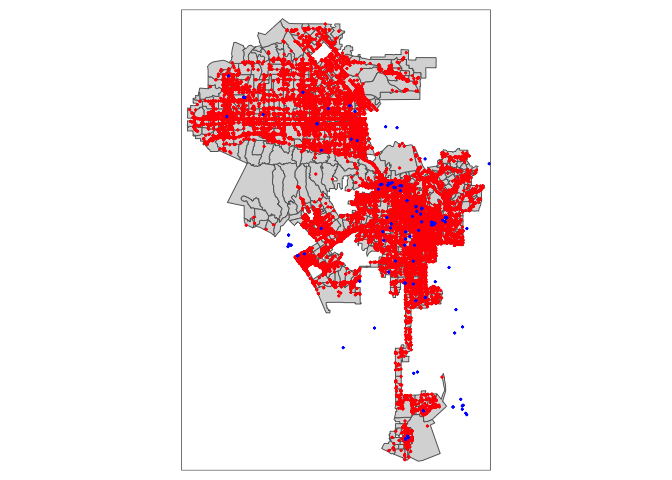
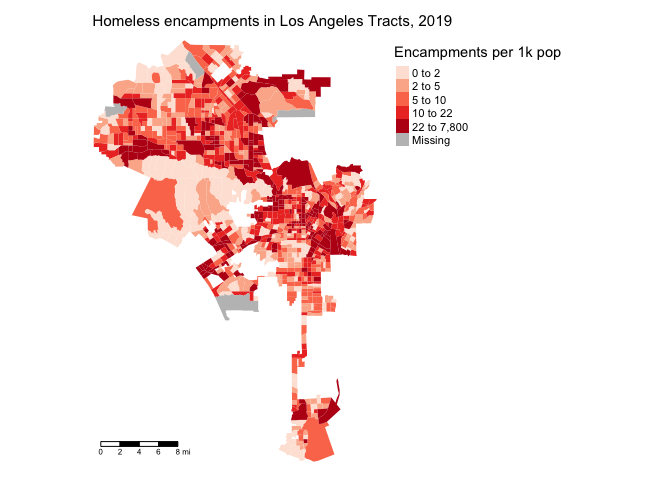

<style>
p.comment {
background-color: #DBDBDB;
padding: 10px;
border: 1px solid black;
margin-left: 25px;
border-radius: 5px;
font-style: normal;
}

.figure {
   margin-top: 20px;
   margin-bottom: 20px;
}

h1.title {
  font-weight: bold;
  font-family: Arial;  
}

h2.title {
  font-family: Arial;  
}

</style>


<style type="text/css">
#TOC {
  font-size: 13px;
  font-family: Arial;
}
</style>


\


In our journey into spatial R, we've been exclusively working with polygon data. In this guide you will learn how to handle and descriptively analyze point data.  More broadly, we will cover how to access and clean data from Open Data portals. The objectives of the guide are as follows 

1. Learn how to download data from an Open Data portal
2. Learn how to read point data into R
3. Learn how to put latitude and longitude data on a map
4. Learn how to put street addresses on a map
5. Learn how to map point data

To achieve these objectives, we will examine the spatial distribution of homeless encampments in the City of Los Angeles using 311 data downloaded from the city's [open data portal](https://data.lacity.org/).

This lab guide follows closely and supplements the material presented in Chapters 2.4, 2.5, 4.2 and 7 in the textbook [Geocomputation with R](https://geocompr.robinlovelace.net/) (GWR).

<p class="comment">**Assignment 8 is due by 2:00 pm, March 8th on Canvas.**  See [here](https://crd150.github.io/hw_guidelines.html) for assignment guidelines.  You must submit an `.Rmd` file and its associated `.html` file. Name the files: yourLastName_firstInitial_asgn08. For example: brazil_n_asgn08.</p>


<div style="margin-bottom:25px;">
</div>
## **Open up an R Markdown file**
\

Download the [Lab template](https://raw.githubusercontent.com/crd150/data/master/labtemplate.Rmd) into an appropriate folder on your hard drive (preferably, a folder named 'Lab 8'), open it in R Studio, and type and run your code there.  The template is also located on Canvas under Files.  Change the title ("Lab 8") and insert your name and date. Don't change anything else inside the YAML (the stuff at the top in between the `---`).  For a rundown on the use of R Markdown, see the [assignment guidelines](https://crd150.github.io/hw_guidelines.html).

<div style="margin-bottom:25px;">
</div>
## **Installing and loading packages**
\

You’ll need to install the following package in R. We’ll talk about what this package provides as its relevant functions come up in the guide.


```r
install.packages("tidygeocoder")
```

You’ll need to load the following packages. Unlike installing, you will always need to load packages whenever you start a new R session. You’ll also always need to use `library()` in your R Markdown file.


```r
library(sf)
library(tidyverse)
library(tidycensus)
library(tigris)
library(tmap)
library(rmapshaper)
library(tidygeocoder)
```


<div style="margin-bottom:25px;">
</div>
## **Read in census tract data**
\

We will need to bring in census tract polygon features and racial composition data from the 2015-2019 American Community Survey using the Census API and keep tracts within Los Angeles city boundaries using a clip.  The code for accomplishing these tasks is below.  We won't go through each line of code in detail because we've covered all of these operations and functions in prior labs.  I've embedded comments within the code that briefly explain what each chunk is doing, but go back to prior guides (or RDS/GWR) if you need further help.  


```r
# Bring in census tract data. 
ca.tracts <- get_acs(geography = "tract", 
              year = 2019,
              variables = c(tpop = "B01003_001", tpopr = "B03002_001", 
                            nhwhite = "B03002_003", nhblk = "B03002_004",
                             nhasn = "B03002_006", hisp = "B03002_012"),
              state = "CA",
              survey = "acs5",
              output = "wide",
              geometry = TRUE)

# Make the data tidy, calculate percent race/ethnicity, and keep essential vars.
ca.tracts <- ca.tracts %>% 
  mutate(pnhwhite = nhwhiteE/tpoprE, pnhasn = nhasnE/tpoprE, 
              pnhblk = nhblkE/tpoprE, phisp = hispE/tpoprE) %>%
  rename(tpop = tpopE) %>%
  select(c(GEOID,tpop, pnhwhite, pnhasn, pnhblk, phisp))  

# Bring in city boundary data
pl <- places(state = "CA", cb = TRUE)

# Keep LA city
la.city <- filter(pl, NAME == "Los Angeles")

#Clip tracts using LA boundary
la.city.tracts <- ms_clip(target = ca.tracts, clip = la.city, remove_slivers = TRUE)
```

<div style="margin-bottom:25px;">
</div>
## **Point data from an open data portal**
\

We will be examining the spatial distribution of homeless encampments in Los Angeles City. We will download homeless encampment data from Los Angeles' Open Data portal. The data represent homeless encampment locations in 2019 as reported through the City's [311 system](https://www.lacity.org/myla311).  To download the data from LA's open data portal, follow these steps:

1. Navigate to the  [Los Angeles City Open Data portal](https://data.lacity.org/A-Well-Run-City/MyLA311-Service-Request-Data-2019/pvft-t768)
2. Click on *View Data*.   This will bring up the  data in an excel style worksheet.
2. You'll find that there are over one million 311 requests in 2019.  Rather than bring all of these requests into R, let's just filter for homeless encampments.  To do this, click on *Filter*,  *Add a New Filter Condition*, select *Request Type* from the first pull down menu, then type in *Homeless Encampment* in the first text box. Hit return/enter.
4. Click on *Export* and select *CSV*.  Download the file into an appropriate folder on your hard drive. Name the file "homeless311_la_2019".

Read the file into R using the function `read_csv()`. Make sure your current working directory is pointing to the appropriate folder (use `getwd()` to see the current directory and `setwd()` to change it).


```r
homeless311.df <- read_csv("homeless311_la_2019.csv")
```

If you had trouble downloading the file, I uploaded it onto GitHub. Read the file into R using the following code.  


```r
homeless311.df <- read_csv("https://raw.githubusercontent.com/crd150/data/master/homeless311_la_2019.csv")
```

Whenever you bring a dataset into R, always look at it.  For example, we examine *homeless311.df* using `glimpse()`


```r
glimpse(homeless311.df)
```

```
## Rows: 55,536
## Columns: 34
## $ SRNumber                  <chr> "1-1523590871", "1-1523576655", "1-152357498…
## $ CreatedDate               <chr> "12/31/2019 11:26:00 PM", "12/31/2019 09:27:…
## $ UpdatedDate               <chr> "01/14/2020 07:52:00 AM", "01/08/2020 01:42:…
## $ ActionTaken               <chr> "SR Created", "SR Created", "SR Created", "S…
## $ Owner                     <chr> "BOS", "BOS", "BOS", "BOS", "BOS", "LASAN", …
## $ RequestType               <chr> "Homeless Encampment", "Homeless Encampment"…
## $ Status                    <chr> "Closed", "Closed", "Closed", "Closed", "Clo…
## $ RequestSource             <chr> "Mobile App", "Mobile App", "Mobile App", "M…
## $ CreatedByUserOrganization <chr> "Self Service", "Self Service", "Self Servic…
## $ MobileOS                  <chr> "iOS", "Android", "iOS", "iOS", "iOS", NA, "…
## $ Anonymous                 <chr> "N", "Y", "Y", "Y", "Y", "N", "N", "N", "N",…
## $ AssignTo                  <chr> "WV", "WV", "WV", "WV", "WV", "NC", "WV", "W…
## $ ServiceDate               <chr> "01/14/2020 12:00:00 AM", "01/10/2020 12:00:…
## $ ClosedDate                <chr> "01/14/2020 07:51:00 AM", "01/08/2020 01:42:…
## $ AddressVerified           <chr> "Y", "Y", "Y", "Y", "Y", "Y", "Y", "Y", "Y",…
## $ ApproximateAddress        <chr> NA, NA, NA, NA, NA, "N", NA, NA, NA, NA, "N"…
## $ Address                   <chr> "CANOGA AVE AT VANOWEN ST, 91303", "23001 W …
## $ HouseNumber               <dbl> NA, 23001, NA, 5550, 5550, NA, 5200, 5500, 2…
## $ Direction                 <chr> NA, "W", NA, "N", "N", NA, "N", "N", "S", "W…
## $ StreetName                <chr> NA, "VANOWEN", NA, "WINNETKA", "WINNETKA", N…
## $ Suffix                    <chr> NA, "ST", NA, "AVE", "AVE", NA, "AVE", "AVE"…
## $ ZipCode                   <dbl> 91303, 91307, 91367, 91364, 91364, 90004, 91…
## $ Latitude                  <dbl> 34.19375, 34.19388, 34.17220, 34.17143, 34.1…
## $ Longitude                 <dbl> -118.5975, -118.6281, -118.5710, -118.5707, …
## $ Location                  <chr> "(34.1937512753, -118.597510305)", "(34.1938…
## $ TBMPage                   <dbl> 530, 529, 560, 560, 560, 594, 559, 559, 634,…
## $ TBMColumn                 <chr> "B", "G", "E", "E", "E", "A", "H", "J", "B",…
## $ TBMRow                    <dbl> 6, 6, 2, 2, 2, 7, 3, 2, 6, 3, 3, 2, 7, 3, 2,…
## $ APC                       <chr> "South Valley APC", "South Valley APC", "Sou…
## $ CD                        <dbl> 3, 12, 3, 3, 3, 13, 3, 3, 1, 3, 7, 3, 3, 4, …
## $ CDMember                  <chr> "Bob Blumenfield", "John Lee", "Bob Blumenfi…
## $ NC                        <dbl> 13, 11, 16, 16, 16, 55, 16, 16, 76, 16, 101,…
## $ NCName                    <chr> "CANOGA PARK NC", "WEST HILLS NC", "WOODLAND…
## $ PolicePrecinct            <chr> "TOPANGA", "TOPANGA", "TOPANGA", "TOPANGA", …
```

Let's bring in a csv file containing the street addresses of [homeless shelters and services in Los Angeles County](https://data-lahub.opendata.arcgis.com/datasets/b0f7b2ebce0146069c74abf4b25a6688_158) (as of 2019), which I also downloaded from Los Angeles' open data portal.  I uploaded the file onto Github so you don't have to download it from the portal like we did above with encampments. The file is also located on Canvas (Week 8 - Lab).


```r
shelters.df <- read_csv("https://raw.githubusercontent.com/crd150/data/master/Homeless_Shelters_and_Services.csv")
```

Take a look at the data


```r
glimpse(shelters.df)
```

```
## Rows: 182
## Columns: 23
## $ source       <chr> "211", "211", "211", "211", "211", "211", "211", "211", "…
## $ ext_id       <lgl> NA, NA, NA, NA, NA, NA, NA, NA, NA, NA, NA, NA, NA, NA, N…
## $ cat1         <chr> "Social Services", "Social Services", "Social Services", …
## $ cat2         <chr> "Homeless Shelters and Services", "Homeless Shelters and …
## $ cat3         <lgl> NA, NA, NA, NA, NA, NA, NA, NA, NA, NA, NA, NA, NA, NA, N…
## $ org_name     <chr> NA, NA, NA, NA, NA, NA, NA, NA, NA, "www.catalystfdn.org"…
## $ Name         <chr> "Special Service For Groups -  Project 180", "1736 Family…
## $ addrln1      <chr> "420 S. San Pedro", "2116 Arlington Ave", "1736 Monterey …
## $ addrln2      <chr> NA, "Suite 200", NA, NA, NA, NA, "4th Fl.", NA, NA, NA, N…
## $ city         <chr> "Los Angeles", "Los Angeles", "Hermosa Beach", "Monrovia"…
## $ state        <chr> "CA", "CA", "CA", "CA", "CA", "CA", "CA", "CA", "CA", "CA…
## $ hours        <chr> "SITE HOURS:  Monday through Friday, 8:30am to 4:30pm.", …
## $ email        <lgl> NA, NA, NA, NA, NA, NA, NA, NA, NA, NA, NA, NA, NA, NA, N…
## $ url          <chr> "ssgmain.org/", "www.1736fcc.org", "www.1736fcc.org", "ww…
## $ info1        <lgl> NA, NA, NA, NA, NA, NA, NA, NA, NA, NA, NA, NA, NA, NA, N…
## $ info2        <lgl> NA, NA, NA, NA, NA, NA, NA, NA, NA, NA, NA, NA, NA, NA, N…
## $ post_id      <dbl> 772, 786, 788, 794, 795, 946, 947, 1073, 1133, 1283, 1353…
## $ description  <chr> "The agency provides advocacy, child care, HIV/AIDS servi…
## $ zip          <dbl> 90013, 90018, 90254, 91016, 91776, 90028, 90027, 90019, 9…
## $ link         <chr> "http://egis3.lacounty.gov/lms/?p=772", "http://egis3.lac…
## $ use_type     <chr> "publish", "publish", "publish", "publish", "publish", "p…
## $ date_updated <chr> "2017/10/30 14:43:13+00", "2017/10/06 16:28:29+00", "2017…
## $ dis_status   <chr> NA, NA, NA, NA, NA, NA, NA, NA, NA, NA, NA, NA, NA, NA, N…
```


<div style="margin-bottom:25px;">
</div>
## **Putting points on a map**
\

Notice that the data we brought in are not spatial. They are regular tibbles, not **sf** objects.


```r
class(homeless311.df)
```

```
## [1] "spec_tbl_df" "tbl_df"      "tbl"         "data.frame"
```

```r
class(shelters.df)
```

```
## [1] "spec_tbl_df" "tbl_df"      "tbl"         "data.frame"
```

In order to convert these nonspatial objects into spatial objects, we need to geolocate them.  To do this, use the geographic coordinates (longitude and latitude) to place points on a map. The file *homeless311.df* has longitude and latitude coordinates, so we have all the information we need to convert it to a spatial object.  

We will use the function `st_as_sf()` to create a point **sf** object out of *homeless311.df* using the  geographic coordinates.  Geographic coordinates are in the form of a longitude and latitude, where longitude is your X coordinate and spans East/West and latitude is your Y coordinate and spans North/South. The function `st_as_sf()` requires you to specify the longitude and latitude of each point using the `coords =` argument, which are conveniently stored in the variables *Longitude* and *Latitude* in *homeless311.df*. We need to take out any observations with missing values `NA` for either *Longitude* or *Latitude*.  Do this by using the function `is.na()` within the `filter()` function.


```r
homeless311.df <- homeless311.df %>%
                filter(is.na(Longitude) == FALSE & is.na(Latitude) == FALSE)
```

You also need to establish the Coordinate Reference System (CRS) using the `crs =` argument, which I covered in Tuesday's lecture. To establish a CRS, you will need to specify the Geographic Coordinate System (so you know where your points are on Earth), which encompasses the datum and ellipse, and a Projection (a way of putting points in 2 dimensions or on a flat map). 


```r
homeless311.sf <- st_as_sf(homeless311.df, coords = c("Longitude", "Latitude"), crs = "+proj=longlat +datum=NAD83 +ellps=WGS84")
```

For `crs =`, we establish the projection `+proj=`, datum `+datum=` and ellipse `+ellps`.  Because we have latitude and longitude, `+proj=` is established as `longlat`. We use NAD83 for datum and WGS84 ellipse. The most common datum and ellipsoid combinations are listed in Figure 1 in the Coordinate_Reference_Systems.pdf document on Canvas (Files - Other Resources).  For the purposes of this lab and assignment 8 (and in your final project if you choose to use point data), use the crs specified above.

Note that the CRS should have only have one space in between `+proj=longlat`, `+datum=WGS84` and `+ellps=WGS84`.  And you should have no spaces anywhere else.  Be careful about this because if you introduce spaces elsewhere you will get an incorrect CRS (and R will not give you an error to let you know). Also note that the longitude will always go before the latitude in `coords =`.

Now we can map encampments over Los Angeles City tracts using our new best friend `tm_shape()`, whom we met in [Lab 5](https://crd150.github.io/lab5.html#Mapping_in_R).


```r
tm_shape(la.city.tracts) +  
  tm_polygons() +
tm_shape(homeless311.sf) +  
  tm_dots(col="red")
```


<div style="margin-bottom:25px;">
</div>
## **Street Addresses**
\

Often you will get point data that won’t have longitude/X and latitude/Y coordinates but instead have street addresses. The process of going from address to X/Y coordinates is known as geocoding. 

To demonstrate geocoding, type in your home street address, city and state inside the quotes below.  We are saving our address in an object we named *myaddress.df*.


```r
myaddress.df  <- tibble(street = "", city = "", state = "")
```

This creates a tibble with your street, city and state saved in three variables. To geocode addresses to longitude and latitude, use the function `geocode()` which is a part of the **tidygeocoder** package.  Use `geocode()` as follows


```r
myaddress.df <- geocode(myaddress.df, street = street, city = city, state = state, method = "census")
```

Here, we specify street, city and state variables, which are conveniently named *street*, *city*, and *state* in *myaddress.df*.  The argument `method = 'census'` specifies the geocoder used to map addresses to longitude/latitude locations. In the above case `'census'` uses the geocoder provided by the U.S. Census to find the address.  Think of a geocoder as R going to the Census geocoder [website](https://geocoding.geo.census.gov/), searching for each address,  plucking the latitude and longitude of the address, and saving it into a tibble named *myaddress.df*.  Other geocoders include Google Maps and [OpenStreetMap](https://www.openstreetmap.org/#map=4/38.01/-95.84). 


If you view this object, you'll find the latitude *lat* and longitude *long* attached as columns. Convert this point to an **sf** object using the function `st_as_sf()` like we did above with the encampments.


```r
myaddress.sf <- st_as_sf(myaddress.df, coords = c("long", "lat"))
```

Type in `tmap_mode("view")` and then [map](https://crd150.github.io/lab5.html#Interactive_maps) *myaddress.sf*.  Zoom into the point.  Did it get your home address correct?

<br>

The file *shelters.df* contains no latitude and longitude data, so we need to convert the street addresses contained in the variables *addrln1*, *city* and *state*.  Use the function `geocode()` like we did above.  We use `method = 'census'` to indicate we want to use the Census API to geocode the addresses for us (as opposed to other geocoders that are available). The process may take a few minutes so be patient.


```r
shelters.geo <- geocode(shelters.df, street = addrln1, city = city, state = state, method = 'census')
```

Look at the column names.


```r
names(shelters.geo)
```

```
##  [1] "source"       "ext_id"       "cat1"         "cat2"         "cat3"        
##  [6] "org_name"     "Name"         "addrln1"      "addrln2"      "city"        
## [11] "state"        "hours"        "email"        "url"          "info1"       
## [16] "info2"        "post_id"      "description"  "zip"          "link"        
## [21] "use_type"     "date_updated" "dis_status"   "lat"          "long"
```

We see the latitudes and longitudes are attached to the variables *lat* and *long*, respectively.  Notice that not all the addresses were successfully geocoded.


```r
summary(shelters.geo$lat)
```

```
##    Min. 1st Qu.  Median    Mean 3rd Qu.    Max.    NA's 
##   33.74   34.00   34.05   34.08   34.12   34.70      24
```

Several shelters received an `NA`.  This is likely because the addresses are not correct, has errors, or are not fully specified.  You'll have to manually fix these issues, which becomes time consuming if you have a really large data set.  For the purposes of this lab, let's just discard these, but in practice, make sure to double check your address data (See the document Geocoding_Best_Practices.pdf in the Other Resources folder on Canvas for best practices for cleaning address data). We use the `filter()` function to filter out the NAs.


```r
shelters.geo <- shelters.geo %>%
                filter(is.na(lat) == FALSE & is.na(long) == FALSE)
```

Convert latitude and longitude data into spatial points using the function `st_as_sf()` like we did above for homeless encampments.


```r
shelters.sf <- st_as_sf(shelters.geo, coords = c("long", "lat"), crs = "+proj=longlat +datum=NAD83 +ellps=WGS84")
```

Now, let's map shelters and encampments on top of tracts.


```r
tm_shape(la.city.tracts) +
  tm_polygons() +
tm_shape(homeless311.sf) +  
  tm_dots(col="red") +
tm_shape(shelters.sf) +  
  tm_dots(col="blue")
```

<!-- -->


<div style="margin-bottom:25px;">
</div>
## **Mapping point patterns**
\


Other than mapping their locations (e.g. pin or dot map), how else can we visually present point locations?  When working with neighborhoods, we can examine point distributions by summing up the number of points in each neighborhood. 

To do this, we can use the function `aggregate()`.


```r
hcamps_agg <- aggregate(homeless311.sf["SRNumber"], la.city.tracts, FUN = "length")
```

The first argument is the **sf** points you want to count, in our case *homeless311.sf*.  You then include in bracket and quotes the unique ID for each point, in our case "SRNumber". The next argument is the object you want to sum the points for, in our case Los Angeles census tracts *la.city.tracts*.  Finally,`FUN = "length"` tells R to sum up the number of points in each tract.

Take a look at the object we created.


```r
glimpse(hcamps_agg)
```

```
## Rows: 1,001
## Columns: 2
## $ SRNumber <int> 110, 32, 35, 186, 7, 3, 6, 32, 2, 37, 1, 18, 31, 11, 28, 173,…
## $ geometry <POLYGON [°]> POLYGON ((-118.2156 34.0736..., POLYGON ((-118.3091 3…
```

The variable *SRNumber* gives us the number of points in each of Los Angeles' tracts.  Notice that there are missing values.


```r
summary(hcamps_agg)
```

```
##     SRNumber               geometry   
##  Min.   :  1.00   MULTIPOLYGON :   1  
##  1st Qu.: 10.00   POLYGON      :1000  
##  Median : 29.00   epsg:4269    :   0  
##  Mean   : 56.83   +proj=long...:   0  
##  3rd Qu.: 69.00                       
##  Max.   :822.00                       
##  NA's   :28
```

This is because there are tracts that have no homeless encampments.  Convert these NA values to 0 using the `replace_na()` function within the `mutate()` function.


```r
hcamps_agg <- hcamps_agg %>%
  mutate(SRNumber = replace_na(SRNumber,0))
```

The function `replace_na()` tells R to replace any NAs found in the variable *SRNumber* with the number 0.  

Next, we save the variable *SRNumber* from *hcamps_agg* into our main dataset *la.city.tracts* by creating a new variable *hcamps* within `mutate()`.


```r
la.city.tracts <- la.city.tracts %>%
            mutate(hcamps = hcamps_agg$SRNumber)
```


We can map the count of encampments by census tract, but counts do not take into consideration exposure.  In this case, tracts that are larger in size or greater in population may have more encampments (a concept we covered in Handout 5). Instead, let's calculate the number of homeless encampments per 1,000 residents.


```r
la.city.tracts <- la.city.tracts %>%
            mutate(hcamppop = (hcamps/tpop)*1000)
```

The above code creates the variable *hcamppop* in *la.city.tracts*, which represents the number of homeless encampments per 1,000 residents.  Note that there are tracts with 0 population sizes, so a division of 0 when you created the variable *hcamppop* will yield an Inf value, which we covered in [Lab 1](https://crd150.github.io/lab1.html#Numeric).  Let's convert *hcamppop* to NA for tracts with population sizes of 0 using the `replace()` function.


```r
la.city.tracts <- la.city.tracts %>%
            mutate(hcamppop = replace(hcamppop, tpop == 0, NA))
```

Now we can create a presentable choropleth map of homeless encampments per 1,000 residents for neighborhoods in the City of Los Angeles.


```r
la.city.tracts %>%
  tm_shape(unit = "mi") +
    tm_polygons(col = "hcamppop", style = "quantile",palette = "Reds", 
              border.alpha = 0, title = "Encampments per 1k pop") +
    tm_scale_bar(position = c("left", "bottom")) +
    tm_compass(type = "4star", position = c("right", "bottom"))  +
    tm_layout(main.title = "Homeless encampments in Los Angeles Tracts, 2019",
            main.title.size = 0.95, frame = FALSE,
            legend.outside = TRUE, legend.outside.position = "right")
```

<!-- -->


***

<a rel="license" href="http://creativecommons.org/licenses/by-nc/4.0/"></a><br />This work is licensed under a <a rel="license" href="http://creativecommons.org/licenses/by-nc/4.0/">Creative Commons Attribution-NonCommercial 4.0 International License</a>.


Website created and maintained by [Noli Brazil](https://nbrazil.faculty.ucdavis.edu/)
